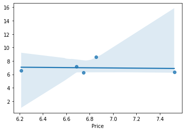
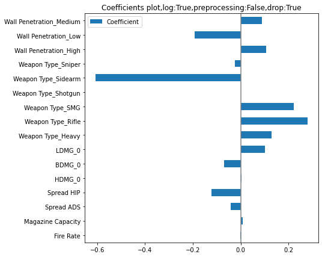

# EDA_Valorant
Exploratory Data Analysis for the game Valorant

Valorant is a free-to-play first-person hero shooter developed and published by Riot Games, for Microsoft Windows. It was released in June 2020, and this dataset is based on their first ever major tournament, Stage 2: "Masters" of the VCT (Valorant Champions Tour) 2021 which took place between 24th May and 30th May in Iceland.
Content

There are 4 csv files in this dataset in which the major one is the player_stats csv file.
Inspiration

This dataset can be used to create beautiful visualizations and insights, and to create a nice analytical report. 


```python
import pandas as pd
import numpy as np
import matplotlib.pyplot as plt
import plotly.express as px
import plotly.graph_objects as go
from collections import Counter
import seaborn as sns
```

## Weapons


```python
df = pd.read_csv(r"C:\Users\anass\Programmation\EDA\Valorant\valorant-stats.csv")
df.head()
```


<div>
<style scoped>
    .dataframe tbody tr th:only-of-type {
        vertical-align: middle;
    }

    .dataframe tbody tr th {
        vertical-align: top;
    }

    .dataframe thead th {
        text-align: right;
    }
</style>
<table border="1" class="dataframe">
  <thead>
    <tr style="text-align: right;">
      <th></th>
      <th>Name</th>
      <th>Weapon Type</th>
      <th>Price</th>
      <th>Fire Rate</th>
      <th>Wall Penetration</th>
      <th>Magazine Capacity</th>
      <th>HDMG_0</th>
      <th>BDMG_0</th>
      <th>LDMG_0</th>
      <th>HDMG_1</th>
      <th>BDMG_1</th>
      <th>LDMG_1</th>
      <th>HDMG_2</th>
      <th>BDMG_2</th>
      <th>LDMG_2</th>
    </tr>
  </thead>
  <tbody>
    <tr>
      <th>0</th>
      <td>Classic</td>
      <td>Sidearm</td>
      <td>0</td>
      <td>6.75</td>
      <td>Low</td>
      <td>12</td>
      <td>78</td>
      <td>26</td>
      <td>22</td>
      <td>78</td>
      <td>26</td>
      <td>22</td>
      <td>66</td>
      <td>22</td>
      <td>18</td>
    </tr>
    <tr>
      <th>1</th>
      <td>Shorty</td>
      <td>Sidearm</td>
      <td>200</td>
      <td>3.30</td>
      <td>Low</td>
      <td>2</td>
      <td>36</td>
      <td>12</td>
      <td>10</td>
      <td>24</td>
      <td>8</td>
      <td>6</td>
      <td>9</td>
      <td>3</td>
      <td>2</td>
    </tr>
    <tr>
      <th>2</th>
      <td>Frenzy</td>
      <td>Sidearm</td>
      <td>400</td>
      <td>10.00</td>
      <td>Low</td>
      <td>13</td>
      <td>78</td>
      <td>26</td>
      <td>22</td>
      <td>63</td>
      <td>21</td>
      <td>17</td>
      <td>63</td>
      <td>21</td>
      <td>17</td>
    </tr>
    <tr>
      <th>3</th>
      <td>Ghost</td>
      <td>Sidearm</td>
      <td>500</td>
      <td>6.75</td>
      <td>Medium</td>
      <td>15</td>
      <td>105</td>
      <td>33</td>
      <td>26</td>
      <td>88</td>
      <td>25</td>
      <td>21</td>
      <td>88</td>
      <td>25</td>
      <td>21</td>
    </tr>
    <tr>
      <th>4</th>
      <td>Sheriff</td>
      <td>Sidearm</td>
      <td>800</td>
      <td>4.00</td>
      <td>High</td>
      <td>6</td>
      <td>160</td>
      <td>55</td>
      <td>47</td>
      <td>160</td>
      <td>55</td>
      <td>47</td>
      <td>145</td>
      <td>50</td>
      <td>43</td>
    </tr>
  </tbody>
</table>
</div>


```python
df_old = df.copy()
```


```python
df_new = df.copy()
```


```python
df_new['Price'] = df_new['Price'].replace([200,400,1000,2100,2500,1100,4500,900,1500],[150,450,950,2050,2250,950,4700,850,1850])
df_new['Fire Rate'] = df_new['Fire Rate'].replace([3.30,18,9.15,6.5,9.25,0.75,10],[3.33,16,10,5.25,9.75,0.6,13])
#note: fire Rate of Odin increases overe time
df_new['HDMG_0'] = df_new['HDMG_0'].replace([36,160,116,156,55],[24,159,115,160,40])
df_new.at[9, 'HDMG_0'] = 156
df_new['BDMG_0'] = df_new['BDMG_0'].replace([33,22,39],[30,20,40])
df_new.at[9, 'BDMG_0'] = 39
df_new['LDMG_0'] = df_new['LDMG_0'].replace([26,47,23,30,49,33,127],[25,46,22,29,48,34,120])
df_new.at[9, 'LDMG_0'] = 33
#other minor changes damage/distance
df_new.at[10, 'HDMG_1'] = 160
df_new.at[10, 'HDMG_2'] = 160
df_new.at[10, 'BDMG_1'] = 40
df_new.at[10, 'BDMG_2'] = 40
df_new.at[10, 'LDMG_1'] = 34
df_new.at[10, 'LDMG_2'] = 34
df_new.at[8, 'LDMG_1'] = 48
df_new.at[8, 'LDMG_2'] = 48
df_new.at[7, 'LDMG_1'] = 29
df_new.at[9, 'LDMG_2'] = 29
df_new.at[13, 'HDMG_2'] = 18
df_new.at[13, 'LDMG_2'] = 7
df_new.at[14, 'HDMG_1'] = 20
df_new.at[14, 'HDMG_2'] = 14
df_new.at[14, 'BDMG_1'] = 10
df_new.at[14, 'LDMG_2'] = 8
df_new.at[14, 'LDMG_1'] = 5
```


```python
df_new
```


<div>
<style scoped>
    .dataframe tbody tr th:only-of-type {
        vertical-align: middle;
    }

    .dataframe tbody tr th {
        vertical-align: top;
    }

    .dataframe thead th {
        text-align: right;
    }
</style>
<table border="1" class="dataframe">
  <thead>
    <tr style="text-align: right;">
      <th></th>
      <th>Name</th>
      <th>Weapon Type</th>
      <th>Price</th>
      <th>Fire Rate</th>
      <th>Wall Penetration</th>
      <th>Magazine Capacity</th>
      <th>HDMG_0</th>
      <th>BDMG_0</th>
      <th>LDMG_0</th>
      <th>HDMG_1</th>
      <th>BDMG_1</th>
      <th>LDMG_1</th>
      <th>HDMG_2</th>
      <th>BDMG_2</th>
      <th>LDMG_2</th>
    </tr>
  </thead>
  <tbody>
    <tr>
      <th>0</th>
      <td>Classic</td>
      <td>Sidearm</td>
      <td>0</td>
      <td>6.75</td>
      <td>Low</td>
      <td>12</td>
      <td>78</td>
      <td>26</td>
      <td>22</td>
      <td>78</td>
      <td>26</td>
      <td>22</td>
      <td>66</td>
      <td>22</td>
      <td>18</td>
    </tr>
    <tr>
      <th>1</th>
      <td>Shorty</td>
      <td>Sidearm</td>
      <td>150</td>
      <td>3.33</td>
      <td>Low</td>
      <td>2</td>
      <td>24</td>
      <td>12</td>
      <td>10</td>
      <td>24</td>
      <td>8</td>
      <td>6</td>
      <td>9</td>
      <td>3</td>
      <td>2</td>
    </tr>
    <tr>
      <th>2</th>
      <td>Frenzy</td>
      <td>Sidearm</td>
      <td>450</td>
      <td>13.00</td>
      <td>Low</td>
      <td>13</td>
      <td>78</td>
      <td>26</td>
      <td>22</td>
      <td>63</td>
      <td>21</td>
      <td>17</td>
      <td>63</td>
      <td>21</td>
      <td>17</td>
    </tr>
    <tr>
      <th>3</th>
      <td>Ghost</td>
      <td>Sidearm</td>
      <td>500</td>
      <td>6.75</td>
      <td>Medium</td>
      <td>15</td>
      <td>105</td>
      <td>30</td>
      <td>25</td>
      <td>88</td>
      <td>25</td>
      <td>21</td>
      <td>88</td>
      <td>25</td>
      <td>21</td>
    </tr>
    <tr>
      <th>4</th>
      <td>Sheriff</td>
      <td>Sidearm</td>
      <td>800</td>
      <td>4.00</td>
      <td>High</td>
      <td>6</td>
      <td>159</td>
      <td>55</td>
      <td>46</td>
      <td>160</td>
      <td>55</td>
      <td>47</td>
      <td>145</td>
      <td>50</td>
      <td>43</td>
    </tr>
    <tr>
      <th>5</th>
      <td>Stinger</td>
      <td>SMG</td>
      <td>950</td>
      <td>16.00</td>
      <td>Low</td>
      <td>20</td>
      <td>67</td>
      <td>27</td>
      <td>22</td>
      <td>62</td>
      <td>25</td>
      <td>21</td>
      <td>62</td>
      <td>25</td>
      <td>21</td>
    </tr>
    <tr>
      <th>6</th>
      <td>Spectre</td>
      <td>SMG</td>
      <td>1600</td>
      <td>13.33</td>
      <td>Medium</td>
      <td>30</td>
      <td>78</td>
      <td>26</td>
      <td>22</td>
      <td>66</td>
      <td>22</td>
      <td>18</td>
      <td>66</td>
      <td>22</td>
      <td>18</td>
    </tr>
    <tr>
      <th>7</th>
      <td>Bulldog</td>
      <td>Rifle</td>
      <td>2050</td>
      <td>10.00</td>
      <td>Medium</td>
      <td>24</td>
      <td>115</td>
      <td>35</td>
      <td>29</td>
      <td>116</td>
      <td>35</td>
      <td>29</td>
      <td>116</td>
      <td>35</td>
      <td>30</td>
    </tr>
    <tr>
      <th>8</th>
      <td>Guardian</td>
      <td>Rifle</td>
      <td>2250</td>
      <td>5.25</td>
      <td>Medium</td>
      <td>12</td>
      <td>195</td>
      <td>65</td>
      <td>48</td>
      <td>195</td>
      <td>65</td>
      <td>48</td>
      <td>195</td>
      <td>65</td>
      <td>48</td>
    </tr>
    <tr>
      <th>9</th>
      <td>Phantom</td>
      <td>Rifle</td>
      <td>2900</td>
      <td>11.00</td>
      <td>Medium</td>
      <td>30</td>
      <td>156</td>
      <td>39</td>
      <td>33</td>
      <td>140</td>
      <td>35</td>
      <td>30</td>
      <td>124</td>
      <td>31</td>
      <td>29</td>
    </tr>
    <tr>
      <th>10</th>
      <td>Vandal</td>
      <td>Rifle</td>
      <td>2900</td>
      <td>9.75</td>
      <td>Medium</td>
      <td>25</td>
      <td>160</td>
      <td>40</td>
      <td>34</td>
      <td>160</td>
      <td>40</td>
      <td>34</td>
      <td>160</td>
      <td>40</td>
      <td>34</td>
    </tr>
    <tr>
      <th>11</th>
      <td>Marshall</td>
      <td>Sniper</td>
      <td>950</td>
      <td>1.50</td>
      <td>Medium</td>
      <td>5</td>
      <td>202</td>
      <td>101</td>
      <td>85</td>
      <td>202</td>
      <td>101</td>
      <td>85</td>
      <td>202</td>
      <td>101</td>
      <td>85</td>
    </tr>
    <tr>
      <th>12</th>
      <td>Operator</td>
      <td>Sniper</td>
      <td>4700</td>
      <td>0.60</td>
      <td>High</td>
      <td>5</td>
      <td>255</td>
      <td>150</td>
      <td>120</td>
      <td>255</td>
      <td>150</td>
      <td>127</td>
      <td>255</td>
      <td>150</td>
      <td>127</td>
    </tr>
    <tr>
      <th>13</th>
      <td>Bucky</td>
      <td>Shotgun</td>
      <td>850</td>
      <td>1.10</td>
      <td>Low</td>
      <td>5</td>
      <td>40</td>
      <td>20</td>
      <td>19</td>
      <td>34</td>
      <td>17</td>
      <td>14</td>
      <td>18</td>
      <td>9</td>
      <td>7</td>
    </tr>
    <tr>
      <th>14</th>
      <td>Judge</td>
      <td>Shotgun</td>
      <td>1850</td>
      <td>3.50</td>
      <td>Medium</td>
      <td>7</td>
      <td>34</td>
      <td>17</td>
      <td>14</td>
      <td>20</td>
      <td>10</td>
      <td>5</td>
      <td>14</td>
      <td>10</td>
      <td>8</td>
    </tr>
    <tr>
      <th>15</th>
      <td>Ares</td>
      <td>Heavy</td>
      <td>1600</td>
      <td>13.00</td>
      <td>High</td>
      <td>50</td>
      <td>72</td>
      <td>30</td>
      <td>25</td>
      <td>72</td>
      <td>30</td>
      <td>25</td>
      <td>67</td>
      <td>28</td>
      <td>23</td>
    </tr>
    <tr>
      <th>16</th>
      <td>Odin</td>
      <td>Heavy</td>
      <td>3200</td>
      <td>12.00</td>
      <td>High</td>
      <td>100</td>
      <td>95</td>
      <td>38</td>
      <td>32</td>
      <td>95</td>
      <td>38</td>
      <td>32</td>
      <td>77</td>
      <td>31</td>
      <td>26</td>
    </tr>
  </tbody>
</table>
</div>


###  Difference between old weapon stats and new stats


```python
df_diff=df_new[['Price','Fire Rate','HDMG_0','BDMG_0','LDMG_0']].subtract(df_old[['Price','Fire Rate','HDMG_0','BDMG_0','LDMG_0']])
df_diff=df_diff.set_index(df_new['Name'])
df_diff = df_diff[(df_diff.T != 0).any()]
print("The difference between old weapon stats and new stats")
df_diff
```

    The difference between old weapon stats and new stats
    


<div>
<style scoped>
    .dataframe tbody tr th:only-of-type {
        vertical-align: middle;
    }

    .dataframe tbody tr th {
        vertical-align: top;
    }

    .dataframe thead th {
        text-align: right;
    }
</style>
<table border="1" class="dataframe">
  <thead>
    <tr style="text-align: right;">
      <th></th>
      <th>Price</th>
      <th>Fire Rate</th>
      <th>HDMG_0</th>
      <th>BDMG_0</th>
      <th>LDMG_0</th>
    </tr>
    <tr>
      <th>Name</th>
      <th></th>
      <th></th>
      <th></th>
      <th></th>
      <th></th>
    </tr>
  </thead>
  <tbody>
    <tr>
      <th>Shorty</th>
      <td>-50</td>
      <td>0.03</td>
      <td>-12</td>
      <td>0</td>
      <td>0</td>
    </tr>
    <tr>
      <th>Frenzy</th>
      <td>50</td>
      <td>3.00</td>
      <td>0</td>
      <td>0</td>
      <td>0</td>
    </tr>
    <tr>
      <th>Ghost</th>
      <td>0</td>
      <td>0.00</td>
      <td>0</td>
      <td>-3</td>
      <td>-1</td>
    </tr>
    <tr>
      <th>Sheriff</th>
      <td>0</td>
      <td>0.00</td>
      <td>-1</td>
      <td>0</td>
      <td>-1</td>
    </tr>
    <tr>
      <th>Stinger</th>
      <td>-50</td>
      <td>-2.00</td>
      <td>0</td>
      <td>0</td>
      <td>-1</td>
    </tr>
    <tr>
      <th>Bulldog</th>
      <td>-50</td>
      <td>0.85</td>
      <td>-1</td>
      <td>0</td>
      <td>-1</td>
    </tr>
    <tr>
      <th>Guardian</th>
      <td>-250</td>
      <td>-1.25</td>
      <td>0</td>
      <td>0</td>
      <td>-1</td>
    </tr>
    <tr>
      <th>Vandal</th>
      <td>0</td>
      <td>0.50</td>
      <td>4</td>
      <td>1</td>
      <td>1</td>
    </tr>
    <tr>
      <th>Marshall</th>
      <td>-150</td>
      <td>0.00</td>
      <td>0</td>
      <td>0</td>
      <td>0</td>
    </tr>
    <tr>
      <th>Operator</th>
      <td>200</td>
      <td>-0.15</td>
      <td>0</td>
      <td>0</td>
      <td>-7</td>
    </tr>
    <tr>
      <th>Bucky</th>
      <td>-50</td>
      <td>0.00</td>
      <td>-15</td>
      <td>-2</td>
      <td>0</td>
    </tr>
    <tr>
      <th>Judge</th>
      <td>350</td>
      <td>0.00</td>
      <td>0</td>
      <td>0</td>
      <td>0</td>
    </tr>
    <tr>
      <th>Ares</th>
      <td>0</td>
      <td>3.00</td>
      <td>0</td>
      <td>0</td>
      <td>0</td>
    </tr>
  </tbody>
</table>
</div>


###  Prices


```python
def return_sorted(col_name):
    sorted_df = df_new.sort_values(by=col_name)
    return {'weapon': sorted_df['Name'].to_list(), 'values': sorted_df[col_name].to_list()}
```


```python
price_dict = return_sorted('Price')

fig_prices= px.bar(price_dict, x = 'weapon', y = 'values', title = 'Prices Distribution')
fig_prices.show()
```


<div>                            <div id="347ff9cc-04c1-4358-9e08-531dbf12268a" class="plotly-graph-div" style="height:525px; width:100%;"></div>            <script type="text/javascript">                require(["plotly"], function(Plotly) {                    window.PLOTLYENV=window.PLOTLYENV || {};                                    if (document.getElementById("347ff9cc-04c1-4358-9e08-531dbf12268a")) {                    Plotly.newPlot(                        "347ff9cc-04c1-4358-9e08-531dbf12268a",                        [{"alignmentgroup":"True","hovertemplate":"weapon=%{x}<br>values=%{y}<extra></extra>","legendgroup":"","marker":{"color":"#636efa","pattern":{"shape":""}},"name":"","offsetgroup":"","orientation":"v","showlegend":false,"textposition":"auto","type":"bar","x":["Classic","Shorty","Frenzy","Ghost","Sheriff","Bucky","Stinger","Marshall","Spectre","Ares","Judge","Bulldog","Guardian","Vandal","Phantom","Odin","Operator"],"xaxis":"x","y":[0,150,450,500,800,850,950,950,1600,1600,1850,2050,2250,2900,2900,3200,4700],"yaxis":"y"}],                        {"barmode":"relative","legend":{"tracegroupgap":0},"template":{"data":{"bar":[{"error_x":{"color":"#2a3f5f"},"error_y":{"color":"#2a3f5f"},"marker":{"line":{"color":"#E5ECF6","width":0.5},"pattern":{"fillmode":"overlay","size":10,"solidity":0.2}},"type":"bar"}],"barpolar":[{"marker":{"line":{"color":"#E5ECF6","width":0.5},"pattern":{"fillmode":"overlay","size":10,"solidity":0.2}},"type":"barpolar"}],"carpet":[{"aaxis":{"endlinecolor":"#2a3f5f","gridcolor":"white","linecolor":"white","minorgridcolor":"white","startlinecolor":"#2a3f5f"},"baxis":{"endlinecolor":"#2a3f5f","gridcolor":"white","linecolor":"white","minorgridcolor":"white","startlinecolor":"#2a3f5f"},"type":"carpet"}],"choropleth":[{"colorbar":{"outlinewidth":0,"ticks":""},"type":"choropleth"}],"contour":[{"colorbar":{"outlinewidth":0,"ticks":""},"colorscale":[[0.0,"#0d0887"],[0.1111111111111111,"#46039f"],[0.2222222222222222,"#7201a8"],[0.3333333333333333,"#9c179e"],[0.4444444444444444,"#bd3786"],[0.5555555555555556,"#d8576b"],[0.6666666666666666,"#ed7953"],[0.7777777777777778,"#fb9f3a"],[0.8888888888888888,"#fdca26"],[1.0,"#f0f921"]],"type":"contour"}],"contourcarpet":[{"colorbar":{"outlinewidth":0,"ticks":""},"type":"contourcarpet"}],"heatmap":[{"colorbar":{"outlinewidth":0,"ticks":""},"colorscale":[[0.0,"#0d0887"],[0.1111111111111111,"#46039f"],[0.2222222222222222,"#7201a8"],[0.3333333333333333,"#9c179e"],[0.4444444444444444,"#bd3786"],[0.5555555555555556,"#d8576b"],[0.6666666666666666,"#ed7953"],[0.7777777777777778,"#fb9f3a"],[0.8888888888888888,"#fdca26"],[1.0,"#f0f921"]],"type":"heatmap"}],"heatmapgl":[{"colorbar":{"outlinewidth":0,"ticks":""},"colorscale":[[0.0,"#0d0887"],[0.1111111111111111,"#46039f"],[0.2222222222222222,"#7201a8"],[0.3333333333333333,"#9c179e"],[0.4444444444444444,"#bd3786"],[0.5555555555555556,"#d8576b"],[0.6666666666666666,"#ed7953"],[0.7777777777777778,"#fb9f3a"],[0.8888888888888888,"#fdca26"],[1.0,"#f0f921"]],"type":"heatmapgl"}],"histogram":[{"marker":{"pattern":{"fillmode":"overlay","size":10,"solidity":0.2}},"type":"histogram"}],"histogram2d":[{"colorbar":{"outlinewidth":0,"ticks":""},"colorscale":[[0.0,"#0d0887"],[0.1111111111111111,"#46039f"],[0.2222222222222222,"#7201a8"],[0.3333333333333333,"#9c179e"],[0.4444444444444444,"#bd3786"],[0.5555555555555556,"#d8576b"],[0.6666666666666666,"#ed7953"],[0.7777777777777778,"#fb9f3a"],[0.8888888888888888,"#fdca26"],[1.0,"#f0f921"]],"type":"histogram2d"}],"histogram2dcontour":[{"colorbar":{"outlinewidth":0,"ticks":""},"colorscale":[[0.0,"#0d0887"],[0.1111111111111111,"#46039f"],[0.2222222222222222,"#7201a8"],[0.3333333333333333,"#9c179e"],[0.4444444444444444,"#bd3786"],[0.5555555555555556,"#d8576b"],[0.6666666666666666,"#ed7953"],[0.7777777777777778,"#fb9f3a"],[0.8888888888888888,"#fdca26"],[1.0,"#f0f921"]],"type":"histogram2dcontour"}],"mesh3d":[{"colorbar":{"outlinewidth":0,"ticks":""},"type":"mesh3d"}],"parcoords":[{"line":{"colorbar":{"outlinewidth":0,"ticks":""}},"type":"parcoords"}],"pie":[{"automargin":true,"type":"pie"}],"scatter":[{"marker":{"colorbar":{"outlinewidth":0,"ticks":""}},"type":"scatter"}],"scatter3d":[{"line":{"colorbar":{"outlinewidth":0,"ticks":""}},"marker":{"colorbar":{"outlinewidth":0,"ticks":""}},"type":"scatter3d"}],"scattercarpet":[{"marker":{"colorbar":{"outlinewidth":0,"ticks":""}},"type":"scattercarpet"}],"scattergeo":[{"marker":{"colorbar":{"outlinewidth":0,"ticks":""}},"type":"scattergeo"}],"scattergl":[{"marker":{"colorbar":{"outlinewidth":0,"ticks":""}},"type":"scattergl"}],"scattermapbox":[{"marker":{"colorbar":{"outlinewidth":0,"ticks":""}},"type":"scattermapbox"}],"scatterpolar":[{"marker":{"colorbar":{"outlinewidth":0,"ticks":""}},"type":"scatterpolar"}],"scatterpolargl":[{"marker":{"colorbar":{"outlinewidth":0,"ticks":""}},"type":"scatterpolargl"}],"scatterternary":[{"marker":{"colorbar":{"outlinewidth":0,"ticks":""}},"type":"scatterternary"}],"surface":[{"colorbar":{"outlinewidth":0,"ticks":""},"colorscale":[[0.0,"#0d0887"],[0.1111111111111111,"#46039f"],[0.2222222222222222,"#7201a8"],[0.3333333333333333,"#9c179e"],[0.4444444444444444,"#bd3786"],[0.5555555555555556,"#d8576b"],[0.6666666666666666,"#ed7953"],[0.7777777777777778,"#fb9f3a"],[0.8888888888888888,"#fdca26"],[1.0,"#f0f921"]],"type":"surface"}],"table":[{"cells":{"fill":{"color":"#EBF0F8"},"line":{"color":"white"}},"header":{"fill":{"color":"#C8D4E3"},"line":{"color":"white"}},"type":"table"}]},"layout":{"annotationdefaults":{"arrowcolor":"#2a3f5f","arrowhead":0,"arrowwidth":1},"autotypenumbers":"strict","coloraxis":{"colorbar":{"outlinewidth":0,"ticks":""}},"colorscale":{"diverging":[[0,"#8e0152"],[0.1,"#c51b7d"],[0.2,"#de77ae"],[0.3,"#f1b6da"],[0.4,"#fde0ef"],[0.5,"#f7f7f7"],[0.6,"#e6f5d0"],[0.7,"#b8e186"],[0.8,"#7fbc41"],[0.9,"#4d9221"],[1,"#276419"]],"sequential":[[0.0,"#0d0887"],[0.1111111111111111,"#46039f"],[0.2222222222222222,"#7201a8"],[0.3333333333333333,"#9c179e"],[0.4444444444444444,"#bd3786"],[0.5555555555555556,"#d8576b"],[0.6666666666666666,"#ed7953"],[0.7777777777777778,"#fb9f3a"],[0.8888888888888888,"#fdca26"],[1.0,"#f0f921"]],"sequentialminus":[[0.0,"#0d0887"],[0.1111111111111111,"#46039f"],[0.2222222222222222,"#7201a8"],[0.3333333333333333,"#9c179e"],[0.4444444444444444,"#bd3786"],[0.5555555555555556,"#d8576b"],[0.6666666666666666,"#ed7953"],[0.7777777777777778,"#fb9f3a"],[0.8888888888888888,"#fdca26"],[1.0,"#f0f921"]]},"colorway":["#636efa","#EF553B","#00cc96","#ab63fa","#FFA15A","#19d3f3","#FF6692","#B6E880","#FF97FF","#FECB52"],"font":{"color":"#2a3f5f"},"geo":{"bgcolor":"white","lakecolor":"white","landcolor":"#E5ECF6","showlakes":true,"showland":true,"subunitcolor":"white"},"hoverlabel":{"align":"left"},"hovermode":"closest","mapbox":{"style":"light"},"paper_bgcolor":"white","plot_bgcolor":"#E5ECF6","polar":{"angularaxis":{"gridcolor":"white","linecolor":"white","ticks":""},"bgcolor":"#E5ECF6","radialaxis":{"gridcolor":"white","linecolor":"white","ticks":""}},"scene":{"xaxis":{"backgroundcolor":"#E5ECF6","gridcolor":"white","gridwidth":2,"linecolor":"white","showbackground":true,"ticks":"","zerolinecolor":"white"},"yaxis":{"backgroundcolor":"#E5ECF6","gridcolor":"white","gridwidth":2,"linecolor":"white","showbackground":true,"ticks":"","zerolinecolor":"white"},"zaxis":{"backgroundcolor":"#E5ECF6","gridcolor":"white","gridwidth":2,"linecolor":"white","showbackground":true,"ticks":"","zerolinecolor":"white"}},"shapedefaults":{"line":{"color":"#2a3f5f"}},"ternary":{"aaxis":{"gridcolor":"white","linecolor":"white","ticks":""},"baxis":{"gridcolor":"white","linecolor":"white","ticks":""},"bgcolor":"#E5ECF6","caxis":{"gridcolor":"white","linecolor":"white","ticks":""}},"title":{"x":0.05},"xaxis":{"automargin":true,"gridcolor":"white","linecolor":"white","ticks":"","title":{"standoff":15},"zerolinecolor":"white","zerolinewidth":2},"yaxis":{"automargin":true,"gridcolor":"white","linecolor":"white","ticks":"","title":{"standoff":15},"zerolinecolor":"white","zerolinewidth":2}}},"title":{"text":"Prices Distribution"},"xaxis":{"anchor":"y","domain":[0.0,1.0],"title":{"text":"weapon"}},"yaxis":{"anchor":"x","domain":[0.0,1.0],"title":{"text":"values"}}},                        {"responsive": true}                    ).then(function(){

var gd = document.getElementById('347ff9cc-04c1-4358-9e08-531dbf12268a');
var x = new MutationObserver(function (mutations, observer) {{
        var display = window.getComputedStyle(gd).display;
        if (!display || display === 'none') {{
            console.log([gd, 'removed!']);
            Plotly.purge(gd);
            observer.disconnect();
        }}
}});

// Listen for the removal of the full notebook cells
var notebookContainer = gd.closest('#notebook-container');
if (notebookContainer) {{
    x.observe(notebookContainer, {childList: true});
}}

// Listen for the clearing of the current output cell
var outputEl = gd.closest('.output');
if (outputEl) {{
    x.observe(outputEl, {childList: true});
}}

                        })                };                });            </script>        </div>


```python
sns.kdeplot(data=df_diff['Price'], shade=True);

```


    

    


###  Types of weapons 


```python
from plotly.offline import init_notebook_mode, iplot
init_notebook_mode(connected=True)  

weapon_type = dict(Counter(df_new['Weapon Type']))
weapon_type = {'Weapon Type': list(weapon_type.keys()), 'count': list(weapon_type.values())}

fig_weapon = px.pie(weapon_type, values = 'count', names = 'Weapon Type', title = 'Weapon Type Distribution', hole = .5, )
fig_weapon.show()
```


<script type="text/javascript">
window.PlotlyConfig = {MathJaxConfig: 'local'};
if (window.MathJax) {MathJax.Hub.Config({SVG: {font: "STIX-Web"}});}
if (typeof require !== 'undefined') {
require.undef("plotly");
requirejs.config({
    paths: {
        'plotly': ['https://cdn.plot.ly/plotly-2.2.0.min']
    }
});
require(['plotly'], function(Plotly) {
    window._Plotly = Plotly;
});
}
</script>


<div>                            <div id="f850b7cd-e1b2-4f17-be0f-814c5990c96c" class="plotly-graph-div" style="height:525px; width:100%;"></div>            <script type="text/javascript">                require(["plotly"], function(Plotly) {                    window.PLOTLYENV=window.PLOTLYENV || {};                                    if (document.getElementById("f850b7cd-e1b2-4f17-be0f-814c5990c96c")) {                    Plotly.newPlot(                        "f850b7cd-e1b2-4f17-be0f-814c5990c96c",                        [{"domain":{"x":[0.0,1.0],"y":[0.0,1.0]},"hole":0.5,"hovertemplate":"Weapon Type=%{label}<br>count=%{value}<extra></extra>","labels":["Sidearm","SMG","Rifle","Sniper","Shotgun","Heavy"],"legendgroup":"","name":"","showlegend":true,"type":"pie","values":[5,2,4,2,2,2]}],                        {"legend":{"tracegroupgap":0},"template":{"data":{"bar":[{"error_x":{"color":"#2a3f5f"},"error_y":{"color":"#2a3f5f"},"marker":{"line":{"color":"#E5ECF6","width":0.5},"pattern":{"fillmode":"overlay","size":10,"solidity":0.2}},"type":"bar"}],"barpolar":[{"marker":{"line":{"color":"#E5ECF6","width":0.5},"pattern":{"fillmode":"overlay","size":10,"solidity":0.2}},"type":"barpolar"}],"carpet":[{"aaxis":{"endlinecolor":"#2a3f5f","gridcolor":"white","linecolor":"white","minorgridcolor":"white","startlinecolor":"#2a3f5f"},"baxis":{"endlinecolor":"#2a3f5f","gridcolor":"white","linecolor":"white","minorgridcolor":"white","startlinecolor":"#2a3f5f"},"type":"carpet"}],"choropleth":[{"colorbar":{"outlinewidth":0,"ticks":""},"type":"choropleth"}],"contour":[{"colorbar":{"outlinewidth":0,"ticks":""},"colorscale":[[0.0,"#0d0887"],[0.1111111111111111,"#46039f"],[0.2222222222222222,"#7201a8"],[0.3333333333333333,"#9c179e"],[0.4444444444444444,"#bd3786"],[0.5555555555555556,"#d8576b"],[0.6666666666666666,"#ed7953"],[0.7777777777777778,"#fb9f3a"],[0.8888888888888888,"#fdca26"],[1.0,"#f0f921"]],"type":"contour"}],"contourcarpet":[{"colorbar":{"outlinewidth":0,"ticks":""},"type":"contourcarpet"}],"heatmap":[{"colorbar":{"outlinewidth":0,"ticks":""},"colorscale":[[0.0,"#0d0887"],[0.1111111111111111,"#46039f"],[0.2222222222222222,"#7201a8"],[0.3333333333333333,"#9c179e"],[0.4444444444444444,"#bd3786"],[0.5555555555555556,"#d8576b"],[0.6666666666666666,"#ed7953"],[0.7777777777777778,"#fb9f3a"],[0.8888888888888888,"#fdca26"],[1.0,"#f0f921"]],"type":"heatmap"}],"heatmapgl":[{"colorbar":{"outlinewidth":0,"ticks":""},"colorscale":[[0.0,"#0d0887"],[0.1111111111111111,"#46039f"],[0.2222222222222222,"#7201a8"],[0.3333333333333333,"#9c179e"],[0.4444444444444444,"#bd3786"],[0.5555555555555556,"#d8576b"],[0.6666666666666666,"#ed7953"],[0.7777777777777778,"#fb9f3a"],[0.8888888888888888,"#fdca26"],[1.0,"#f0f921"]],"type":"heatmapgl"}],"histogram":[{"marker":{"pattern":{"fillmode":"overlay","size":10,"solidity":0.2}},"type":"histogram"}],"histogram2d":[{"colorbar":{"outlinewidth":0,"ticks":""},"colorscale":[[0.0,"#0d0887"],[0.1111111111111111,"#46039f"],[0.2222222222222222,"#7201a8"],[0.3333333333333333,"#9c179e"],[0.4444444444444444,"#bd3786"],[0.5555555555555556,"#d8576b"],[0.6666666666666666,"#ed7953"],[0.7777777777777778,"#fb9f3a"],[0.8888888888888888,"#fdca26"],[1.0,"#f0f921"]],"type":"histogram2d"}],"histogram2dcontour":[{"colorbar":{"outlinewidth":0,"ticks":""},"colorscale":[[0.0,"#0d0887"],[0.1111111111111111,"#46039f"],[0.2222222222222222,"#7201a8"],[0.3333333333333333,"#9c179e"],[0.4444444444444444,"#bd3786"],[0.5555555555555556,"#d8576b"],[0.6666666666666666,"#ed7953"],[0.7777777777777778,"#fb9f3a"],[0.8888888888888888,"#fdca26"],[1.0,"#f0f921"]],"type":"histogram2dcontour"}],"mesh3d":[{"colorbar":{"outlinewidth":0,"ticks":""},"type":"mesh3d"}],"parcoords":[{"line":{"colorbar":{"outlinewidth":0,"ticks":""}},"type":"parcoords"}],"pie":[{"automargin":true,"type":"pie"}],"scatter":[{"marker":{"colorbar":{"outlinewidth":0,"ticks":""}},"type":"scatter"}],"scatter3d":[{"line":{"colorbar":{"outlinewidth":0,"ticks":""}},"marker":{"colorbar":{"outlinewidth":0,"ticks":""}},"type":"scatter3d"}],"scattercarpet":[{"marker":{"colorbar":{"outlinewidth":0,"ticks":""}},"type":"scattercarpet"}],"scattergeo":[{"marker":{"colorbar":{"outlinewidth":0,"ticks":""}},"type":"scattergeo"}],"scattergl":[{"marker":{"colorbar":{"outlinewidth":0,"ticks":""}},"type":"scattergl"}],"scattermapbox":[{"marker":{"colorbar":{"outlinewidth":0,"ticks":""}},"type":"scattermapbox"}],"scatterpolar":[{"marker":{"colorbar":{"outlinewidth":0,"ticks":""}},"type":"scatterpolar"}],"scatterpolargl":[{"marker":{"colorbar":{"outlinewidth":0,"ticks":""}},"type":"scatterpolargl"}],"scatterternary":[{"marker":{"colorbar":{"outlinewidth":0,"ticks":""}},"type":"scatterternary"}],"surface":[{"colorbar":{"outlinewidth":0,"ticks":""},"colorscale":[[0.0,"#0d0887"],[0.1111111111111111,"#46039f"],[0.2222222222222222,"#7201a8"],[0.3333333333333333,"#9c179e"],[0.4444444444444444,"#bd3786"],[0.5555555555555556,"#d8576b"],[0.6666666666666666,"#ed7953"],[0.7777777777777778,"#fb9f3a"],[0.8888888888888888,"#fdca26"],[1.0,"#f0f921"]],"type":"surface"}],"table":[{"cells":{"fill":{"color":"#EBF0F8"},"line":{"color":"white"}},"header":{"fill":{"color":"#C8D4E3"},"line":{"color":"white"}},"type":"table"}]},"layout":{"annotationdefaults":{"arrowcolor":"#2a3f5f","arrowhead":0,"arrowwidth":1},"autotypenumbers":"strict","coloraxis":{"colorbar":{"outlinewidth":0,"ticks":""}},"colorscale":{"diverging":[[0,"#8e0152"],[0.1,"#c51b7d"],[0.2,"#de77ae"],[0.3,"#f1b6da"],[0.4,"#fde0ef"],[0.5,"#f7f7f7"],[0.6,"#e6f5d0"],[0.7,"#b8e186"],[0.8,"#7fbc41"],[0.9,"#4d9221"],[1,"#276419"]],"sequential":[[0.0,"#0d0887"],[0.1111111111111111,"#46039f"],[0.2222222222222222,"#7201a8"],[0.3333333333333333,"#9c179e"],[0.4444444444444444,"#bd3786"],[0.5555555555555556,"#d8576b"],[0.6666666666666666,"#ed7953"],[0.7777777777777778,"#fb9f3a"],[0.8888888888888888,"#fdca26"],[1.0,"#f0f921"]],"sequentialminus":[[0.0,"#0d0887"],[0.1111111111111111,"#46039f"],[0.2222222222222222,"#7201a8"],[0.3333333333333333,"#9c179e"],[0.4444444444444444,"#bd3786"],[0.5555555555555556,"#d8576b"],[0.6666666666666666,"#ed7953"],[0.7777777777777778,"#fb9f3a"],[0.8888888888888888,"#fdca26"],[1.0,"#f0f921"]]},"colorway":["#636efa","#EF553B","#00cc96","#ab63fa","#FFA15A","#19d3f3","#FF6692","#B6E880","#FF97FF","#FECB52"],"font":{"color":"#2a3f5f"},"geo":{"bgcolor":"white","lakecolor":"white","landcolor":"#E5ECF6","showlakes":true,"showland":true,"subunitcolor":"white"},"hoverlabel":{"align":"left"},"hovermode":"closest","mapbox":{"style":"light"},"paper_bgcolor":"white","plot_bgcolor":"#E5ECF6","polar":{"angularaxis":{"gridcolor":"white","linecolor":"white","ticks":""},"bgcolor":"#E5ECF6","radialaxis":{"gridcolor":"white","linecolor":"white","ticks":""}},"scene":{"xaxis":{"backgroundcolor":"#E5ECF6","gridcolor":"white","gridwidth":2,"linecolor":"white","showbackground":true,"ticks":"","zerolinecolor":"white"},"yaxis":{"backgroundcolor":"#E5ECF6","gridcolor":"white","gridwidth":2,"linecolor":"white","showbackground":true,"ticks":"","zerolinecolor":"white"},"zaxis":{"backgroundcolor":"#E5ECF6","gridcolor":"white","gridwidth":2,"linecolor":"white","showbackground":true,"ticks":"","zerolinecolor":"white"}},"shapedefaults":{"line":{"color":"#2a3f5f"}},"ternary":{"aaxis":{"gridcolor":"white","linecolor":"white","ticks":""},"baxis":{"gridcolor":"white","linecolor":"white","ticks":""},"bgcolor":"#E5ECF6","caxis":{"gridcolor":"white","linecolor":"white","ticks":""}},"title":{"x":0.05},"xaxis":{"automargin":true,"gridcolor":"white","linecolor":"white","ticks":"","title":{"standoff":15},"zerolinecolor":"white","zerolinewidth":2},"yaxis":{"automargin":true,"gridcolor":"white","linecolor":"white","ticks":"","title":{"standoff":15},"zerolinecolor":"white","zerolinewidth":2}}},"title":{"text":"Weapon Type Distribution"}},                        {"responsive": true}                    ).then(function(){

var gd = document.getElementById('f850b7cd-e1b2-4f17-be0f-814c5990c96c');
var x = new MutationObserver(function (mutations, observer) {{
        var display = window.getComputedStyle(gd).display;
        if (!display || display === 'none') {{
            console.log([gd, 'removed!']);
            Plotly.purge(gd);
            observer.disconnect();
        }}
}});

// Listen for the removal of the full notebook cells
var notebookContainer = gd.closest('#notebook-container');
if (notebookContainer) {{
    x.observe(notebookContainer, {childList: true});
}}

// Listen for the clearing of the current output cell
var outputEl = gd.closest('.output');
if (outputEl) {{
    x.observe(outputEl, {childList: true});
}}

                        })                };                });            </script>        </div>


```python


headshot_dict = return_sorted('HDMG_0')
bodyshot_dict = return_sorted('BDMG_0')


fig_headshot = px.bar(headshot_dict, x = 'weapon', y = 'values', title = 'Weapon Headshot Distribution')
fig_headshot.show()

```


<div>                            <div id="2dbb4ab1-7fbf-4d08-a4f1-4d4a1521511d" class="plotly-graph-div" style="height:525px; width:100%;"></div>            <script type="text/javascript">                require(["plotly"], function(Plotly) {                    window.PLOTLYENV=window.PLOTLYENV || {};                                    if (document.getElementById("2dbb4ab1-7fbf-4d08-a4f1-4d4a1521511d")) {                    Plotly.newPlot(                        "2dbb4ab1-7fbf-4d08-a4f1-4d4a1521511d",                        [{"alignmentgroup":"True","hovertemplate":"weapon=%{x}<br>values=%{y}<extra></extra>","legendgroup":"","marker":{"color":"#636efa","pattern":{"shape":""}},"name":"","offsetgroup":"","orientation":"v","showlegend":false,"textposition":"auto","type":"bar","x":["Shorty","Judge","Bucky","Stinger","Ares","Classic","Frenzy","Spectre","Odin","Ghost","Bulldog","Phantom","Sheriff","Vandal","Guardian","Marshall","Operator"],"xaxis":"x","y":[24,34,40,67,72,78,78,78,95,105,115,156,159,160,195,202,255],"yaxis":"y"}],                        {"barmode":"relative","legend":{"tracegroupgap":0},"template":{"data":{"bar":[{"error_x":{"color":"#2a3f5f"},"error_y":{"color":"#2a3f5f"},"marker":{"line":{"color":"#E5ECF6","width":0.5},"pattern":{"fillmode":"overlay","size":10,"solidity":0.2}},"type":"bar"}],"barpolar":[{"marker":{"line":{"color":"#E5ECF6","width":0.5},"pattern":{"fillmode":"overlay","size":10,"solidity":0.2}},"type":"barpolar"}],"carpet":[{"aaxis":{"endlinecolor":"#2a3f5f","gridcolor":"white","linecolor":"white","minorgridcolor":"white","startlinecolor":"#2a3f5f"},"baxis":{"endlinecolor":"#2a3f5f","gridcolor":"white","linecolor":"white","minorgridcolor":"white","startlinecolor":"#2a3f5f"},"type":"carpet"}],"choropleth":[{"colorbar":{"outlinewidth":0,"ticks":""},"type":"choropleth"}],"contour":[{"colorbar":{"outlinewidth":0,"ticks":""},"colorscale":[[0.0,"#0d0887"],[0.1111111111111111,"#46039f"],[0.2222222222222222,"#7201a8"],[0.3333333333333333,"#9c179e"],[0.4444444444444444,"#bd3786"],[0.5555555555555556,"#d8576b"],[0.6666666666666666,"#ed7953"],[0.7777777777777778,"#fb9f3a"],[0.8888888888888888,"#fdca26"],[1.0,"#f0f921"]],"type":"contour"}],"contourcarpet":[{"colorbar":{"outlinewidth":0,"ticks":""},"type":"contourcarpet"}],"heatmap":[{"colorbar":{"outlinewidth":0,"ticks":""},"colorscale":[[0.0,"#0d0887"],[0.1111111111111111,"#46039f"],[0.2222222222222222,"#7201a8"],[0.3333333333333333,"#9c179e"],[0.4444444444444444,"#bd3786"],[0.5555555555555556,"#d8576b"],[0.6666666666666666,"#ed7953"],[0.7777777777777778,"#fb9f3a"],[0.8888888888888888,"#fdca26"],[1.0,"#f0f921"]],"type":"heatmap"}],"heatmapgl":[{"colorbar":{"outlinewidth":0,"ticks":""},"colorscale":[[0.0,"#0d0887"],[0.1111111111111111,"#46039f"],[0.2222222222222222,"#7201a8"],[0.3333333333333333,"#9c179e"],[0.4444444444444444,"#bd3786"],[0.5555555555555556,"#d8576b"],[0.6666666666666666,"#ed7953"],[0.7777777777777778,"#fb9f3a"],[0.8888888888888888,"#fdca26"],[1.0,"#f0f921"]],"type":"heatmapgl"}],"histogram":[{"marker":{"pattern":{"fillmode":"overlay","size":10,"solidity":0.2}},"type":"histogram"}],"histogram2d":[{"colorbar":{"outlinewidth":0,"ticks":""},"colorscale":[[0.0,"#0d0887"],[0.1111111111111111,"#46039f"],[0.2222222222222222,"#7201a8"],[0.3333333333333333,"#9c179e"],[0.4444444444444444,"#bd3786"],[0.5555555555555556,"#d8576b"],[0.6666666666666666,"#ed7953"],[0.7777777777777778,"#fb9f3a"],[0.8888888888888888,"#fdca26"],[1.0,"#f0f921"]],"type":"histogram2d"}],"histogram2dcontour":[{"colorbar":{"outlinewidth":0,"ticks":""},"colorscale":[[0.0,"#0d0887"],[0.1111111111111111,"#46039f"],[0.2222222222222222,"#7201a8"],[0.3333333333333333,"#9c179e"],[0.4444444444444444,"#bd3786"],[0.5555555555555556,"#d8576b"],[0.6666666666666666,"#ed7953"],[0.7777777777777778,"#fb9f3a"],[0.8888888888888888,"#fdca26"],[1.0,"#f0f921"]],"type":"histogram2dcontour"}],"mesh3d":[{"colorbar":{"outlinewidth":0,"ticks":""},"type":"mesh3d"}],"parcoords":[{"line":{"colorbar":{"outlinewidth":0,"ticks":""}},"type":"parcoords"}],"pie":[{"automargin":true,"type":"pie"}],"scatter":[{"marker":{"colorbar":{"outlinewidth":0,"ticks":""}},"type":"scatter"}],"scatter3d":[{"line":{"colorbar":{"outlinewidth":0,"ticks":""}},"marker":{"colorbar":{"outlinewidth":0,"ticks":""}},"type":"scatter3d"}],"scattercarpet":[{"marker":{"colorbar":{"outlinewidth":0,"ticks":""}},"type":"scattercarpet"}],"scattergeo":[{"marker":{"colorbar":{"outlinewidth":0,"ticks":""}},"type":"scattergeo"}],"scattergl":[{"marker":{"colorbar":{"outlinewidth":0,"ticks":""}},"type":"scattergl"}],"scattermapbox":[{"marker":{"colorbar":{"outlinewidth":0,"ticks":""}},"type":"scattermapbox"}],"scatterpolar":[{"marker":{"colorbar":{"outlinewidth":0,"ticks":""}},"type":"scatterpolar"}],"scatterpolargl":[{"marker":{"colorbar":{"outlinewidth":0,"ticks":""}},"type":"scatterpolargl"}],"scatterternary":[{"marker":{"colorbar":{"outlinewidth":0,"ticks":""}},"type":"scatterternary"}],"surface":[{"colorbar":{"outlinewidth":0,"ticks":""},"colorscale":[[0.0,"#0d0887"],[0.1111111111111111,"#46039f"],[0.2222222222222222,"#7201a8"],[0.3333333333333333,"#9c179e"],[0.4444444444444444,"#bd3786"],[0.5555555555555556,"#d8576b"],[0.6666666666666666,"#ed7953"],[0.7777777777777778,"#fb9f3a"],[0.8888888888888888,"#fdca26"],[1.0,"#f0f921"]],"type":"surface"}],"table":[{"cells":{"fill":{"color":"#EBF0F8"},"line":{"color":"white"}},"header":{"fill":{"color":"#C8D4E3"},"line":{"color":"white"}},"type":"table"}]},"layout":{"annotationdefaults":{"arrowcolor":"#2a3f5f","arrowhead":0,"arrowwidth":1},"autotypenumbers":"strict","coloraxis":{"colorbar":{"outlinewidth":0,"ticks":""}},"colorscale":{"diverging":[[0,"#8e0152"],[0.1,"#c51b7d"],[0.2,"#de77ae"],[0.3,"#f1b6da"],[0.4,"#fde0ef"],[0.5,"#f7f7f7"],[0.6,"#e6f5d0"],[0.7,"#b8e186"],[0.8,"#7fbc41"],[0.9,"#4d9221"],[1,"#276419"]],"sequential":[[0.0,"#0d0887"],[0.1111111111111111,"#46039f"],[0.2222222222222222,"#7201a8"],[0.3333333333333333,"#9c179e"],[0.4444444444444444,"#bd3786"],[0.5555555555555556,"#d8576b"],[0.6666666666666666,"#ed7953"],[0.7777777777777778,"#fb9f3a"],[0.8888888888888888,"#fdca26"],[1.0,"#f0f921"]],"sequentialminus":[[0.0,"#0d0887"],[0.1111111111111111,"#46039f"],[0.2222222222222222,"#7201a8"],[0.3333333333333333,"#9c179e"],[0.4444444444444444,"#bd3786"],[0.5555555555555556,"#d8576b"],[0.6666666666666666,"#ed7953"],[0.7777777777777778,"#fb9f3a"],[0.8888888888888888,"#fdca26"],[1.0,"#f0f921"]]},"colorway":["#636efa","#EF553B","#00cc96","#ab63fa","#FFA15A","#19d3f3","#FF6692","#B6E880","#FF97FF","#FECB52"],"font":{"color":"#2a3f5f"},"geo":{"bgcolor":"white","lakecolor":"white","landcolor":"#E5ECF6","showlakes":true,"showland":true,"subunitcolor":"white"},"hoverlabel":{"align":"left"},"hovermode":"closest","mapbox":{"style":"light"},"paper_bgcolor":"white","plot_bgcolor":"#E5ECF6","polar":{"angularaxis":{"gridcolor":"white","linecolor":"white","ticks":""},"bgcolor":"#E5ECF6","radialaxis":{"gridcolor":"white","linecolor":"white","ticks":""}},"scene":{"xaxis":{"backgroundcolor":"#E5ECF6","gridcolor":"white","gridwidth":2,"linecolor":"white","showbackground":true,"ticks":"","zerolinecolor":"white"},"yaxis":{"backgroundcolor":"#E5ECF6","gridcolor":"white","gridwidth":2,"linecolor":"white","showbackground":true,"ticks":"","zerolinecolor":"white"},"zaxis":{"backgroundcolor":"#E5ECF6","gridcolor":"white","gridwidth":2,"linecolor":"white","showbackground":true,"ticks":"","zerolinecolor":"white"}},"shapedefaults":{"line":{"color":"#2a3f5f"}},"ternary":{"aaxis":{"gridcolor":"white","linecolor":"white","ticks":""},"baxis":{"gridcolor":"white","linecolor":"white","ticks":""},"bgcolor":"#E5ECF6","caxis":{"gridcolor":"white","linecolor":"white","ticks":""}},"title":{"x":0.05},"xaxis":{"automargin":true,"gridcolor":"white","linecolor":"white","ticks":"","title":{"standoff":15},"zerolinecolor":"white","zerolinewidth":2},"yaxis":{"automargin":true,"gridcolor":"white","linecolor":"white","ticks":"","title":{"standoff":15},"zerolinecolor":"white","zerolinewidth":2}}},"title":{"text":"Weapon Headshot Distribution"},"xaxis":{"anchor":"y","domain":[0.0,1.0],"title":{"text":"weapon"}},"yaxis":{"anchor":"x","domain":[0.0,1.0],"title":{"text":"values"}}},                        {"responsive": true}                    ).then(function(){

var gd = document.getElementById('2dbb4ab1-7fbf-4d08-a4f1-4d4a1521511d');
var x = new MutationObserver(function (mutations, observer) {{
        var display = window.getComputedStyle(gd).display;
        if (!display || display === 'none') {{
            console.log([gd, 'removed!']);
            Plotly.purge(gd);
            observer.disconnect();
        }}
}});

// Listen for the removal of the full notebook cells
var notebookContainer = gd.closest('#notebook-container');
if (notebookContainer) {{
    x.observe(notebookContainer, {childList: true});
}}

// Listen for the clearing of the current output cell
var outputEl = gd.closest('.output');
if (outputEl) {{
    x.observe(outputEl, {childList: true});
}}

                        })                };                });            </script>        </div>


```python
fig_headshot = px.bar(bodyshot_dict, x = 'weapon', y = 'values', title = 'Weapon Bodyshot Distribution')
fig_headshot.show()

```


<div>                            <div id="bdf8bd83-01f1-430f-910f-e3539b3baf2b" class="plotly-graph-div" style="height:525px; width:100%;"></div>            <script type="text/javascript">                require(["plotly"], function(Plotly) {                    window.PLOTLYENV=window.PLOTLYENV || {};                                    if (document.getElementById("bdf8bd83-01f1-430f-910f-e3539b3baf2b")) {                    Plotly.newPlot(                        "bdf8bd83-01f1-430f-910f-e3539b3baf2b",                        [{"alignmentgroup":"True","hovertemplate":"weapon=%{x}<br>values=%{y}<extra></extra>","legendgroup":"","marker":{"color":"#636efa","pattern":{"shape":""}},"name":"","offsetgroup":"","orientation":"v","showlegend":false,"textposition":"auto","type":"bar","x":["Shorty","Judge","Bucky","Classic","Frenzy","Spectre","Stinger","Ghost","Ares","Bulldog","Odin","Phantom","Vandal","Sheriff","Guardian","Marshall","Operator"],"xaxis":"x","y":[12,17,20,26,26,26,27,30,30,35,38,39,40,55,65,101,150],"yaxis":"y"}],                        {"barmode":"relative","legend":{"tracegroupgap":0},"template":{"data":{"bar":[{"error_x":{"color":"#2a3f5f"},"error_y":{"color":"#2a3f5f"},"marker":{"line":{"color":"#E5ECF6","width":0.5},"pattern":{"fillmode":"overlay","size":10,"solidity":0.2}},"type":"bar"}],"barpolar":[{"marker":{"line":{"color":"#E5ECF6","width":0.5},"pattern":{"fillmode":"overlay","size":10,"solidity":0.2}},"type":"barpolar"}],"carpet":[{"aaxis":{"endlinecolor":"#2a3f5f","gridcolor":"white","linecolor":"white","minorgridcolor":"white","startlinecolor":"#2a3f5f"},"baxis":{"endlinecolor":"#2a3f5f","gridcolor":"white","linecolor":"white","minorgridcolor":"white","startlinecolor":"#2a3f5f"},"type":"carpet"}],"choropleth":[{"colorbar":{"outlinewidth":0,"ticks":""},"type":"choropleth"}],"contour":[{"colorbar":{"outlinewidth":0,"ticks":""},"colorscale":[[0.0,"#0d0887"],[0.1111111111111111,"#46039f"],[0.2222222222222222,"#7201a8"],[0.3333333333333333,"#9c179e"],[0.4444444444444444,"#bd3786"],[0.5555555555555556,"#d8576b"],[0.6666666666666666,"#ed7953"],[0.7777777777777778,"#fb9f3a"],[0.8888888888888888,"#fdca26"],[1.0,"#f0f921"]],"type":"contour"}],"contourcarpet":[{"colorbar":{"outlinewidth":0,"ticks":""},"type":"contourcarpet"}],"heatmap":[{"colorbar":{"outlinewidth":0,"ticks":""},"colorscale":[[0.0,"#0d0887"],[0.1111111111111111,"#46039f"],[0.2222222222222222,"#7201a8"],[0.3333333333333333,"#9c179e"],[0.4444444444444444,"#bd3786"],[0.5555555555555556,"#d8576b"],[0.6666666666666666,"#ed7953"],[0.7777777777777778,"#fb9f3a"],[0.8888888888888888,"#fdca26"],[1.0,"#f0f921"]],"type":"heatmap"}],"heatmapgl":[{"colorbar":{"outlinewidth":0,"ticks":""},"colorscale":[[0.0,"#0d0887"],[0.1111111111111111,"#46039f"],[0.2222222222222222,"#7201a8"],[0.3333333333333333,"#9c179e"],[0.4444444444444444,"#bd3786"],[0.5555555555555556,"#d8576b"],[0.6666666666666666,"#ed7953"],[0.7777777777777778,"#fb9f3a"],[0.8888888888888888,"#fdca26"],[1.0,"#f0f921"]],"type":"heatmapgl"}],"histogram":[{"marker":{"pattern":{"fillmode":"overlay","size":10,"solidity":0.2}},"type":"histogram"}],"histogram2d":[{"colorbar":{"outlinewidth":0,"ticks":""},"colorscale":[[0.0,"#0d0887"],[0.1111111111111111,"#46039f"],[0.2222222222222222,"#7201a8"],[0.3333333333333333,"#9c179e"],[0.4444444444444444,"#bd3786"],[0.5555555555555556,"#d8576b"],[0.6666666666666666,"#ed7953"],[0.7777777777777778,"#fb9f3a"],[0.8888888888888888,"#fdca26"],[1.0,"#f0f921"]],"type":"histogram2d"}],"histogram2dcontour":[{"colorbar":{"outlinewidth":0,"ticks":""},"colorscale":[[0.0,"#0d0887"],[0.1111111111111111,"#46039f"],[0.2222222222222222,"#7201a8"],[0.3333333333333333,"#9c179e"],[0.4444444444444444,"#bd3786"],[0.5555555555555556,"#d8576b"],[0.6666666666666666,"#ed7953"],[0.7777777777777778,"#fb9f3a"],[0.8888888888888888,"#fdca26"],[1.0,"#f0f921"]],"type":"histogram2dcontour"}],"mesh3d":[{"colorbar":{"outlinewidth":0,"ticks":""},"type":"mesh3d"}],"parcoords":[{"line":{"colorbar":{"outlinewidth":0,"ticks":""}},"type":"parcoords"}],"pie":[{"automargin":true,"type":"pie"}],"scatter":[{"marker":{"colorbar":{"outlinewidth":0,"ticks":""}},"type":"scatter"}],"scatter3d":[{"line":{"colorbar":{"outlinewidth":0,"ticks":""}},"marker":{"colorbar":{"outlinewidth":0,"ticks":""}},"type":"scatter3d"}],"scattercarpet":[{"marker":{"colorbar":{"outlinewidth":0,"ticks":""}},"type":"scattercarpet"}],"scattergeo":[{"marker":{"colorbar":{"outlinewidth":0,"ticks":""}},"type":"scattergeo"}],"scattergl":[{"marker":{"colorbar":{"outlinewidth":0,"ticks":""}},"type":"scattergl"}],"scattermapbox":[{"marker":{"colorbar":{"outlinewidth":0,"ticks":""}},"type":"scattermapbox"}],"scatterpolar":[{"marker":{"colorbar":{"outlinewidth":0,"ticks":""}},"type":"scatterpolar"}],"scatterpolargl":[{"marker":{"colorbar":{"outlinewidth":0,"ticks":""}},"type":"scatterpolargl"}],"scatterternary":[{"marker":{"colorbar":{"outlinewidth":0,"ticks":""}},"type":"scatterternary"}],"surface":[{"colorbar":{"outlinewidth":0,"ticks":""},"colorscale":[[0.0,"#0d0887"],[0.1111111111111111,"#46039f"],[0.2222222222222222,"#7201a8"],[0.3333333333333333,"#9c179e"],[0.4444444444444444,"#bd3786"],[0.5555555555555556,"#d8576b"],[0.6666666666666666,"#ed7953"],[0.7777777777777778,"#fb9f3a"],[0.8888888888888888,"#fdca26"],[1.0,"#f0f921"]],"type":"surface"}],"table":[{"cells":{"fill":{"color":"#EBF0F8"},"line":{"color":"white"}},"header":{"fill":{"color":"#C8D4E3"},"line":{"color":"white"}},"type":"table"}]},"layout":{"annotationdefaults":{"arrowcolor":"#2a3f5f","arrowhead":0,"arrowwidth":1},"autotypenumbers":"strict","coloraxis":{"colorbar":{"outlinewidth":0,"ticks":""}},"colorscale":{"diverging":[[0,"#8e0152"],[0.1,"#c51b7d"],[0.2,"#de77ae"],[0.3,"#f1b6da"],[0.4,"#fde0ef"],[0.5,"#f7f7f7"],[0.6,"#e6f5d0"],[0.7,"#b8e186"],[0.8,"#7fbc41"],[0.9,"#4d9221"],[1,"#276419"]],"sequential":[[0.0,"#0d0887"],[0.1111111111111111,"#46039f"],[0.2222222222222222,"#7201a8"],[0.3333333333333333,"#9c179e"],[0.4444444444444444,"#bd3786"],[0.5555555555555556,"#d8576b"],[0.6666666666666666,"#ed7953"],[0.7777777777777778,"#fb9f3a"],[0.8888888888888888,"#fdca26"],[1.0,"#f0f921"]],"sequentialminus":[[0.0,"#0d0887"],[0.1111111111111111,"#46039f"],[0.2222222222222222,"#7201a8"],[0.3333333333333333,"#9c179e"],[0.4444444444444444,"#bd3786"],[0.5555555555555556,"#d8576b"],[0.6666666666666666,"#ed7953"],[0.7777777777777778,"#fb9f3a"],[0.8888888888888888,"#fdca26"],[1.0,"#f0f921"]]},"colorway":["#636efa","#EF553B","#00cc96","#ab63fa","#FFA15A","#19d3f3","#FF6692","#B6E880","#FF97FF","#FECB52"],"font":{"color":"#2a3f5f"},"geo":{"bgcolor":"white","lakecolor":"white","landcolor":"#E5ECF6","showlakes":true,"showland":true,"subunitcolor":"white"},"hoverlabel":{"align":"left"},"hovermode":"closest","mapbox":{"style":"light"},"paper_bgcolor":"white","plot_bgcolor":"#E5ECF6","polar":{"angularaxis":{"gridcolor":"white","linecolor":"white","ticks":""},"bgcolor":"#E5ECF6","radialaxis":{"gridcolor":"white","linecolor":"white","ticks":""}},"scene":{"xaxis":{"backgroundcolor":"#E5ECF6","gridcolor":"white","gridwidth":2,"linecolor":"white","showbackground":true,"ticks":"","zerolinecolor":"white"},"yaxis":{"backgroundcolor":"#E5ECF6","gridcolor":"white","gridwidth":2,"linecolor":"white","showbackground":true,"ticks":"","zerolinecolor":"white"},"zaxis":{"backgroundcolor":"#E5ECF6","gridcolor":"white","gridwidth":2,"linecolor":"white","showbackground":true,"ticks":"","zerolinecolor":"white"}},"shapedefaults":{"line":{"color":"#2a3f5f"}},"ternary":{"aaxis":{"gridcolor":"white","linecolor":"white","ticks":""},"baxis":{"gridcolor":"white","linecolor":"white","ticks":""},"bgcolor":"#E5ECF6","caxis":{"gridcolor":"white","linecolor":"white","ticks":""}},"title":{"x":0.05},"xaxis":{"automargin":true,"gridcolor":"white","linecolor":"white","ticks":"","title":{"standoff":15},"zerolinecolor":"white","zerolinewidth":2},"yaxis":{"automargin":true,"gridcolor":"white","linecolor":"white","ticks":"","title":{"standoff":15},"zerolinecolor":"white","zerolinewidth":2}}},"title":{"text":"Weapon Bodyshot Distribution"},"xaxis":{"anchor":"y","domain":[0.0,1.0],"title":{"text":"weapon"}},"yaxis":{"anchor":"x","domain":[0.0,1.0],"title":{"text":"values"}}},                        {"responsive": true}                    ).then(function(){

var gd = document.getElementById('bdf8bd83-01f1-430f-910f-e3539b3baf2b');
var x = new MutationObserver(function (mutations, observer) {{
        var display = window.getComputedStyle(gd).display;
        if (!display || display === 'none') {{
            console.log([gd, 'removed!']);
            Plotly.purge(gd);
            observer.disconnect();
        }}
}});

// Listen for the removal of the full notebook cells
var notebookContainer = gd.closest('#notebook-container');
if (notebookContainer) {{
    x.observe(notebookContainer, {childList: true});
}}

// Listen for the clearing of the current output cell
var outputEl = gd.closest('.output');
if (outputEl) {{
    x.observe(outputEl, {childList: true});
}}

                        })                };                });            </script>        </div>


### Models :


```python
df_new.describe()
```


<div>
<style scoped>
    .dataframe tbody tr th:only-of-type {
        vertical-align: middle;
    }

    .dataframe tbody tr th {
        vertical-align: top;
    }

    .dataframe thead th {
        text-align: right;
    }
</style>
<table border="1" class="dataframe">
  <thead>
    <tr style="text-align: right;">
      <th></th>
      <th>Price</th>
      <th>Fire Rate</th>
      <th>Magazine Capacity</th>
      <th>HDMG_0</th>
      <th>BDMG_0</th>
      <th>LDMG_0</th>
      <th>HDMG_1</th>
      <th>BDMG_1</th>
      <th>LDMG_1</th>
      <th>HDMG_2</th>
      <th>BDMG_2</th>
      <th>LDMG_2</th>
    </tr>
  </thead>
  <tbody>
    <tr>
      <th>count</th>
      <td>17.000000</td>
      <td>17.000000</td>
      <td>17.000000</td>
      <td>17.000000</td>
      <td>17.000000</td>
      <td>17.000000</td>
      <td>17.000000</td>
      <td>17.000000</td>
      <td>17.000000</td>
      <td>17.000000</td>
      <td>17.000000</td>
      <td>17.000000</td>
    </tr>
    <tr>
      <th>mean</th>
      <td>1629.411765</td>
      <td>7.697647</td>
      <td>21.235294</td>
      <td>112.529412</td>
      <td>43.352941</td>
      <td>35.764706</td>
      <td>107.647059</td>
      <td>41.352941</td>
      <td>34.176471</td>
      <td>101.588235</td>
      <td>39.294118</td>
      <td>32.764706</td>
    </tr>
    <tr>
      <th>std</th>
      <td>1261.578726</td>
      <td>4.913525</td>
      <td>23.823647</td>
      <td>65.352044</td>
      <td>34.622863</td>
      <td>27.673384</td>
      <td>67.755942</td>
      <td>35.862482</td>
      <td>30.406075</td>
      <td>70.336743</td>
      <td>36.706206</td>
      <td>30.918298</td>
    </tr>
    <tr>
      <th>min</th>
      <td>0.000000</td>
      <td>0.600000</td>
      <td>2.000000</td>
      <td>24.000000</td>
      <td>12.000000</td>
      <td>10.000000</td>
      <td>20.000000</td>
      <td>8.000000</td>
      <td>5.000000</td>
      <td>9.000000</td>
      <td>3.000000</td>
      <td>2.000000</td>
    </tr>
    <tr>
      <th>25%</th>
      <td>800.000000</td>
      <td>3.500000</td>
      <td>6.000000</td>
      <td>72.000000</td>
      <td>26.000000</td>
      <td>22.000000</td>
      <td>63.000000</td>
      <td>22.000000</td>
      <td>18.000000</td>
      <td>63.000000</td>
      <td>22.000000</td>
      <td>18.000000</td>
    </tr>
    <tr>
      <th>50%</th>
      <td>1600.000000</td>
      <td>6.750000</td>
      <td>13.000000</td>
      <td>95.000000</td>
      <td>30.000000</td>
      <td>25.000000</td>
      <td>88.000000</td>
      <td>30.000000</td>
      <td>25.000000</td>
      <td>77.000000</td>
      <td>28.000000</td>
      <td>23.000000</td>
    </tr>
    <tr>
      <th>75%</th>
      <td>2250.000000</td>
      <td>12.000000</td>
      <td>25.000000</td>
      <td>159.000000</td>
      <td>40.000000</td>
      <td>34.000000</td>
      <td>160.000000</td>
      <td>40.000000</td>
      <td>34.000000</td>
      <td>145.000000</td>
      <td>40.000000</td>
      <td>34.000000</td>
    </tr>
    <tr>
      <th>max</th>
      <td>4700.000000</td>
      <td>16.000000</td>
      <td>100.000000</td>
      <td>255.000000</td>
      <td>150.000000</td>
      <td>120.000000</td>
      <td>255.000000</td>
      <td>150.000000</td>
      <td>127.000000</td>
      <td>255.000000</td>
      <td>150.000000</td>
      <td>127.000000</td>
    </tr>
  </tbody>
</table>
</div>


```python
df_new=df_new.set_index("Name")
```


```python
df_anal=df_new.iloc[:, :8]
cols = df_anal.columns.tolist()
cols = [cols[0]]+cols[2:]+[cols[1]]
df_anal = df_anal[cols] 
df_anal
```


<div>
<style scoped>
    .dataframe tbody tr th:only-of-type {
        vertical-align: middle;
    }

    .dataframe tbody tr th {
        vertical-align: top;
    }

    .dataframe thead th {
        text-align: right;
    }
</style>
<table border="1" class="dataframe">
  <thead>
    <tr style="text-align: right;">
      <th></th>
      <th>Weapon Type</th>
      <th>Fire Rate</th>
      <th>Wall Penetration</th>
      <th>Magazine Capacity</th>
      <th>HDMG_0</th>
      <th>BDMG_0</th>
      <th>LDMG_0</th>
      <th>Price</th>
    </tr>
    <tr>
      <th>Name</th>
      <th></th>
      <th></th>
      <th></th>
      <th></th>
      <th></th>
      <th></th>
      <th></th>
      <th></th>
    </tr>
  </thead>
  <tbody>
    <tr>
      <th>Classic</th>
      <td>Sidearm</td>
      <td>6.75</td>
      <td>Low</td>
      <td>12</td>
      <td>78</td>
      <td>26</td>
      <td>22</td>
      <td>0</td>
    </tr>
    <tr>
      <th>Shorty</th>
      <td>Sidearm</td>
      <td>3.33</td>
      <td>Low</td>
      <td>2</td>
      <td>24</td>
      <td>12</td>
      <td>10</td>
      <td>150</td>
    </tr>
    <tr>
      <th>Frenzy</th>
      <td>Sidearm</td>
      <td>13.00</td>
      <td>Low</td>
      <td>13</td>
      <td>78</td>
      <td>26</td>
      <td>22</td>
      <td>450</td>
    </tr>
    <tr>
      <th>Ghost</th>
      <td>Sidearm</td>
      <td>6.75</td>
      <td>Medium</td>
      <td>15</td>
      <td>105</td>
      <td>30</td>
      <td>25</td>
      <td>500</td>
    </tr>
    <tr>
      <th>Sheriff</th>
      <td>Sidearm</td>
      <td>4.00</td>
      <td>High</td>
      <td>6</td>
      <td>159</td>
      <td>55</td>
      <td>46</td>
      <td>800</td>
    </tr>
    <tr>
      <th>Stinger</th>
      <td>SMG</td>
      <td>16.00</td>
      <td>Low</td>
      <td>20</td>
      <td>67</td>
      <td>27</td>
      <td>22</td>
      <td>950</td>
    </tr>
    <tr>
      <th>Spectre</th>
      <td>SMG</td>
      <td>13.33</td>
      <td>Medium</td>
      <td>30</td>
      <td>78</td>
      <td>26</td>
      <td>22</td>
      <td>1600</td>
    </tr>
    <tr>
      <th>Bulldog</th>
      <td>Rifle</td>
      <td>10.00</td>
      <td>Medium</td>
      <td>24</td>
      <td>115</td>
      <td>35</td>
      <td>29</td>
      <td>2050</td>
    </tr>
    <tr>
      <th>Guardian</th>
      <td>Rifle</td>
      <td>5.25</td>
      <td>Medium</td>
      <td>12</td>
      <td>195</td>
      <td>65</td>
      <td>48</td>
      <td>2250</td>
    </tr>
    <tr>
      <th>Phantom</th>
      <td>Rifle</td>
      <td>11.00</td>
      <td>Medium</td>
      <td>30</td>
      <td>156</td>
      <td>39</td>
      <td>33</td>
      <td>2900</td>
    </tr>
    <tr>
      <th>Vandal</th>
      <td>Rifle</td>
      <td>9.75</td>
      <td>Medium</td>
      <td>25</td>
      <td>160</td>
      <td>40</td>
      <td>34</td>
      <td>2900</td>
    </tr>
    <tr>
      <th>Marshall</th>
      <td>Sniper</td>
      <td>1.50</td>
      <td>Medium</td>
      <td>5</td>
      <td>202</td>
      <td>101</td>
      <td>85</td>
      <td>950</td>
    </tr>
    <tr>
      <th>Operator</th>
      <td>Sniper</td>
      <td>0.60</td>
      <td>High</td>
      <td>5</td>
      <td>255</td>
      <td>150</td>
      <td>120</td>
      <td>4700</td>
    </tr>
    <tr>
      <th>Bucky</th>
      <td>Shotgun</td>
      <td>1.10</td>
      <td>Low</td>
      <td>5</td>
      <td>40</td>
      <td>20</td>
      <td>19</td>
      <td>850</td>
    </tr>
    <tr>
      <th>Judge</th>
      <td>Shotgun</td>
      <td>3.50</td>
      <td>Medium</td>
      <td>7</td>
      <td>34</td>
      <td>17</td>
      <td>14</td>
      <td>1850</td>
    </tr>
    <tr>
      <th>Ares</th>
      <td>Heavy</td>
      <td>13.00</td>
      <td>High</td>
      <td>50</td>
      <td>72</td>
      <td>30</td>
      <td>25</td>
      <td>1600</td>
    </tr>
    <tr>
      <th>Odin</th>
      <td>Heavy</td>
      <td>12.00</td>
      <td>High</td>
      <td>100</td>
      <td>95</td>
      <td>38</td>
      <td>32</td>
      <td>3200</td>
    </tr>
  </tbody>
</table>
</div>


```python
# Correlation matrix
# from https://www.kaggle.com/kerneler/starter-valorant-weapon-stats-f856dcf8-1
def plotCorrelationMatrix(df, graphWidth):

    df = df.dropna('columns') # drop columns with NaN
    df = df[[col for col in df if df[col].nunique() > 1]] # keep columns where there are more than 1 unique values
    if df.shape[1] < 2:
        print(f'No correlation plots shown: The number of non-NaN or constant columns ({df.shape[1]}) is less than 2')
        return
    corr = df.corr()
    plt.figure(num=None, figsize=(graphWidth, graphWidth), dpi=80, facecolor='w', edgecolor='k')
    corrMat = plt.matshow(corr, fignum = 1)
    plt.xticks(range(len(corr.columns)), corr.columns, rotation=90)
    plt.yticks(range(len(corr.columns)), corr.columns)
    plt.gca().xaxis.tick_bottom()
    plt.colorbar(corrMat)
    plt.title(f'Correlation Matrix for the weapons dataframe', fontsize=15)
    plt.show()
```


```python
plotCorrelationMatrix(df_new, 8)


```


    

    


```python
import warnings
warnings.filterwarnings('ignore')
sns.pairplot(df_anal);

```


    

    


```python
sns.pairplot(df_anal,hue='Weapon Type');
#,hue='Gender'
```


    

    


What we can see here us that the damages (Head, body and leg ) are correlated between each other. The price is kind of correlated with the damage and the magazine capacity (with some outliers). And the fire rate is kind of independent from the rest.

First we try with categorical variables, then without categorical variables.

The dataset set is small so there isn't much to draw from it but we are just playing


```python

def get_X_y(columns):
    X = df_anal[columns] #
    Y = df_anal['Price']
    X = pd.get_dummies(data=X)#, drop_first=True)
    return X,Y

```


```python
from sklearn.model_selection import train_test_split
from sklearn.linear_model import LinearRegression
import statsmodels.api as sm
from sklearn.metrics import mean_squared_error as msr
from sklearn.preprocessing import MinMaxScaler

def model_analysis(X,Y,loga=False,drop_first=False,preprocessing = True):
    if loga:
        # We shouldnt have any negative values so we might try the Logarithm
        Y_log = Y.apply(lambda x: np.log(x))
        Y_log = Y_log.drop(labels=['Classic'])
        X = X.drop(['Classic'])
        X = pd.get_dummies(data=X, drop_first=drop_first)
        Y = Y_log
    if preprocessing :
        scaler = MinMaxScaler()
        X_tr=scaler.fit_transform(X)
        X=pd.DataFrame(X_tr, index=X.index, columns=X.columns)
        
    X_train, X_test, y_train, y_test = train_test_split(X, Y, test_size=0.3, random_state=101)
    model = LinearRegression()
    model.fit(X_train,y_train)
    coeff_parameter = pd.DataFrame(model.coef_,X.columns,columns=['Coefficient'])
    predictions = model.predict(X_test)
    sns.regplot(y_test,predictions)
    X_train_Sm= sm.add_constant(X_train)
    ls=sm.OLS(y_train,X_train_Sm).fit()
    print(ls.summary())
    if loga:
        #test_score = model.score(X_test, y_test)
        model_score = model.score(X, Y)
        test_score = msr(np.exp(model.predict(X_test)), np.exp(y_test))
        model_score2 = msr(np.exp(model.predict(X)), np.exp(Y_log))

    
    else:
        #test_score = model.score(X_test, y_test)
        model_score = model.score(X, Y)
        test_score = msr(model.predict(X_test),y_test)
        model_score2 = msr(model.predict(X),Y)


    return coeff_parameter,test_score,model_score,model_score2

    
    
    
```


```python
def model_analysis_no_plot(X,Y,loga=False,drop_first=False,preprocessing = True):
    if loga:
        # We shouldnt have any negative values so we might try the Logarithm
        Y_log = Y.apply(lambda x: np.log(x))
        Y_log = Y_log.drop(labels=['Classic'])
        X = X.drop(['Classic'])
        X = pd.get_dummies(data=X, drop_first=drop_first)
        Y = Y_log
    if preprocessing :
        scaler = MinMaxScaler()
        X_tr=scaler.fit_transform(X)
        X=pd.DataFrame(X_tr, index=X.index, columns=X.columns)
        
    X_train, X_test, y_train, y_test = train_test_split(X, Y, test_size=0.3, random_state=101)
    model = LinearRegression()
    model.fit(X_train,y_train)
    predictions = model.predict(X_test)

    if loga:

        test_score = msr(np.exp(model.predict(X_test)), np.exp(y_test))
        model_score = msr(np.exp(model.predict(X)), np.exp(Y_log))

    
    else:
        test_score = msr(model.predict(X_test),y_test)
        model_score = msr(model.predict(X),Y)


    return test_score,model_score,model

```


```python
columns=['Weapon Type', 'Wall Penetration','Fire Rate','Magazine Capacity','HDMG_0','BDMG_0','LDMG_0']
X,Y = get_X_y(columns)     
X.head()
```


<div>
<style scoped>
    .dataframe tbody tr th:only-of-type {
        vertical-align: middle;
    }

    .dataframe tbody tr th {
        vertical-align: top;
    }

    .dataframe thead th {
        text-align: right;
    }
</style>
<table border="1" class="dataframe">
  <thead>
    <tr style="text-align: right;">
      <th></th>
      <th>Fire Rate</th>
      <th>Magazine Capacity</th>
      <th>HDMG_0</th>
      <th>BDMG_0</th>
      <th>LDMG_0</th>
      <th>Weapon Type_Heavy</th>
      <th>Weapon Type_Rifle</th>
      <th>Weapon Type_SMG</th>
      <th>Weapon Type_Shotgun</th>
      <th>Weapon Type_Sidearm</th>
      <th>Weapon Type_Sniper</th>
      <th>Wall Penetration_High</th>
      <th>Wall Penetration_Low</th>
      <th>Wall Penetration_Medium</th>
    </tr>
    <tr>
      <th>Name</th>
      <th></th>
      <th></th>
      <th></th>
      <th></th>
      <th></th>
      <th></th>
      <th></th>
      <th></th>
      <th></th>
      <th></th>
      <th></th>
      <th></th>
      <th></th>
      <th></th>
    </tr>
  </thead>
  <tbody>
    <tr>
      <th>Classic</th>
      <td>6.75</td>
      <td>12</td>
      <td>78</td>
      <td>26</td>
      <td>22</td>
      <td>0</td>
      <td>0</td>
      <td>0</td>
      <td>0</td>
      <td>1</td>
      <td>0</td>
      <td>0</td>
      <td>1</td>
      <td>0</td>
    </tr>
    <tr>
      <th>Shorty</th>
      <td>3.33</td>
      <td>2</td>
      <td>24</td>
      <td>12</td>
      <td>10</td>
      <td>0</td>
      <td>0</td>
      <td>0</td>
      <td>0</td>
      <td>1</td>
      <td>0</td>
      <td>0</td>
      <td>1</td>
      <td>0</td>
    </tr>
    <tr>
      <th>Frenzy</th>
      <td>13.00</td>
      <td>13</td>
      <td>78</td>
      <td>26</td>
      <td>22</td>
      <td>0</td>
      <td>0</td>
      <td>0</td>
      <td>0</td>
      <td>1</td>
      <td>0</td>
      <td>0</td>
      <td>1</td>
      <td>0</td>
    </tr>
    <tr>
      <th>Ghost</th>
      <td>6.75</td>
      <td>15</td>
      <td>105</td>
      <td>30</td>
      <td>25</td>
      <td>0</td>
      <td>0</td>
      <td>0</td>
      <td>0</td>
      <td>1</td>
      <td>0</td>
      <td>0</td>
      <td>0</td>
      <td>1</td>
    </tr>
    <tr>
      <th>Sheriff</th>
      <td>4.00</td>
      <td>6</td>
      <td>159</td>
      <td>55</td>
      <td>46</td>
      <td>0</td>
      <td>0</td>
      <td>0</td>
      <td>0</td>
      <td>1</td>
      <td>0</td>
      <td>1</td>
      <td>0</td>
      <td>0</td>
    </tr>
  </tbody>
</table>
</div>


Let's see some cases


```python
#for preprocessing in True,False :
#    for drop_first in True,False :
#        for loga in  True,False :

preprocessing,drop_first,loga = True, False, True
print('preprocessing:',preprocessing ,"--",'drop_first:',drop_first ,"--",'loga:',loga)
results = model_analysis(X,Y,loga=loga,drop_first=drop_first,preprocessing = preprocessing)
#coeff_parameter,test_score,model_score,model_score2
coeff_parameter = results[0]
coeff_parameter.plot(kind="barh", figsize=(9, 7))
plt.title("Coefficients plot,log:{},preprocessing:{},drop:{}".format(loga,preprocessing,drop_first))
plt.axvline(x=0, color=".5")
plt.subplots_adjust(left=0.3)
print("Model test error :", results[1])
print("Model total error :",results[3] )

```

    preprocessing: True -- drop_first: False -- loga: True
                                OLS Regression Results                            
    ==============================================================================
    Dep. Variable:                  Price   R-squared:                       1.000
    Model:                            OLS   Adj. R-squared:                    nan
    Method:                 Least Squares   F-statistic:                       nan
    Date:                Thu, 03 Mar 2022   Prob (F-statistic):                nan
    Time:                        23:01:15   Log-Likelihood:                 332.59
    No. Observations:                  11   AIC:                            -643.2
    Df Residuals:                       0   BIC:                            -638.8
    Df Model:                          10                                         
    Covariance Type:            nonrobust                                         
    ===========================================================================================
                                  coef    std err          t      P>|t|      [0.025      0.975]
    -------------------------------------------------------------------------------------------
    const                       3.3628        inf          0        nan         nan         nan
    Fire Rate                   0.5436        inf          0        nan         nan         nan
    Magazine Capacity           0.5914        inf          0        nan         nan         nan
    HDMG_0                     -0.2017        inf         -0        nan         nan         nan
    BDMG_0                    -13.4861        inf         -0        nan         nan         nan
    LDMG_0                     19.3067        inf          0        nan         nan         nan
    Weapon Type_Heavy           1.8187        inf          0        nan         nan         nan
    Weapon Type_Rifle           1.1942        inf          0        nan         nan         nan
    Weapon Type_SMG             1.1094        inf          0        nan         nan         nan
    Weapon Type_Shotgun     -2.357e-15        inf         -0        nan         nan         nan
    Weapon Type_Sidearm         0.4222        inf          0        nan         nan         nan
    Weapon Type_Sniper         -1.1816        inf         -0        nan         nan         nan
    Wall Penetration_High       0.6371        inf          0        nan         nan         nan
    Wall Penetration_Low        1.1293        inf          0        nan         nan         nan
    Wall Penetration_Medium     1.5964        inf          0        nan         nan         nan
    ==============================================================================
    Omnibus:                       14.053   Durbin-Watson:                   2.127
    Prob(Omnibus):                  0.001   Jarque-Bera (JB):                7.825
    Skew:                           1.692   Prob(JB):                       0.0200
    Kurtosis:                       5.372   Cond. No.                     1.55e+03
    ==============================================================================
    
    Notes:
    [1] Standard Errors assume that the covariance matrix of the errors is correctly specified.
    [2] The input rank is higher than the number of observations.
    [3] The condition number is large, 1.55e+03. This might indicate that there are
    strong multicollinearity or other numerical problems.
    Model test error : 2155331.1776546254
    Model total error : 673540.9930170705
    


    

    


    

    


This is weird as we expect the price to be correlated witht the body damage also the leg damage seems the most infulential, while it's not important in the game.


```python
preprocessing,drop_first,loga = False, True, True
print('preprocessing:',preprocessing ,"--",'drop_first:',drop_first ,"--",'loga:',loga)
results = model_analysis(X,Y,loga=loga,drop_first=drop_first,preprocessing = preprocessing)
#coeff_parameter,test_score,model_score,model_score2
coeff_parameter = results[0]
coeff_parameter.plot(kind="barh", figsize=(9, 7))
plt.title("Coefficients plot,log:{},preprocessing:{},drop:{}".format(loga,preprocessing,drop_first))
plt.axvline(x=0, color=".5")
plt.subplots_adjust(left=0.3)
print("Model test error :", results[1])
print("Model total error :",results[3] )

```

    preprocessing: False -- drop_first: True -- loga: True
                                OLS Regression Results                            
    ==============================================================================
    Dep. Variable:                  Price   R-squared:                       1.000
    Model:                            OLS   Adj. R-squared:                    nan
    Method:                 Least Squares   F-statistic:                       nan
    Date:                Thu, 03 Mar 2022   Prob (F-statistic):                nan
    Time:                        23:27:23   Log-Likelihood:                 318.22
    No. Observations:                  11   AIC:                            -614.4
    Df Residuals:                       0   BIC:                            -610.1
    Df Model:                          10                                         
    Covariance Type:            nonrobust                                         
    ===========================================================================================
                                  coef    std err          t      P>|t|      [0.025      0.975]
    -------------------------------------------------------------------------------------------
    const                       2.9755        inf          0        nan         nan         nan
    Fire Rate                   0.0353        inf          0        nan         nan         nan
    Magazine Capacity           0.0060        inf          0        nan         nan         nan
    HDMG_0                     -0.0009        inf         -0        nan         nan         nan
    BDMG_0                     -0.0977        inf         -0        nan         nan         nan
    LDMG_0                      0.1755        inf          0        nan         nan         nan
    Weapon Type_Heavy           1.7495        inf          0        nan         nan         nan
    Weapon Type_Rifle           1.1112        inf          0        nan         nan         nan
    Weapon Type_SMG             1.0264        inf          0        nan         nan         nan
    Weapon Type_Shotgun      1.535e-17        inf          0        nan         nan         nan
    Weapon Type_Sidearm         0.3392        inf          0        nan         nan         nan
    Weapon Type_Sniper         -1.2507        inf         -0        nan         nan         nan
    Wall Penetration_High       0.4988        inf          0        nan         nan         nan
    Wall Penetration_Low        1.0048        inf          0        nan         nan         nan
    Wall Penetration_Medium     1.4719        inf          0        nan         nan         nan
    ==============================================================================
    Omnibus:                        1.791   Durbin-Watson:                   0.828
    Prob(Omnibus):                  0.408   Jarque-Bera (JB):                1.246
    Skew:                           0.646   Prob(JB):                        0.536
    Kurtosis:                       1.975   Cond. No.                     2.19e+04
    ==============================================================================
    
    Notes:
    [1] Standard Errors assume that the covariance matrix of the errors is correctly specified.
    [2] The input rank is higher than the number of observations.
    [3] The condition number is large, 2.19e+04. This might indicate that there are
    strong multicollinearity or other numerical problems.
    Model test error : 2155331.177653041
    Model total error : 673540.9930165753
    


    

    


    

    


Without scaling, the categorical coeff has more value, which expected (as an equilibrium with the previous case)


```python
preprocessing,drop_first,loga = True, False, False
print('preprocessing:',preprocessing ,"--",'drop_first:',drop_first ,"--",'loga:',loga)
results = model_analysis(X,Y,loga=loga,drop_first=drop_first,preprocessing = preprocessing)
#coeff_parameter,test_score,model_score,model_score2
coeff_parameter = results[0]
coeff_parameter.plot(kind="barh", figsize=(9, 7))
plt.title("Coefficients plot,log:{},preprocessing:{},drop:{}".format(loga,preprocessing,drop_first))
plt.axvline(x=0, color=".5")
plt.subplots_adjust(left=0.3)
print("Model test error :", results[1])
print("Model total error :",results[3])
```

    preprocessing: True -- drop_first: False -- loga: False
                                OLS Regression Results                            
    ==============================================================================
    Dep. Variable:                  Price   R-squared:                       1.000
    Model:                            OLS   Adj. R-squared:                    nan
    Method:                 Least Squares   F-statistic:                       nan
    Date:                Thu, 03 Mar 2022   Prob (F-statistic):                nan
    Time:                        23:30:52   Log-Likelihood:                 265.00
    No. Observations:                  11   AIC:                            -508.0
    Df Residuals:                       0   BIC:                            -503.6
    Df Model:                          10                                         
    Covariance Type:            nonrobust                                         
    ===========================================================================================
                                  coef    std err          t      P>|t|      [0.025      0.975]
    -------------------------------------------------------------------------------------------
    const                    3351.0523        inf          0        nan         nan         nan
    Fire Rate               -1.544e+04        inf         -0        nan         nan         nan
    Magazine Capacity        2.388e+04        inf          0        nan         nan         nan
    HDMG_0                   4887.3618        inf          0        nan         nan         nan
    BDMG_0                  -1.335e+04        inf         -0        nan         nan         nan
    LDMG_0                  -2483.5027        inf         -0        nan         nan         nan
    Weapon Type_Heavy       -1.545e+04        inf         -0        nan         nan         nan
    Weapon Type_Rifle        6388.6515        inf          0        nan         nan         nan
    Weapon Type_SMG          7569.3334        inf          0        nan         nan         nan
    Weapon Type_Shotgun      3.763e-12        inf          0        nan         nan         nan
    Weapon Type_Sidearm     -2358.2159        inf         -0        nan         nan         nan
    Weapon Type_Sniper       7203.8085        inf          0        nan         nan         nan
    Wall Penetration_High    4356.1068        inf          0        nan         nan         nan
    Wall Penetration_Low     1894.1727        inf          0        nan         nan         nan
    Wall Penetration_Medium -2899.2273        inf         -0        nan         nan         nan
    ==============================================================================
    Omnibus:                        3.106   Durbin-Watson:                   0.734
    Prob(Omnibus):                  0.212   Jarque-Bera (JB):                1.954
    Skew:                           0.996   Prob(JB):                        0.376
    Kurtosis:                       2.456   Cond. No.                         277.
    ==============================================================================
    
    Notes:
    [1] Standard Errors assume that the covariance matrix of the errors is correctly specified.
    [2] The input rank is higher than the number of observations.
    Model test error : 41612516.45368513
    Model total error : 14686770.513065338
    


    

    


    

    


Now without the categories


```python
columns=['Fire Rate','Magazine Capacity','HDMG_0','BDMG_0','LDMG_0']
X,Y = get_X_y(columns)     
X.head()
```


<div>
<style scoped>
    .dataframe tbody tr th:only-of-type {
        vertical-align: middle;
    }

    .dataframe tbody tr th {
        vertical-align: top;
    }

    .dataframe thead th {
        text-align: right;
    }
</style>
<table border="1" class="dataframe">
  <thead>
    <tr style="text-align: right;">
      <th></th>
      <th>Fire Rate</th>
      <th>Magazine Capacity</th>
      <th>HDMG_0</th>
      <th>BDMG_0</th>
      <th>LDMG_0</th>
    </tr>
    <tr>
      <th>Name</th>
      <th></th>
      <th></th>
      <th></th>
      <th></th>
      <th></th>
    </tr>
  </thead>
  <tbody>
    <tr>
      <th>Classic</th>
      <td>6.75</td>
      <td>12</td>
      <td>78</td>
      <td>26</td>
      <td>22</td>
    </tr>
    <tr>
      <th>Shorty</th>
      <td>3.33</td>
      <td>2</td>
      <td>24</td>
      <td>12</td>
      <td>10</td>
    </tr>
    <tr>
      <th>Frenzy</th>
      <td>13.00</td>
      <td>13</td>
      <td>78</td>
      <td>26</td>
      <td>22</td>
    </tr>
    <tr>
      <th>Ghost</th>
      <td>6.75</td>
      <td>15</td>
      <td>105</td>
      <td>30</td>
      <td>25</td>
    </tr>
    <tr>
      <th>Sheriff</th>
      <td>4.00</td>
      <td>6</td>
      <td>159</td>
      <td>55</td>
      <td>46</td>
    </tr>
  </tbody>
</table>
</div>


```python
preprocessing,drop_first,loga = True, True, True
#the drop_first doesnt matter here
print('preprocessing:',preprocessing ,"--",'drop_first:',drop_first ,"--",'loga:',loga)
results = model_analysis(X,Y,loga=loga,drop_first=drop_first,preprocessing = preprocessing)
#coeff_parameter,test_score,model_score,model_score2
coeff_parameter = results[0]
coeff_parameter.plot(kind="barh", figsize=(9, 7))
plt.title("Coefficients plot,log:{},preprocessing:{},drop:{}".format(loga,preprocessing,drop_first))
plt.axvline(x=0, color=".5")
plt.subplots_adjust(left=0.3)
print("Model test error :", results[1])
print("Model total error :",results[3])
```

    preprocessing: True -- drop_first: True -- loga: True
                                OLS Regression Results                            
    ==============================================================================
    Dep. Variable:                  Price   R-squared:                       0.925
    Model:                            OLS   Adj. R-squared:                  0.851
    Method:                 Least Squares   F-statistic:                     12.41
    Date:                Thu, 03 Mar 2022   Prob (F-statistic):            0.00760
    Time:                        23:34:22   Log-Likelihood:               -0.79261
    No. Observations:                  11   AIC:                             13.59
    Df Residuals:                       5   BIC:                             15.97
    Df Model:                           5                                         
    Covariance Type:            nonrobust                                         
    =====================================================================================
                            coef    std err          t      P>|t|      [0.025      0.975]
    -------------------------------------------------------------------------------------
    const                 4.8563      0.457     10.637      0.000       3.683       6.030
    Fire Rate             1.0460      0.597      1.751      0.140      -0.490       2.582
    Magazine Capacity     1.4926      0.506      2.948      0.032       0.191       2.794
    HDMG_0                3.5055      0.871      4.025      0.010       1.267       5.744
    BDMG_0               -4.4123      9.737     -0.453      0.669     -29.443      20.618
    LDMG_0                4.4560      9.532      0.467      0.660     -20.046      28.958
    ==============================================================================
    Omnibus:                        3.527   Durbin-Watson:                   2.492
    Prob(Omnibus):                  0.171   Jarque-Bera (JB):                1.004
    Skew:                          -0.655   Prob(JB):                        0.605
    Kurtosis:                       3.690   Cond. No.                         154.
    ==============================================================================
    
    Notes:
    [1] Standard Errors assume that the covariance matrix of the errors is correctly specified.
    Model test error : 1273102.725027882
    Model total error : 486564.3119100884
    


    

    


    

    


```python
preprocessing,drop_first,loga = False, True, False
#the drop_first doesnt matter here
print('preprocessing:',preprocessing ,"--",'drop_first:',drop_first ,"--",'loga:',loga)
results = model_analysis(X,Y,loga=loga,drop_first=drop_first,preprocessing = preprocessing)
#coeff_parameter,test_score,model_score,model_score2
coeff_parameter = results[0]
coeff_parameter.plot(kind="barh", figsize=(9, 7))
plt.title("Coefficients plot,log:{},preprocessing:{},drop:{}".format(loga,preprocessing,drop_first))
plt.axvline(x=0, color=".5")
plt.subplots_adjust(left=0.3)
print("Model test error :", results[1])
print("Model total error :",results[3])
```

    preprocessing: False -- drop_first: True -- loga: False
                                OLS Regression Results                            
    ==============================================================================
    Dep. Variable:                  Price   R-squared:                       0.724
    Model:                            OLS   Adj. R-squared:                  0.447
    Method:                 Least Squares   F-statistic:                     2.618
    Date:                Thu, 03 Mar 2022   Prob (F-statistic):              0.157
    Time:                        23:42:26   Log-Likelihood:                -87.114
    No. Observations:                  11   AIC:                             186.2
    Df Residuals:                       5   BIC:                             188.6
    Df Model:                           5                                         
    Covariance Type:            nonrobust                                         
    =====================================================================================
                            coef    std err          t      P>|t|      [0.025      0.975]
    -------------------------------------------------------------------------------------
    const             -1044.9246   1264.773     -0.826      0.446   -4296.128    2206.279
    Fire Rate            74.3647     95.652      0.777      0.472    -171.516     320.245
    Magazine Capacity    23.5296     13.990      1.682      0.153     -12.434      59.493
    HDMG_0                9.1049      9.714      0.937      0.392     -15.865      34.075
    BDMG_0              128.4019    129.531      0.991      0.367    -204.568     461.372
    LDMG_0             -140.9858    158.382     -0.890      0.414    -548.119     266.147
    ==============================================================================
    Omnibus:                        2.800   Durbin-Watson:                   2.610
    Prob(Omnibus):                  0.247   Jarque-Bera (JB):                0.984
    Skew:                          -0.081   Prob(JB):                        0.611
    Kurtosis:                       1.543   Cond. No.                         737.
    ==============================================================================
    
    Notes:
    [1] Standard Errors assume that the covariance matrix of the errors is correctly specified.
    Model test error : 1244489.4775722283
    Model total error : 725792.1414135534
    


    

    


    

    


```python
#comparing errors
error_total = dict()
error_test =  dict()
for preprocessing in True,False :
    for drop_first in True,False :
        for loga in  True,False :
            for category in  True,False :
                if category == True :
                    columns = ['Weapon Type', 'Wall Penetration','Fire Rate','Magazine Capacity','HDMG_0','BDMG_0','LDMG_0']
                else :
                    columns = ['Fire Rate','Magazine Capacity','HDMG_0','BDMG_0','LDMG_0']
                X,Y = get_X_y(columns) 
                results = model_analysis_no_plot(X,Y,loga=loga,drop_first=drop_first,preprocessing = preprocessing)
                error_total[str((preprocessing,drop_first,loga,category))]=results[1]
                error_test[str((preprocessing,drop_first,loga,category))]=results[0]


#plt.bar(list(error_total.keys()), list(error_total.values()))
sns.barplot(x=list(error_total.keys()),y=list(error_total.values()));
plt.xticks(rotation=90)
plt.tight_layout()
```


    

    


```python
sns.barplot(x=list(error_test.keys()),y=list(error_test.values()));
plt.xticks(rotation=90)
plt.tight_layout()
```


    

    


```python
# without the four outliers
outliers= [(True, True, False, True),(True, False, False, True),(False, True, False, True),(False, False, False, True)]
for outlier in outliers:
    del error_total[str(outlier)]
    del error_test[str(outlier)]
```


```python
sns.barplot(x=list(error_total.keys()),y=list(error_total.values()));
plt.xticks(rotation=90)
plt.tight_layout()
```


    

    


```python
sns.barplot(x=list(error_test.keys()),y=list(error_test.values()));
plt.xticks(rotation=90)
plt.tight_layout()
```


    

    


All the errors are huge, this is not something to model with linear regression , also other variables aren't taken into consideration , like the spray.


```python
#The T,F,T,F example
columns=['Fire Rate','Magazine Capacity','HDMG_0','BDMG_0','LDMG_0']
X,Y = get_X_y(columns)     

```


```python
preprocessing,drop_first,loga = True, False, True
results = model_analysis(X,Y,loga=loga,drop_first=drop_first,preprocessing = preprocessing)
coeff_parameter = results[0]
coeff_parameter.plot(kind="barh", figsize=(9, 7))
plt.title("Coefficients plot")
plt.axvline(x=0, color=".5")
plt.subplots_adjust(left=0.3)
print("Model test error :", results[1])
print("Model total error :",results[3] )
model =  model_analysis_no_plot(X,Y,loga=loga,drop_first=drop_first,preprocessing = preprocessing)[2]

```

                                OLS Regression Results                            
    ==============================================================================
    Dep. Variable:                  Price   R-squared:                       0.925
    Model:                            OLS   Adj. R-squared:                  0.851
    Method:                 Least Squares   F-statistic:                     12.41
    Date:                Fri, 04 Mar 2022   Prob (F-statistic):            0.00760
    Time:                        01:26:04   Log-Likelihood:               -0.79261
    No. Observations:                  11   AIC:                             13.59
    Df Residuals:                       5   BIC:                             15.97
    Df Model:                           5                                         
    Covariance Type:            nonrobust                                         
    =====================================================================================
                            coef    std err          t      P>|t|      [0.025      0.975]
    -------------------------------------------------------------------------------------
    const                 4.8563      0.457     10.637      0.000       3.683       6.030
    Fire Rate             1.0460      0.597      1.751      0.140      -0.490       2.582
    Magazine Capacity     1.4926      0.506      2.948      0.032       0.191       2.794
    HDMG_0                3.5055      0.871      4.025      0.010       1.267       5.744
    BDMG_0               -4.4123      9.737     -0.453      0.669     -29.443      20.618
    LDMG_0                4.4560      9.532      0.467      0.660     -20.046      28.958
    ==============================================================================
    Omnibus:                        3.527   Durbin-Watson:                   2.492
    Prob(Omnibus):                  0.171   Jarque-Bera (JB):                1.004
    Skew:                          -0.655   Prob(JB):                        0.605
    Kurtosis:                       3.690   Cond. No.                         154.
    ==============================================================================
    
    Notes:
    [1] Standard Errors assume that the covariance matrix of the errors is correctly specified.
    Model test error : 1273102.725027882
    Model total error : 486564.3119100884
    


    

    


    

    


```python
scaler = MinMaxScaler()
X_tr=scaler.fit_transform(X[1:])
X=pd.DataFrame(X_tr, index=X[1:].index, columns=X[1:].columns)
predicted = pd.Series(np.exp(model.predict(X)), index=Y[1:].index)
predicted = predicted.astype(int)
comparaison = predicted.to_frame(name="predicted")
comparaison["Actual value"] = Y[1:]
comparaison
```


<div>
<style scoped>
    .dataframe tbody tr th:only-of-type {
        vertical-align: middle;
    }

    .dataframe tbody tr th {
        vertical-align: top;
    }

    .dataframe thead th {
        text-align: right;
    }
</style>
<table border="1" class="dataframe">
  <thead>
    <tr style="text-align: right;">
      <th></th>
      <th>predicted</th>
      <th>Actual value</th>
    </tr>
    <tr>
      <th>Name</th>
      <th></th>
      <th></th>
    </tr>
  </thead>
  <tbody>
    <tr>
      <th>Shorty</th>
      <td>154</td>
      <td>150</td>
    </tr>
    <tr>
      <th>Frenzy</th>
      <td>832</td>
      <td>450</td>
    </tr>
    <tr>
      <th>Ghost</th>
      <td>839</td>
      <td>500</td>
    </tr>
    <tr>
      <th>Sheriff</th>
      <td>1451</td>
      <td>800</td>
    </tr>
    <tr>
      <th>Stinger</th>
      <td>930</td>
      <td>950</td>
    </tr>
    <tr>
      <th>Spectre</th>
      <td>1102</td>
      <td>1600</td>
    </tr>
    <tr>
      <th>Bulldog</th>
      <td>1401</td>
      <td>2050</td>
    </tr>
    <tr>
      <th>Guardian</th>
      <td>2354</td>
      <td>2250</td>
    </tr>
    <tr>
      <th>Phantom</th>
      <td>3167</td>
      <td>2900</td>
    </tr>
    <tr>
      <th>Vandal</th>
      <td>2889</td>
      <td>2900</td>
    </tr>
    <tr>
      <th>Marshall</th>
      <td>2583</td>
      <td>950</td>
    </tr>
    <tr>
      <th>Operator</th>
      <td>4680</td>
      <td>4700</td>
    </tr>
    <tr>
      <th>Bucky</th>
      <td>197</td>
      <td>850</td>
    </tr>
    <tr>
      <th>Judge</th>
      <td>197</td>
      <td>1850</td>
    </tr>
    <tr>
      <th>Ares</th>
      <td>1326</td>
      <td>1600</td>
    </tr>
    <tr>
      <th>Odin</th>
      <td>3868</td>
      <td>3200</td>
    </tr>
  </tbody>
</table>
</div>


```python
warnings.filterwarnings('default')
```


```python
cnx = sqlite3.connect(r"C:\Users\anass\Programmation\EDA\Valorant\valorant.sqlite")
cursor = cnx.execute("SELECT name FROM sqlite_master WHERE type='table';")
for name in cursor.fetchall():
    print(name[0])
list_data = []
for name in res.fetchall():
    list_data.append(pd.read_sql_query("SELECT * FROM {}".format(name[0]), cnx))
cursor.close()
sqliteConnection.close()
```

    Matches
    Games
    Game_Rounds
    Game_Scoreboard
    


```python
list_data
```


    []


```python
dbfile=r"C:\Users\anass\Programmation\EDA\Valorant\valorant.sqlite"
def read_sqlite(dbfile):
    import sqlite3
    from pandas import read_sql_query, read_sql_table

    with sqlite3.connect(dbfile) as dbcon:
        tables = list(read_sql_query("SELECT name FROM sqlite_master WHERE type='table';", dbcon)['name'])
        out = {tbl : read_sql_query(f"SELECT * from {tbl}", dbcon) for tbl in tables}

    return out
```


```python
list_data=read_sqlite(dbfile)
```


    ---------------------------------------------------------------------------

    AttributeError                            Traceback (most recent call last)

    <ipython-input-472-dad064b6c9e2> in <module>
    ----> 1 list_data=read_sqlite(dbfile)
    

    <ipython-input-471-fa30fe4f5662> in read_sqlite(dbfile)
          5 
          6     with sqlite3.connect(dbfile) as dbcon:
    ----> 7         tables = list(read_sql_query("SELECT name FROM sqlite_master WHERE type='table';", dbcon)['name'])
          8         out = {tbl : read_sql_query(f"SELECT * from {tbl}", dbcon) for tbl in tables}
          9 
    

    ~\anaconda3\envs\downgrade\lib\site-packages\pandas\io\sql.py in read_sql_query(sql, con, index_col, coerce_float, params, parse_dates, chunksize, dtype)
        433     parameter will be converted to UTC.
        434     """
    --> 435     pandas_sql = pandasSQL_builder(con)
        436     return pandas_sql.read_query(
        437         sql,
    

    ~\anaconda3\envs\downgrade\lib\site-packages\pandas\io\sql.py in pandasSQL_builder(con, schema, meta, is_cursor)
        785     # is_cursor should not be necessary.
        786     con = _engine_builder(con)
    --> 787     if _is_sqlalchemy_connectable(con):
        788         return SQLDatabase(con, schema=schema, meta=meta)
        789     elif isinstance(con, str):
    

    ~\anaconda3\envs\downgrade\lib\site-packages\pandas\io\sql.py in _is_sqlalchemy_connectable(con)
         66     if _SQLALCHEMY_INSTALLED is None:
         67         try:
    ---> 68             import sqlalchemy
         69 
         70             _SQLALCHEMY_INSTALLED = True
    

    ~\anaconda3\envs\downgrade\lib\site-packages\sqlalchemy\__init__.py in <module>
         10 import sqlalchemy.exc as exceptions
         11 
    ---> 12 from sqlalchemy.sql import (
         13     alias,
         14     and_,
    

    ~\anaconda3\envs\downgrade\lib\site-packages\sqlalchemy\sql\__init__.py in <module>
          5 # the MIT License: http://www.opensource.org/licenses/mit-license.php
          6 
    ----> 7 from sqlalchemy.sql.expression import (
          8     Alias,
          9     ClauseElement,
    

    ~\anaconda3\envs\downgrade\lib\site-packages\sqlalchemy\sql\expression.py in <module>
         30 from operator import attrgetter
         31 
    ---> 32 from sqlalchemy import util, exc
         33 from sqlalchemy.sql import operators
         34 from sqlalchemy.sql.operators import Operators, ColumnOperators
    

    ~\anaconda3\envs\downgrade\lib\site-packages\sqlalchemy\util\__init__.py in <module>
          5 # the MIT License: http://www.opensource.org/licenses/mit-license.php
          6 
    ----> 7 from .compat import callable, cmp, reduce, defaultdict, py25_dict, \
          8     threading, py3k_warning, jython, pypy, cpython, win32, set_types, buffer, \
          9     pickle, update_wrapper, partial, md5_hex, decode_slice, dottedgetter,\
    

    ~\anaconda3\envs\downgrade\lib\site-packages\sqlalchemy\util\compat.py in <module>
        200 import time
        201 if win32 or jython:
    --> 202     time_func = time.clock
        203 else:
        204     time_func = time.time
    

    AttributeError: module 'time' has no attribute 'clock'


```python

```
