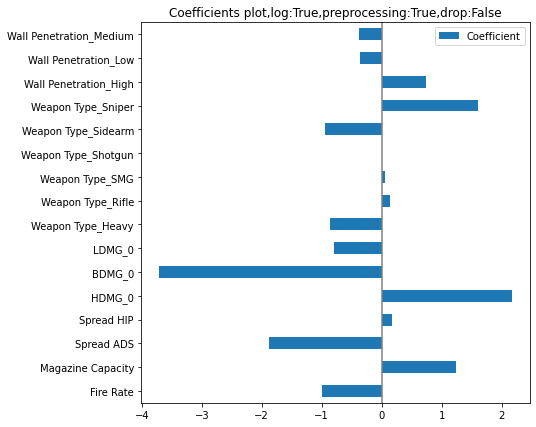
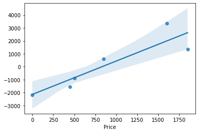
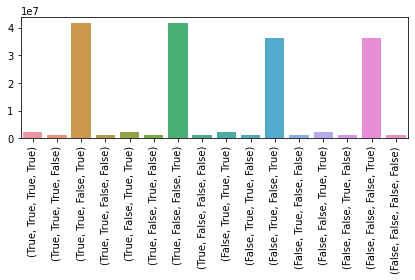
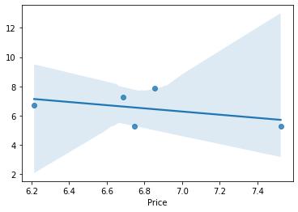

## Introduction 

Valorant is a free-to-play first-person hero shooter developed and published by Riot Games, for Microsoft Windows. First teased under the codename Project A in October 2019, the game began a closed beta period with limited access on April 7, 2020, followed by an official release on June 2, 2020.

[The weapons dataset](https://www.kaggle.com/aadhavvignesh/valorant-weapon-stats) is based on their first ever major tournament, Stage 2: "Masters" of the VCT (Valorant Champions Tour) 2021 which took place between 24th May and 30th May in Iceland.

And the new dataset is taken from the game directly (patch 4.04)


```python
import pandas as pd
import numpy as np
import matplotlib.pyplot as plt
import plotly.express as px
import plotly.graph_objects as go
from collections import Counter
import seaborn as sns
```


```python
from matplotlib import rcParams
rcParams['figure.figsize'] = 15,8
```

## Weapons


```python
df = pd.read_csv(r"C:\Users\anass\Programmation\EDA\Valorant\valorant-stats.csv")
df.head()
```


<div>
<style scoped>
    .dataframe tbody tr th:only-of-type {
        vertical-align: middle;
    }

    .dataframe tbody tr th {
        vertical-align: top;
    }

    .dataframe thead th {
        text-align: right;
    }
</style>
<table border="1" class="dataframe">
  <thead>
    <tr style="text-align: right;">
      <th></th>
      <th>Name</th>
      <th>Weapon Type</th>
      <th>Price</th>
      <th>Fire Rate</th>
      <th>Wall Penetration</th>
      <th>Magazine Capacity</th>
      <th>HDMG_0</th>
      <th>BDMG_0</th>
      <th>LDMG_0</th>
      <th>HDMG_1</th>
      <th>BDMG_1</th>
      <th>LDMG_1</th>
      <th>HDMG_2</th>
      <th>BDMG_2</th>
      <th>LDMG_2</th>
    </tr>
  </thead>
  <tbody>
    <tr>
      <th>0</th>
      <td>Classic</td>
      <td>Sidearm</td>
      <td>0</td>
      <td>6.75</td>
      <td>Low</td>
      <td>12</td>
      <td>78</td>
      <td>26</td>
      <td>22</td>
      <td>78</td>
      <td>26</td>
      <td>22</td>
      <td>66</td>
      <td>22</td>
      <td>18</td>
    </tr>
    <tr>
      <th>1</th>
      <td>Shorty</td>
      <td>Sidearm</td>
      <td>200</td>
      <td>3.30</td>
      <td>Low</td>
      <td>2</td>
      <td>36</td>
      <td>12</td>
      <td>10</td>
      <td>24</td>
      <td>8</td>
      <td>6</td>
      <td>9</td>
      <td>3</td>
      <td>2</td>
    </tr>
    <tr>
      <th>2</th>
      <td>Frenzy</td>
      <td>Sidearm</td>
      <td>400</td>
      <td>10.00</td>
      <td>Low</td>
      <td>13</td>
      <td>78</td>
      <td>26</td>
      <td>22</td>
      <td>63</td>
      <td>21</td>
      <td>17</td>
      <td>63</td>
      <td>21</td>
      <td>17</td>
    </tr>
    <tr>
      <th>3</th>
      <td>Ghost</td>
      <td>Sidearm</td>
      <td>500</td>
      <td>6.75</td>
      <td>Medium</td>
      <td>15</td>
      <td>105</td>
      <td>33</td>
      <td>26</td>
      <td>88</td>
      <td>25</td>
      <td>21</td>
      <td>88</td>
      <td>25</td>
      <td>21</td>
    </tr>
    <tr>
      <th>4</th>
      <td>Sheriff</td>
      <td>Sidearm</td>
      <td>800</td>
      <td>4.00</td>
      <td>High</td>
      <td>6</td>
      <td>160</td>
      <td>55</td>
      <td>47</td>
      <td>160</td>
      <td>55</td>
      <td>47</td>
      <td>145</td>
      <td>50</td>
      <td>43</td>
    </tr>
  </tbody>
</table>
</div>


```python
df.insert(6, "Spread HIP", [0.4,4,0.45,0.3,0.25,0.65,0.4,0.3,0.1,0.2,0.25,1,5,2.6,2.25,1,0.8], True)
df.insert(6, "Spread ADS", [0.4,4,0.45,0.3,0.25,0.5,0.25,0.3,0,0.11,0.157,0,0,2.6,2.25,0.9,0.79], True)
```


```python
df_old = df.copy()
```


```python
df_new = df.copy()
```


```python
df_new['Price'] = df_new['Price'].replace([200,400,1000,2100,2500,1100,4500,900,1500],[150,450,950,2050,2250,950,4700,850,1850])
df_new['Fire Rate'] = df_new['Fire Rate'].replace([3.30,18,9.15,6.5,9.25,0.75,10],[3.33,16,10,5.25,9.75,0.6,13])
#note: fire Rate of Odin increases overe time
df_new['HDMG_0'] = df_new['HDMG_0'].replace([36,160,116,156,55],[24,159,115,160,40])
df_new.at[9, 'HDMG_0'] = 156
df_new['BDMG_0'] = df_new['BDMG_0'].replace([33,22,39],[30,20,40])
df_new.at[9, 'BDMG_0'] = 39
df_new['LDMG_0'] = df_new['LDMG_0'].replace([26,47,23,30,49,33,127],[25,46,22,29,48,34,120])
df_new.at[9, 'LDMG_0'] = 33
#other minor changes damage/distance
df_new.at[10, 'HDMG_1'] = 160
df_new.at[10, 'HDMG_2'] = 160
df_new.at[10, 'BDMG_1'] = 40
df_new.at[10, 'BDMG_2'] = 40
df_new.at[10, 'LDMG_1'] = 34
df_new.at[10, 'LDMG_2'] = 34
df_new.at[8, 'LDMG_1'] = 48
df_new.at[8, 'LDMG_2'] = 48
df_new.at[7, 'LDMG_1'] = 29
df_new.at[9, 'LDMG_2'] = 29
df_new.at[13, 'HDMG_2'] = 18
df_new.at[13, 'LDMG_2'] = 7
df_new.at[14, 'HDMG_1'] = 20
df_new.at[14, 'HDMG_2'] = 14
df_new.at[14, 'BDMG_1'] = 10
df_new.at[14, 'LDMG_2'] = 8
df_new.at[14, 'LDMG_1'] = 5
```


```python
df_new.head()
```


<div>
<style scoped>
    .dataframe tbody tr th:only-of-type {
        vertical-align: middle;
    }

    .dataframe tbody tr th {
        vertical-align: top;
    }

    .dataframe thead th {
        text-align: right;
    }
</style>
<table border="1" class="dataframe">
  <thead>
    <tr style="text-align: right;">
      <th></th>
      <th>Name</th>
      <th>Weapon Type</th>
      <th>Price</th>
      <th>Fire Rate</th>
      <th>Wall Penetration</th>
      <th>Magazine Capacity</th>
      <th>Spread ADS</th>
      <th>Spread HIP</th>
      <th>HDMG_0</th>
      <th>BDMG_0</th>
      <th>LDMG_0</th>
      <th>HDMG_1</th>
      <th>BDMG_1</th>
      <th>LDMG_1</th>
      <th>HDMG_2</th>
      <th>BDMG_2</th>
      <th>LDMG_2</th>
    </tr>
  </thead>
  <tbody>
    <tr>
      <th>0</th>
      <td>Classic</td>
      <td>Sidearm</td>
      <td>0</td>
      <td>6.75</td>
      <td>Low</td>
      <td>12</td>
      <td>0.40</td>
      <td>0.40</td>
      <td>78</td>
      <td>26</td>
      <td>22</td>
      <td>78</td>
      <td>26</td>
      <td>22</td>
      <td>66</td>
      <td>22</td>
      <td>18</td>
    </tr>
    <tr>
      <th>1</th>
      <td>Shorty</td>
      <td>Sidearm</td>
      <td>150</td>
      <td>3.33</td>
      <td>Low</td>
      <td>2</td>
      <td>4.00</td>
      <td>4.00</td>
      <td>24</td>
      <td>12</td>
      <td>10</td>
      <td>24</td>
      <td>8</td>
      <td>6</td>
      <td>9</td>
      <td>3</td>
      <td>2</td>
    </tr>
    <tr>
      <th>2</th>
      <td>Frenzy</td>
      <td>Sidearm</td>
      <td>450</td>
      <td>13.00</td>
      <td>Low</td>
      <td>13</td>
      <td>0.45</td>
      <td>0.45</td>
      <td>78</td>
      <td>26</td>
      <td>22</td>
      <td>63</td>
      <td>21</td>
      <td>17</td>
      <td>63</td>
      <td>21</td>
      <td>17</td>
    </tr>
    <tr>
      <th>3</th>
      <td>Ghost</td>
      <td>Sidearm</td>
      <td>500</td>
      <td>6.75</td>
      <td>Medium</td>
      <td>15</td>
      <td>0.30</td>
      <td>0.30</td>
      <td>105</td>
      <td>30</td>
      <td>25</td>
      <td>88</td>
      <td>25</td>
      <td>21</td>
      <td>88</td>
      <td>25</td>
      <td>21</td>
    </tr>
    <tr>
      <th>4</th>
      <td>Sheriff</td>
      <td>Sidearm</td>
      <td>800</td>
      <td>4.00</td>
      <td>High</td>
      <td>6</td>
      <td>0.25</td>
      <td>0.25</td>
      <td>159</td>
      <td>55</td>
      <td>46</td>
      <td>160</td>
      <td>55</td>
      <td>47</td>
      <td>145</td>
      <td>50</td>
      <td>43</td>
    </tr>
  </tbody>
</table>
</div>


###  Difference between old weapon stats and new stats


```python
df_diff=df_new[['Price','Fire Rate','HDMG_0','BDMG_0','LDMG_0']].subtract(df_old[['Price','Fire Rate','HDMG_0','BDMG_0','LDMG_0']])
df_diff=df_diff.set_index(df_new['Name'])
df_diff = df_diff[(df_diff.T != 0).any()]
print("The difference between old weapon stats and new stats")
df_diff
```

    The difference between old weapon stats and new stats
    


<div>
<style scoped>
    .dataframe tbody tr th:only-of-type {
        vertical-align: middle;
    }

    .dataframe tbody tr th {
        vertical-align: top;
    }

    .dataframe thead th {
        text-align: right;
    }
</style>
<table border="1" class="dataframe">
  <thead>
    <tr style="text-align: right;">
      <th></th>
      <th>Price</th>
      <th>Fire Rate</th>
      <th>HDMG_0</th>
      <th>BDMG_0</th>
      <th>LDMG_0</th>
    </tr>
    <tr>
      <th>Name</th>
      <th></th>
      <th></th>
      <th></th>
      <th></th>
      <th></th>
    </tr>
  </thead>
  <tbody>
    <tr>
      <th>Shorty</th>
      <td>-50</td>
      <td>0.03</td>
      <td>-12</td>
      <td>0</td>
      <td>0</td>
    </tr>
    <tr>
      <th>Frenzy</th>
      <td>50</td>
      <td>3.00</td>
      <td>0</td>
      <td>0</td>
      <td>0</td>
    </tr>
    <tr>
      <th>Ghost</th>
      <td>0</td>
      <td>0.00</td>
      <td>0</td>
      <td>-3</td>
      <td>-1</td>
    </tr>
    <tr>
      <th>Sheriff</th>
      <td>0</td>
      <td>0.00</td>
      <td>-1</td>
      <td>0</td>
      <td>-1</td>
    </tr>
    <tr>
      <th>Stinger</th>
      <td>-50</td>
      <td>-2.00</td>
      <td>0</td>
      <td>0</td>
      <td>-1</td>
    </tr>
    <tr>
      <th>Bulldog</th>
      <td>-50</td>
      <td>0.85</td>
      <td>-1</td>
      <td>0</td>
      <td>-1</td>
    </tr>
    <tr>
      <th>Guardian</th>
      <td>-250</td>
      <td>-1.25</td>
      <td>0</td>
      <td>0</td>
      <td>-1</td>
    </tr>
    <tr>
      <th>Vandal</th>
      <td>0</td>
      <td>0.50</td>
      <td>4</td>
      <td>1</td>
      <td>1</td>
    </tr>
    <tr>
      <th>Marshall</th>
      <td>-150</td>
      <td>0.00</td>
      <td>0</td>
      <td>0</td>
      <td>0</td>
    </tr>
    <tr>
      <th>Operator</th>
      <td>200</td>
      <td>-0.15</td>
      <td>0</td>
      <td>0</td>
      <td>-7</td>
    </tr>
    <tr>
      <th>Bucky</th>
      <td>-50</td>
      <td>0.00</td>
      <td>-15</td>
      <td>-2</td>
      <td>0</td>
    </tr>
    <tr>
      <th>Judge</th>
      <td>350</td>
      <td>0.00</td>
      <td>0</td>
      <td>0</td>
      <td>0</td>
    </tr>
    <tr>
      <th>Ares</th>
      <td>0</td>
      <td>3.00</td>
      <td>0</td>
      <td>0</td>
      <td>0</td>
    </tr>
  </tbody>
</table>
</div>


###  Prices


```python
def return_sorted(col_name):
    sorted_df = df_new.sort_values(by=col_name)
    return {'weapon': sorted_df['Name'].to_list(), 'values': sorted_df[col_name].to_list()}
```


```python
price_dict = return_sorted('Price')

fig_prices=  sns.barplot(x="weapon", y="values", data=price_dict) 
fig_prices.set_title('Prices Distribution');
```


    

    


```python
sns.kdeplot(data=df_diff['Price'], shade=True);

```


    

    


###  Types of weapons 


```python
from plotly.offline import init_notebook_mode, iplot
init_notebook_mode(connected=True)  

weapon_type = dict(Counter(df_new['Weapon Type']))
weapon_type = {'Weapon Type': list(weapon_type.keys()), 'count': list(weapon_type.values())}
fig=  plt.pie(weapon_type['count'], labels=weapon_type['Weapon Type'], autopct = '%0.0f%%')
plt.title('Weapon Type Distribution');

```


<script type="text/javascript">
window.PlotlyConfig = {MathJaxConfig: 'local'};
if (window.MathJax) {MathJax.Hub.Config({SVG: {font: "STIX-Web"}});}
if (typeof require !== 'undefined') {
require.undef("plotly");
requirejs.config({
    paths: {
        'plotly': ['https://cdn.plot.ly/plotly-2.2.0.min']
    }
});
require(['plotly'], function(Plotly) {
    window._Plotly = Plotly;
});
}
</script>


    

    


```python


headshot_dict = return_sorted('HDMG_0')
bodyshot_dict = return_sorted('BDMG_0')


sns.barplot(x="weapon", y="values", data=headshot_dict) 
plt.xticks(rotation=70)
plt.tight_layout()
plt.title('Weapon Headshot Distribution');


```


    

    


```python


sns.barplot(x="weapon", y="values", data=bodyshot_dict) 
plt.xticks(rotation=70)
plt.tight_layout()
plt.title('Weapon Bodyshot Distribution');

```


    

    


### Models :


```python
df_new.describe()
```


<div>
<style scoped>
    .dataframe tbody tr th:only-of-type {
        vertical-align: middle;
    }

    .dataframe tbody tr th {
        vertical-align: top;
    }

    .dataframe thead th {
        text-align: right;
    }
</style>
<table border="1" class="dataframe">
  <thead>
    <tr style="text-align: right;">
      <th></th>
      <th>Price</th>
      <th>Fire Rate</th>
      <th>Magazine Capacity</th>
      <th>Spread ADS</th>
      <th>Spread HIP</th>
      <th>HDMG_0</th>
      <th>BDMG_0</th>
      <th>LDMG_0</th>
      <th>HDMG_1</th>
      <th>BDMG_1</th>
      <th>LDMG_1</th>
      <th>HDMG_2</th>
      <th>BDMG_2</th>
      <th>LDMG_2</th>
    </tr>
  </thead>
  <tbody>
    <tr>
      <th>count</th>
      <td>17.000000</td>
      <td>17.000000</td>
      <td>17.000000</td>
      <td>17.000000</td>
      <td>17.000000</td>
      <td>17.000000</td>
      <td>17.000000</td>
      <td>17.000000</td>
      <td>17.000000</td>
      <td>17.000000</td>
      <td>17.000000</td>
      <td>17.000000</td>
      <td>17.000000</td>
      <td>17.000000</td>
    </tr>
    <tr>
      <th>mean</th>
      <td>1629.411765</td>
      <td>7.697647</td>
      <td>21.235294</td>
      <td>0.779824</td>
      <td>1.173529</td>
      <td>112.529412</td>
      <td>43.352941</td>
      <td>35.764706</td>
      <td>107.647059</td>
      <td>41.352941</td>
      <td>34.176471</td>
      <td>101.588235</td>
      <td>39.294118</td>
      <td>32.764706</td>
    </tr>
    <tr>
      <th>std</th>
      <td>1261.578726</td>
      <td>4.913525</td>
      <td>23.823647</td>
      <td>1.114471</td>
      <td>1.443749</td>
      <td>65.352044</td>
      <td>34.622863</td>
      <td>27.673384</td>
      <td>67.755942</td>
      <td>35.862482</td>
      <td>30.406075</td>
      <td>70.336743</td>
      <td>36.706206</td>
      <td>30.918298</td>
    </tr>
    <tr>
      <th>min</th>
      <td>0.000000</td>
      <td>0.600000</td>
      <td>2.000000</td>
      <td>0.000000</td>
      <td>0.100000</td>
      <td>24.000000</td>
      <td>12.000000</td>
      <td>10.000000</td>
      <td>20.000000</td>
      <td>8.000000</td>
      <td>5.000000</td>
      <td>9.000000</td>
      <td>3.000000</td>
      <td>2.000000</td>
    </tr>
    <tr>
      <th>25%</th>
      <td>800.000000</td>
      <td>3.500000</td>
      <td>6.000000</td>
      <td>0.157000</td>
      <td>0.300000</td>
      <td>72.000000</td>
      <td>26.000000</td>
      <td>22.000000</td>
      <td>63.000000</td>
      <td>22.000000</td>
      <td>18.000000</td>
      <td>63.000000</td>
      <td>22.000000</td>
      <td>18.000000</td>
    </tr>
    <tr>
      <th>50%</th>
      <td>1600.000000</td>
      <td>6.750000</td>
      <td>13.000000</td>
      <td>0.300000</td>
      <td>0.450000</td>
      <td>95.000000</td>
      <td>30.000000</td>
      <td>25.000000</td>
      <td>88.000000</td>
      <td>30.000000</td>
      <td>25.000000</td>
      <td>77.000000</td>
      <td>28.000000</td>
      <td>23.000000</td>
    </tr>
    <tr>
      <th>75%</th>
      <td>2250.000000</td>
      <td>12.000000</td>
      <td>25.000000</td>
      <td>0.790000</td>
      <td>1.000000</td>
      <td>159.000000</td>
      <td>40.000000</td>
      <td>34.000000</td>
      <td>160.000000</td>
      <td>40.000000</td>
      <td>34.000000</td>
      <td>145.000000</td>
      <td>40.000000</td>
      <td>34.000000</td>
    </tr>
    <tr>
      <th>max</th>
      <td>4700.000000</td>
      <td>16.000000</td>
      <td>100.000000</td>
      <td>4.000000</td>
      <td>5.000000</td>
      <td>255.000000</td>
      <td>150.000000</td>
      <td>120.000000</td>
      <td>255.000000</td>
      <td>150.000000</td>
      <td>127.000000</td>
      <td>255.000000</td>
      <td>150.000000</td>
      <td>127.000000</td>
    </tr>
  </tbody>
</table>
</div>


```python
df_new=df_new.set_index("Name")

```


```python
df_anal=df_new.iloc[:, :10]
cols = df_anal.columns.tolist()
cols = [cols[0]]+cols[2:]+[cols[1]]
df_anal = df_anal[cols] 
df_anal
```


<div>
<style scoped>
    .dataframe tbody tr th:only-of-type {
        vertical-align: middle;
    }

    .dataframe tbody tr th {
        vertical-align: top;
    }

    .dataframe thead th {
        text-align: right;
    }
</style>
<table border="1" class="dataframe">
  <thead>
    <tr style="text-align: right;">
      <th></th>
      <th>Weapon Type</th>
      <th>Fire Rate</th>
      <th>Wall Penetration</th>
      <th>Magazine Capacity</th>
      <th>Spread ADS</th>
      <th>Spread HIP</th>
      <th>HDMG_0</th>
      <th>BDMG_0</th>
      <th>LDMG_0</th>
      <th>Price</th>
    </tr>
    <tr>
      <th>Name</th>
      <th></th>
      <th></th>
      <th></th>
      <th></th>
      <th></th>
      <th></th>
      <th></th>
      <th></th>
      <th></th>
      <th></th>
    </tr>
  </thead>
  <tbody>
    <tr>
      <th>Classic</th>
      <td>Sidearm</td>
      <td>6.75</td>
      <td>Low</td>
      <td>12</td>
      <td>0.400</td>
      <td>0.40</td>
      <td>78</td>
      <td>26</td>
      <td>22</td>
      <td>0</td>
    </tr>
    <tr>
      <th>Shorty</th>
      <td>Sidearm</td>
      <td>3.33</td>
      <td>Low</td>
      <td>2</td>
      <td>4.000</td>
      <td>4.00</td>
      <td>24</td>
      <td>12</td>
      <td>10</td>
      <td>150</td>
    </tr>
    <tr>
      <th>Frenzy</th>
      <td>Sidearm</td>
      <td>13.00</td>
      <td>Low</td>
      <td>13</td>
      <td>0.450</td>
      <td>0.45</td>
      <td>78</td>
      <td>26</td>
      <td>22</td>
      <td>450</td>
    </tr>
    <tr>
      <th>Ghost</th>
      <td>Sidearm</td>
      <td>6.75</td>
      <td>Medium</td>
      <td>15</td>
      <td>0.300</td>
      <td>0.30</td>
      <td>105</td>
      <td>30</td>
      <td>25</td>
      <td>500</td>
    </tr>
    <tr>
      <th>Sheriff</th>
      <td>Sidearm</td>
      <td>4.00</td>
      <td>High</td>
      <td>6</td>
      <td>0.250</td>
      <td>0.25</td>
      <td>159</td>
      <td>55</td>
      <td>46</td>
      <td>800</td>
    </tr>
    <tr>
      <th>Stinger</th>
      <td>SMG</td>
      <td>16.00</td>
      <td>Low</td>
      <td>20</td>
      <td>0.500</td>
      <td>0.65</td>
      <td>67</td>
      <td>27</td>
      <td>22</td>
      <td>950</td>
    </tr>
    <tr>
      <th>Spectre</th>
      <td>SMG</td>
      <td>13.33</td>
      <td>Medium</td>
      <td>30</td>
      <td>0.250</td>
      <td>0.40</td>
      <td>78</td>
      <td>26</td>
      <td>22</td>
      <td>1600</td>
    </tr>
    <tr>
      <th>Bulldog</th>
      <td>Rifle</td>
      <td>10.00</td>
      <td>Medium</td>
      <td>24</td>
      <td>0.300</td>
      <td>0.30</td>
      <td>115</td>
      <td>35</td>
      <td>29</td>
      <td>2050</td>
    </tr>
    <tr>
      <th>Guardian</th>
      <td>Rifle</td>
      <td>5.25</td>
      <td>Medium</td>
      <td>12</td>
      <td>0.000</td>
      <td>0.10</td>
      <td>195</td>
      <td>65</td>
      <td>48</td>
      <td>2250</td>
    </tr>
    <tr>
      <th>Phantom</th>
      <td>Rifle</td>
      <td>11.00</td>
      <td>Medium</td>
      <td>30</td>
      <td>0.110</td>
      <td>0.20</td>
      <td>156</td>
      <td>39</td>
      <td>33</td>
      <td>2900</td>
    </tr>
    <tr>
      <th>Vandal</th>
      <td>Rifle</td>
      <td>9.75</td>
      <td>Medium</td>
      <td>25</td>
      <td>0.157</td>
      <td>0.25</td>
      <td>160</td>
      <td>40</td>
      <td>34</td>
      <td>2900</td>
    </tr>
    <tr>
      <th>Marshall</th>
      <td>Sniper</td>
      <td>1.50</td>
      <td>Medium</td>
      <td>5</td>
      <td>0.000</td>
      <td>1.00</td>
      <td>202</td>
      <td>101</td>
      <td>85</td>
      <td>950</td>
    </tr>
    <tr>
      <th>Operator</th>
      <td>Sniper</td>
      <td>0.60</td>
      <td>High</td>
      <td>5</td>
      <td>0.000</td>
      <td>5.00</td>
      <td>255</td>
      <td>150</td>
      <td>120</td>
      <td>4700</td>
    </tr>
    <tr>
      <th>Bucky</th>
      <td>Shotgun</td>
      <td>1.10</td>
      <td>Low</td>
      <td>5</td>
      <td>2.600</td>
      <td>2.60</td>
      <td>40</td>
      <td>20</td>
      <td>19</td>
      <td>850</td>
    </tr>
    <tr>
      <th>Judge</th>
      <td>Shotgun</td>
      <td>3.50</td>
      <td>Medium</td>
      <td>7</td>
      <td>2.250</td>
      <td>2.25</td>
      <td>34</td>
      <td>17</td>
      <td>14</td>
      <td>1850</td>
    </tr>
    <tr>
      <th>Ares</th>
      <td>Heavy</td>
      <td>13.00</td>
      <td>High</td>
      <td>50</td>
      <td>0.900</td>
      <td>1.00</td>
      <td>72</td>
      <td>30</td>
      <td>25</td>
      <td>1600</td>
    </tr>
    <tr>
      <th>Odin</th>
      <td>Heavy</td>
      <td>12.00</td>
      <td>High</td>
      <td>100</td>
      <td>0.790</td>
      <td>0.80</td>
      <td>95</td>
      <td>38</td>
      <td>32</td>
      <td>3200</td>
    </tr>
  </tbody>
</table>
</div>


```python
# Correlation matrix
# from https://www.kaggle.com/kerneler/starter-valorant-weapon-stats-f856dcf8-1
def plotCorrelationMatrix(df, graphWidth):

    df = df.dropna('columns') # drop columns with NaN
    df = df[[col for col in df if df[col].nunique() > 1]] # keep columns where there are more than 1 unique values
    if df.shape[1] < 2:
        print(f'No correlation plots shown: The number of non-NaN or constant columns ({df.shape[1]}) is less than 2')
        return
    corr = df.corr()
    plt.figure(num=None, figsize=(graphWidth, graphWidth), dpi=80, facecolor='w', edgecolor='k')
    corrMat = plt.matshow(corr, fignum = 1)
    plt.xticks(range(len(corr.columns)), corr.columns, rotation=90)
    plt.yticks(range(len(corr.columns)), corr.columns)
    plt.gca().xaxis.tick_bottom()
    plt.colorbar(corrMat)
    plt.title(f'Correlation Matrix for the weapons dataframe', fontsize=15)
    plt.show()
```


```python
plotCorrelationMatrix(df_new, 8)


```

    C:\Users\anass\AppData\Local\Temp/ipykernel_82712/3485586321.py:5: FutureWarning:
    
    In a future version of pandas all arguments of DataFrame.dropna will be keyword-only.
    
    


    

    


```python
import warnings
warnings.filterwarnings('ignore')
sns.pairplot(df_anal);

```


    

    


```python
sns.pairplot(df_anal,hue='Weapon Type');
#,hue='Gender'
```


    

    


What we can see here us that the damages (Head, body and leg ) are correlated between each other. The price is kind of correlated with the damage and the magazine capacity (with some outliers). And the fire rate is kind of independent from the rest.

First we try with categorical variables, then without categorical variables.

The dataset set is small so there isn't much to draw from it but we are just playing


```python

def get_X_y(columns):
    X = df_anal[columns] #
    Y = df_anal['Price']
    X = pd.get_dummies(data=X)#, drop_first=True)
    return X,Y

```


```python
from sklearn.model_selection import train_test_split
from sklearn.linear_model import LinearRegression
import statsmodels.api as sm
from sklearn.metrics import mean_squared_error as msr
from sklearn.preprocessing import MinMaxScaler

def model_analysis(X,Y,loga=False,drop_first=False,preprocessing = True):
    if loga:
        # We shouldnt have any negative values so we might try the Logarithm
        Y_log = Y.apply(lambda x: np.log(x))
        Y_log = Y_log.drop(labels=['Classic'])
        X = X.drop(['Classic'])
        X = pd.get_dummies(data=X, drop_first=drop_first)
        Y = Y_log
    if preprocessing :
        scaler = MinMaxScaler()
        X_tr=scaler.fit_transform(X)
        X=pd.DataFrame(X_tr, index=X.index, columns=X.columns)
        
    X_train, X_test, y_train, y_test = train_test_split(X, Y, test_size=0.3, random_state=101)
    model = LinearRegression()
    model.fit(X_train,y_train)
    coeff_parameter = pd.DataFrame(model.coef_,X.columns,columns=['Coefficient'])
    predictions = model.predict(X_test)
    sns.regplot(y_test,predictions)
    X_train_Sm= sm.add_constant(X_train)
    ls=sm.OLS(y_train,X_train_Sm).fit()
    print(ls.summary())
    if loga:
        #test_score = model.score(X_test, y_test)
        model_score = model.score(X, Y)
        test_score = msr(np.exp(model.predict(X_test)), np.exp(y_test))
        model_score2 = msr(np.exp(model.predict(X)), np.exp(Y_log))

    
    else:
        #test_score = model.score(X_test, y_test)
        model_score = model.score(X, Y)
        test_score = msr(model.predict(X_test),y_test)
        model_score2 = msr(model.predict(X),Y)


    return coeff_parameter,test_score,model_score,model_score2

    
    
    
```


```python
def model_analysis_no_plot(X,Y,loga=False,drop_first=False,preprocessing = True):
    if loga:
        # We shouldnt have any negative values so we might try the Logarithm
        Y_log = Y.apply(lambda x: np.log(x))
        Y_log = Y_log.drop(labels=['Classic'])
        X = X.drop(['Classic'])
        X = pd.get_dummies(data=X, drop_first=drop_first)
        Y = Y_log
    if preprocessing :
        scaler = MinMaxScaler()
        X_tr=scaler.fit_transform(X)
        X=pd.DataFrame(X_tr, index=X.index, columns=X.columns)
        
    X_train, X_test, y_train, y_test = train_test_split(X, Y, test_size=0.3, random_state=101)
    model = LinearRegression()
    model.fit(X_train,y_train)
    predictions = model.predict(X_test)

    if loga:

        test_score = msr(np.exp(model.predict(X_test)), np.exp(y_test))
        model_score = msr(np.exp(model.predict(X)), np.exp(Y_log))

    
    else:
        test_score = msr(model.predict(X_test),y_test)
        model_score = msr(model.predict(X),Y)


    return test_score,model_score,model

```


```python
columns=['Weapon Type', 'Wall Penetration','Fire Rate','Magazine Capacity','Spread ADS','Spread HIP','HDMG_0','BDMG_0','LDMG_0']
X,Y = get_X_y(columns)     
X.head()
```


<div>
<style scoped>
    .dataframe tbody tr th:only-of-type {
        vertical-align: middle;
    }

    .dataframe tbody tr th {
        vertical-align: top;
    }

    .dataframe thead th {
        text-align: right;
    }
</style>
<table border="1" class="dataframe">
  <thead>
    <tr style="text-align: right;">
      <th></th>
      <th>Fire Rate</th>
      <th>Magazine Capacity</th>
      <th>Spread ADS</th>
      <th>Spread HIP</th>
      <th>HDMG_0</th>
      <th>BDMG_0</th>
      <th>LDMG_0</th>
      <th>Weapon Type_Heavy</th>
      <th>Weapon Type_Rifle</th>
      <th>Weapon Type_SMG</th>
      <th>Weapon Type_Shotgun</th>
      <th>Weapon Type_Sidearm</th>
      <th>Weapon Type_Sniper</th>
      <th>Wall Penetration_High</th>
      <th>Wall Penetration_Low</th>
      <th>Wall Penetration_Medium</th>
    </tr>
    <tr>
      <th>Name</th>
      <th></th>
      <th></th>
      <th></th>
      <th></th>
      <th></th>
      <th></th>
      <th></th>
      <th></th>
      <th></th>
      <th></th>
      <th></th>
      <th></th>
      <th></th>
      <th></th>
      <th></th>
      <th></th>
    </tr>
  </thead>
  <tbody>
    <tr>
      <th>Classic</th>
      <td>6.75</td>
      <td>12</td>
      <td>0.40</td>
      <td>0.40</td>
      <td>78</td>
      <td>26</td>
      <td>22</td>
      <td>0</td>
      <td>0</td>
      <td>0</td>
      <td>0</td>
      <td>1</td>
      <td>0</td>
      <td>0</td>
      <td>1</td>
      <td>0</td>
    </tr>
    <tr>
      <th>Shorty</th>
      <td>3.33</td>
      <td>2</td>
      <td>4.00</td>
      <td>4.00</td>
      <td>24</td>
      <td>12</td>
      <td>10</td>
      <td>0</td>
      <td>0</td>
      <td>0</td>
      <td>0</td>
      <td>1</td>
      <td>0</td>
      <td>0</td>
      <td>1</td>
      <td>0</td>
    </tr>
    <tr>
      <th>Frenzy</th>
      <td>13.00</td>
      <td>13</td>
      <td>0.45</td>
      <td>0.45</td>
      <td>78</td>
      <td>26</td>
      <td>22</td>
      <td>0</td>
      <td>0</td>
      <td>0</td>
      <td>0</td>
      <td>1</td>
      <td>0</td>
      <td>0</td>
      <td>1</td>
      <td>0</td>
    </tr>
    <tr>
      <th>Ghost</th>
      <td>6.75</td>
      <td>15</td>
      <td>0.30</td>
      <td>0.30</td>
      <td>105</td>
      <td>30</td>
      <td>25</td>
      <td>0</td>
      <td>0</td>
      <td>0</td>
      <td>0</td>
      <td>1</td>
      <td>0</td>
      <td>0</td>
      <td>0</td>
      <td>1</td>
    </tr>
    <tr>
      <th>Sheriff</th>
      <td>4.00</td>
      <td>6</td>
      <td>0.25</td>
      <td>0.25</td>
      <td>159</td>
      <td>55</td>
      <td>46</td>
      <td>0</td>
      <td>0</td>
      <td>0</td>
      <td>0</td>
      <td>1</td>
      <td>0</td>
      <td>1</td>
      <td>0</td>
      <td>0</td>
    </tr>
  </tbody>
</table>
</div>


Let's see some cases


```python
#for preprocessing in True,False :
#    for drop_first in True,False :
#        for loga in  True,False :

preprocessing,drop_first,loga = True, False, True
print('preprocessing:',preprocessing ,"--",'drop_first:',drop_first ,"--",'loga:',loga)
results = model_analysis(X,Y,loga=loga,drop_first=drop_first,preprocessing = preprocessing)
#coeff_parameter,test_score,model_score,model_score2
coeff_parameter = results[0]
coeff_parameter.plot(kind="barh", figsize=(9, 7))
plt.title("Coefficients plot,log:{},preprocessing:{},drop:{}".format(loga,preprocessing,drop_first))
plt.axvline(x=0, color=".5")
plt.subplots_adjust(left=0.3)
print("Model test error :", results[1])
print("Model total error :",results[3] )

```

    preprocessing: True -- drop_first: False -- loga: True
                                OLS Regression Results                            
    ==============================================================================
    Dep. Variable:                  Price   R-squared:                       1.000
    Model:                            OLS   Adj. R-squared:                    nan
    Method:                 Least Squares   F-statistic:                       nan
    Date:                Sat, 05 Mar 2022   Prob (F-statistic):                nan
    Time:                        21:01:37   Log-Likelihood:                 329.24
    No. Observations:                  11   AIC:                            -636.5
    Df Residuals:                       0   BIC:                            -632.1
    Df Model:                          10                                         
    Covariance Type:            nonrobust                                         
    ===========================================================================================
                                  coef    std err          t      P>|t|      [0.025      0.975]
    -------------------------------------------------------------------------------------------
    const                       5.2806        inf          0        nan         nan         nan
    Fire Rate                  -0.9532        inf         -0        nan         nan         nan
    Magazine Capacity           1.2337        inf          0        nan         nan         nan
    Spread ADS                 -2.0044        inf         -0        nan         nan         nan
    Spread HIP                  0.3846        inf          0        nan         nan         nan
    HDMG_0                      2.0795        inf          0        nan         nan         nan
    BDMG_0                     -4.0065        inf         -0        nan         nan         nan
    LDMG_0                     -0.1950        inf         -0        nan         nan         nan
    Weapon Type_Heavy           0.2138        inf          0        nan         nan         nan
    Weapon Type_Rifle           1.3001        inf          0        nan         nan         nan
    Weapon Type_SMG             1.2093        inf          0        nan         nan         nan
    Weapon Type_Shotgun              0        nan        nan        nan         nan         nan
    Weapon Type_Sidearm         0.2272        inf          0        nan         nan         nan
    Weapon Type_Sniper          2.3302        inf          0        nan         nan         nan
    Wall Penetration_High       2.5440        inf          0        nan         nan         nan
    Wall Penetration_Low        1.3701        inf          0        nan         nan         nan
    Wall Penetration_Medium     1.3665        inf          0        nan         nan         nan
    ==============================================================================
    Omnibus:                       20.841   Durbin-Watson:                   2.338
    Prob(Omnibus):                  0.000   Jarque-Bera (JB):               14.900
    Skew:                          -2.161   Prob(JB):                     0.000582
    Kurtosis:                       6.718   Cond. No.                         347.
    ==============================================================================
    
    Notes:
    [1] Standard Errors assume that the covariance matrix of the errors is correctly specified.
    [2] The input rank is higher than the number of observations.
    Model test error : 1993498.7978286124
    Model total error : 622968.3743214415
    


    

    


    

    


The price is positively correlated witht the head damage, but it is weird that's the coefficient is negative for the body damage. The spead is negative as expected, (HIP less infulential), and the fire rate has a negative coeff too. The category is having a considerable effect too.


```python
preprocessing,drop_first,loga = False, True, True
print('preprocessing:',preprocessing ,"--",'drop_first:',drop_first ,"--",'loga:',loga)
results = model_analysis(X,Y,loga=loga,drop_first=drop_first,preprocessing = preprocessing)
#coeff_parameter,test_score,model_score,model_score2
coeff_parameter = results[0]
coeff_parameter.plot(kind="barh", figsize=(9, 7))
plt.title("Coefficients plot,log:{},preprocessing:{},drop:{}".format(loga,preprocessing,drop_first))
plt.axvline(x=0, color=".5")
plt.subplots_adjust(left=0.3)
print("Model test error :", results[1])
print("Model total error :",results[3] )

```

    preprocessing: False -- drop_first: True -- loga: True
                                OLS Regression Results                            
    ==============================================================================
    Dep. Variable:                  Price   R-squared:                       1.000
    Model:                            OLS   Adj. R-squared:                    nan
    Method:                 Least Squares   F-statistic:                       nan
    Date:                Sat, 05 Mar 2022   Prob (F-statistic):                nan
    Time:                        21:01:37   Log-Likelihood:                 313.90
    No. Observations:                  11   AIC:                            -605.8
    Df Residuals:                       0   BIC:                            -601.4
    Df Model:                          10                                         
    Covariance Type:            nonrobust                                         
    ===========================================================================================
                                  coef    std err          t      P>|t|      [0.025      0.975]
    -------------------------------------------------------------------------------------------
    const                       1.4781        inf          0        nan         nan         nan
    Fire Rate                   0.1336        inf          0        nan         nan         nan
    Magazine Capacity          -0.0020        inf         -0        nan         nan         nan
    Spread ADS                  1.6953        inf          0        nan         nan         nan
    Spread HIP                 -1.2679        inf         -0        nan         nan         nan
    HDMG_0                     -0.0057        inf         -0        nan         nan         nan
    BDMG_0                     -0.1538        inf         -0        nan         nan         nan
    LDMG_0                      0.3172        inf          0        nan         nan         nan
    Weapon Type_Heavy           0.8321        inf          0        nan         nan         nan
    Weapon Type_Rifle           0.5062        inf          0        nan         nan         nan
    Weapon Type_SMG             0.6632        inf          0        nan         nan         nan
    Weapon Type_Shotgun              0        nan        nan        nan         nan         nan
    Weapon Type_Sidearm         0.0426        inf          0        nan         nan         nan
    Weapon Type_Sniper         -0.5661        inf         -0        nan         nan         nan
    Wall Penetration_High       0.2660        inf          0        nan         nan         nan
    Wall Penetration_Low        0.1493        inf          0        nan         nan         nan
    Wall Penetration_Medium     1.0628        inf          0        nan         nan         nan
    ==============================================================================
    Omnibus:                        0.832   Durbin-Watson:                   0.648
    Prob(Omnibus):                  0.660   Jarque-Bera (JB):                0.707
    Skew:                           0.490   Prob(JB):                        0.702
    Kurtosis:                       2.238   Cond. No.                     4.82e+03
    ==============================================================================
    
    Notes:
    [1] Standard Errors assume that the covariance matrix of the errors is correctly specified.
    [2] The input rank is higher than the number of observations.
    [3] The condition number is large, 4.82e+03. This might indicate that there are
    strong multicollinearity or other numerical problems.
    Model test error : 4034693.0969555243
    Model total error : 1260841.5927986014
    


    

    


    

    


Without scaling, the categorical coeff has more value, which expected (as an equilibrium with the previous case)


```python
preprocessing,drop_first,loga = True, False, False
print('preprocessing:',preprocessing ,"--",'drop_first:',drop_first ,"--",'loga:',loga)
results = model_analysis(X,Y,loga=loga,drop_first=drop_first,preprocessing = preprocessing)
#coeff_parameter,test_score,model_score,model_score2
coeff_parameter = results[0]
coeff_parameter.plot(kind="barh", figsize=(9, 7))
plt.title("Coefficients plot,log:{},preprocessing:{},drop:{}".format(loga,preprocessing,drop_first))
plt.axvline(x=0, color=".5")
plt.subplots_adjust(left=0.3)
print("Model test error :", results[1])
print("Model total error :",results[3])
```

    preprocessing: True -- drop_first: False -- loga: False
                                OLS Regression Results                            
    ==============================================================================
    Dep. Variable:                  Price   R-squared:                       1.000
    Model:                            OLS   Adj. R-squared:                    nan
    Method:                 Least Squares   F-statistic:                       nan
    Date:                Sat, 05 Mar 2022   Prob (F-statistic):                nan
    Time:                        21:01:38   Log-Likelihood:                 272.47
    No. Observations:                  11   AIC:                            -522.9
    Df Residuals:                       0   BIC:                            -518.6
    Df Model:                          10                                         
    Covariance Type:            nonrobust                                         
    ===========================================================================================
                                  coef    std err          t      P>|t|      [0.025      0.975]
    -------------------------------------------------------------------------------------------
    const                    -434.6740        inf         -0        nan         nan         nan
    Fire Rate                1382.6125        inf          0        nan         nan         nan
    Magazine Capacity        -185.6431        inf         -0        nan         nan         nan
    Spread ADS                806.5477        inf          0        nan         nan         nan
    Spread HIP               3563.2003        inf          0        nan         nan         nan
    HDMG_0                   6051.7006        inf          0        nan         nan         nan
    BDMG_0                  -4724.2348        inf         -0        nan         nan         nan
    LDMG_0                  -1500.4482        inf         -0        nan         nan         nan
    Weapon Type_Heavy         205.0651        inf          0        nan         nan         nan
    Weapon Type_Rifle         573.9149        inf          0        nan         nan         nan
    Weapon Type_SMG           339.4114        inf          0        nan         nan         nan
    Weapon Type_Shotgun              0        nan        nan        nan         nan         nan
    Weapon Type_Sidearm     -2049.6501        inf         -0        nan         nan         nan
    Weapon Type_Sniper        496.5848        inf          0        nan         nan         nan
    Wall Penetration_High    1253.5542        inf          0        nan         nan         nan
    Wall Penetration_Low    -1253.3397        inf         -0        nan         nan         nan
    Wall Penetration_Medium  -434.8885        inf         -0        nan         nan         nan
    ==============================================================================
    Omnibus:                        1.666   Durbin-Watson:                   0.846
    Prob(Omnibus):                  0.435   Jarque-Bera (JB):                1.096
    Skew:                          -0.716   Prob(JB):                        0.578
    Kurtosis:                       2.416   Cond. No.                         239.
    ==============================================================================
    
    Notes:
    [1] Standard Errors assume that the covariance matrix of the errors is correctly specified.
    [2] The input rank is higher than the number of observations.
    Model test error : 2331658.5946693993
    Model total error : 822938.3275303763
    


    

    


    

    


Now without the categories


```python
columns=['Fire Rate','Magazine Capacity','Spread ADS','Spread HIP','HDMG_0','BDMG_0','LDMG_0']
X,Y = get_X_y(columns)     
X.head()
```


<div>
<style scoped>
    .dataframe tbody tr th:only-of-type {
        vertical-align: middle;
    }

    .dataframe tbody tr th {
        vertical-align: top;
    }

    .dataframe thead th {
        text-align: right;
    }
</style>
<table border="1" class="dataframe">
  <thead>
    <tr style="text-align: right;">
      <th></th>
      <th>Fire Rate</th>
      <th>Magazine Capacity</th>
      <th>Spread ADS</th>
      <th>Spread HIP</th>
      <th>HDMG_0</th>
      <th>BDMG_0</th>
      <th>LDMG_0</th>
    </tr>
    <tr>
      <th>Name</th>
      <th></th>
      <th></th>
      <th></th>
      <th></th>
      <th></th>
      <th></th>
      <th></th>
    </tr>
  </thead>
  <tbody>
    <tr>
      <th>Classic</th>
      <td>6.75</td>
      <td>12</td>
      <td>0.40</td>
      <td>0.40</td>
      <td>78</td>
      <td>26</td>
      <td>22</td>
    </tr>
    <tr>
      <th>Shorty</th>
      <td>3.33</td>
      <td>2</td>
      <td>4.00</td>
      <td>4.00</td>
      <td>24</td>
      <td>12</td>
      <td>10</td>
    </tr>
    <tr>
      <th>Frenzy</th>
      <td>13.00</td>
      <td>13</td>
      <td>0.45</td>
      <td>0.45</td>
      <td>78</td>
      <td>26</td>
      <td>22</td>
    </tr>
    <tr>
      <th>Ghost</th>
      <td>6.75</td>
      <td>15</td>
      <td>0.30</td>
      <td>0.30</td>
      <td>105</td>
      <td>30</td>
      <td>25</td>
    </tr>
    <tr>
      <th>Sheriff</th>
      <td>4.00</td>
      <td>6</td>
      <td>0.25</td>
      <td>0.25</td>
      <td>159</td>
      <td>55</td>
      <td>46</td>
    </tr>
  </tbody>
</table>
</div>


```python
preprocessing,drop_first,loga = True, True, True
#the drop_first doesnt matter here
print('preprocessing:',preprocessing ,"--",'drop_first:',drop_first ,"--",'loga:',loga)
results = model_analysis(X,Y,loga=loga,drop_first=drop_first,preprocessing = preprocessing)
#coeff_parameter,test_score,model_score,model_score2
coeff_parameter = results[0]
coeff_parameter.plot(kind="barh", figsize=(9, 7))
plt.title("Coefficients plot,log:{},preprocessing:{},drop:{}".format(loga,preprocessing,drop_first))
plt.axvline(x=0, color=".5")
plt.subplots_adjust(left=0.3)
print("Model test error :", results[1])
print("Model total error :",results[3])
```

    preprocessing: True -- drop_first: True -- loga: True
                                OLS Regression Results                            
    ==============================================================================
    Dep. Variable:                  Price   R-squared:                       0.950
    Model:                            OLS   Adj. R-squared:                  0.833
    Method:                 Least Squares   F-statistic:                     8.105
    Date:                Sat, 05 Mar 2022   Prob (F-statistic):             0.0567
    Time:                        21:01:38   Log-Likelihood:                 1.3805
    No. Observations:                  11   AIC:                             13.24
    Df Residuals:                       3   BIC:                             16.42
    Df Model:                           7                                         
    Covariance Type:            nonrobust                                         
    =====================================================================================
                            coef    std err          t      P>|t|      [0.025      0.975]
    -------------------------------------------------------------------------------------
    const                 7.3929      2.646      2.794      0.068      -1.029      15.815
    Fire Rate            -0.6564      2.074     -0.317      0.772      -7.257       5.944
    Magazine Capacity     2.9882      1.437      2.080      0.129      -1.584       7.560
    Spread ADS           -9.3208      7.878     -1.183      0.322     -34.392      15.750
    Spread HIP            8.8874      8.215      1.082      0.359     -17.256      35.031
    HDMG_0                6.1060      4.053      1.506      0.229      -6.793      19.005
    BDMG_0               15.4863     23.029      0.672      0.549     -57.801      88.773
    LDMG_0              -29.5039     34.773     -0.848      0.459    -140.168      81.160
    ==============================================================================
    Omnibus:                        1.388   Durbin-Watson:                   2.748
    Prob(Omnibus):                  0.499   Jarque-Bera (JB):                0.081
    Skew:                          -0.127   Prob(JB):                        0.960
    Kurtosis:                       3.337   Cond. No.                         467.
    ==============================================================================
    
    Notes:
    [1] Standard Errors assume that the covariance matrix of the errors is correctly specified.
    Model test error : 979903.678594393
    Model total error : 375070.11838569085
    


    

    


    

    


It's weird that the Leg damage has a relatively big coefficient (in the absolute value), and that the HIP has a positive coefficient.
Note that while the error is big the performance of the model is better than without the spread variables.


```python
preprocessing,drop_first,loga = False, True, False
#the drop_first doesnt matter here
print('preprocessing:',preprocessing ,"--",'drop_first:',drop_first ,"--",'loga:',loga)
results = model_analysis(X,Y,loga=loga,drop_first=drop_first,preprocessing = preprocessing)
#coeff_parameter,test_score,model_score,model_score2
coeff_parameter = results[0]
coeff_parameter.plot(kind="barh", figsize=(9, 7))
plt.title("Coefficients plot,log:{},preprocessing:{},drop:{}".format(loga,preprocessing,drop_first))
plt.axvline(x=0, color=".5")
plt.subplots_adjust(left=0.3)
print("Model test error :", results[1])
print("Model total error :",results[3])
```

    preprocessing: False -- drop_first: True -- loga: False
                                OLS Regression Results                            
    ==============================================================================
    Dep. Variable:                  Price   R-squared:                       0.985
    Model:                            OLS   Adj. R-squared:                  0.949
    Method:                 Least Squares   F-statistic:                     27.43
    Date:                Sat, 05 Mar 2022   Prob (F-statistic):             0.0101
    Time:                        21:01:38   Log-Likelihood:                -71.227
    No. Observations:                  11   AIC:                             158.5
    Df Residuals:                       3   BIC:                             161.6
    Df Model:                           7                                         
    Covariance Type:            nonrobust                                         
    =====================================================================================
                            coef    std err          t      P>|t|      [0.025      0.975]
    -------------------------------------------------------------------------------------
    const              -885.7179   1784.363     -0.496      0.654   -6564.359    4792.923
    Fire Rate            39.3979     79.660      0.495      0.655    -214.115     292.911
    Magazine Capacity    28.1403      4.700      5.987      0.009      13.183      43.098
    Spread ADS        -1013.4148    532.605     -1.903      0.153   -2708.400     681.571
    Spread HIP         1210.3934    245.350      4.933      0.016     429.581    1991.206
    HDMG_0               29.8647      5.852      5.103      0.015      11.240      48.489
    BDMG_0              -18.3923     44.543     -0.413      0.707    -160.149     123.364
    LDMG_0              -45.5457     51.049     -0.892      0.438    -208.007     116.916
    ==============================================================================
    Omnibus:                        2.506   Durbin-Watson:                   2.201
    Prob(Omnibus):                  0.286   Jarque-Bera (JB):                0.330
    Skew:                           0.021   Prob(JB):                        0.848
    Kurtosis:                       3.848   Cond. No.                     3.56e+03
    ==============================================================================
    
    Notes:
    [1] Standard Errors assume that the covariance matrix of the errors is correctly specified.
    [2] The condition number is large, 3.56e+03. This might indicate that there are
    strong multicollinearity or other numerical problems.
    Model test error : 1013268.5170922922
    Model total error : 373573.136709475
    


    

    


    

    


```python
#comparing errors
error_total = dict()
error_test =  dict()
for preprocessing in True,False :
    for drop_first in True,False :
        for loga in  True,False :
            for category in  True,False :
                if category == True :
                    columns = ['Weapon Type', 'Wall Penetration','Fire Rate','Magazine Capacity','HDMG_0','BDMG_0','LDMG_0']
                else :
                    columns = ['Fire Rate','Magazine Capacity','HDMG_0','BDMG_0','LDMG_0']
                X,Y = get_X_y(columns) 
                results = model_analysis_no_plot(X,Y,loga=loga,drop_first=drop_first,preprocessing = preprocessing)
                error_total[str((preprocessing,drop_first,loga,category))]=results[1]
                error_test[str((preprocessing,drop_first,loga,category))]=results[0]


#plt.bar(list(error_total.keys()), list(error_total.values()))
sns.barplot(x=list(error_total.keys()),y=list(error_total.values()));
plt.xticks(rotation=90)
plt.tight_layout()
```


    

    


```python
sns.barplot(x=list(error_test.keys()),y=list(error_test.values()));
plt.xticks(rotation=90)
plt.tight_layout()
```


    

    


```python
# without the four outliers
outliers= [(True, True, False, True),(True, False, False, True),(False, True, False, True),(False, False, False, True)]
for outlier in outliers:
    del error_total[str(outlier)]
    del error_test[str(outlier)]
```


```python
sns.barplot(x=list(error_total.keys()),y=list(error_total.values()));
plt.xticks(rotation=90)
plt.tight_layout()
```


    

    


```python
sns.barplot(x=list(error_test.keys()),y=list(error_test.values()));
plt.xticks(rotation=90)
plt.tight_layout()
```


    

    


All the errors are huge, this is not something to model with linear regression , also other variables aren't taken into consideration , like the spray.


```python
#The T,F,T,F example
columns=['Fire Rate','Magazine Capacity','HDMG_0','BDMG_0','LDMG_0']
X,Y = get_X_y(columns)     

```


```python
preprocessing,drop_first,loga = True, False, True
results = model_analysis(X,Y,loga=loga,drop_first=drop_first,preprocessing = preprocessing)
coeff_parameter = results[0]
coeff_parameter.plot(kind="barh", figsize=(9, 7))
plt.title("Coefficients plot")
plt.axvline(x=0, color=".5")
plt.subplots_adjust(left=0.3)
print("Model test error :", results[1])
print("Model total error :",results[3] )
model =  model_analysis_no_plot(X,Y,loga=loga,drop_first=drop_first,preprocessing = preprocessing)[2]

```

                                OLS Regression Results                            
    ==============================================================================
    Dep. Variable:                  Price   R-squared:                       0.925
    Model:                            OLS   Adj. R-squared:                  0.851
    Method:                 Least Squares   F-statistic:                     12.41
    Date:                Sat, 05 Mar 2022   Prob (F-statistic):            0.00760
    Time:                        21:01:40   Log-Likelihood:               -0.79261
    No. Observations:                  11   AIC:                             13.59
    Df Residuals:                       5   BIC:                             15.97
    Df Model:                           5                                         
    Covariance Type:            nonrobust                                         
    =====================================================================================
                            coef    std err          t      P>|t|      [0.025      0.975]
    -------------------------------------------------------------------------------------
    const                 4.8563      0.457     10.637      0.000       3.683       6.030
    Fire Rate             1.0460      0.597      1.751      0.140      -0.490       2.582
    Magazine Capacity     1.4926      0.506      2.948      0.032       0.191       2.794
    HDMG_0                3.5055      0.871      4.025      0.010       1.267       5.744
    BDMG_0               -4.4123      9.737     -0.453      0.669     -29.443      20.618
    LDMG_0                4.4560      9.532      0.467      0.660     -20.046      28.958
    ==============================================================================
    Omnibus:                        3.527   Durbin-Watson:                   2.492
    Prob(Omnibus):                  0.171   Jarque-Bera (JB):                1.004
    Skew:                          -0.655   Prob(JB):                        0.605
    Kurtosis:                       3.690   Cond. No.                         154.
    ==============================================================================
    
    Notes:
    [1] Standard Errors assume that the covariance matrix of the errors is correctly specified.
    Model test error : 1273102.7250278767
    Model total error : 486564.3119100869
    


    

    


    

    


```python
scaler = MinMaxScaler()
X_tr=scaler.fit_transform(X[1:])
X=pd.DataFrame(X_tr, index=X[1:].index, columns=X[1:].columns)
predicted = pd.Series(np.exp(model.predict(X)), index=Y[1:].index)
predicted = predicted.astype(int)
comparaison = predicted.to_frame(name="predicted")
comparaison["Actual value"] = Y[1:]
comparaison
```


<div>
<style scoped>
    .dataframe tbody tr th:only-of-type {
        vertical-align: middle;
    }

    .dataframe tbody tr th {
        vertical-align: top;
    }

    .dataframe thead th {
        text-align: right;
    }
</style>
<table border="1" class="dataframe">
  <thead>
    <tr style="text-align: right;">
      <th></th>
      <th>predicted</th>
      <th>Actual value</th>
    </tr>
    <tr>
      <th>Name</th>
      <th></th>
      <th></th>
    </tr>
  </thead>
  <tbody>
    <tr>
      <th>Shorty</th>
      <td>154</td>
      <td>150</td>
    </tr>
    <tr>
      <th>Frenzy</th>
      <td>832</td>
      <td>450</td>
    </tr>
    <tr>
      <th>Ghost</th>
      <td>839</td>
      <td>500</td>
    </tr>
    <tr>
      <th>Sheriff</th>
      <td>1451</td>
      <td>800</td>
    </tr>
    <tr>
      <th>Stinger</th>
      <td>930</td>
      <td>950</td>
    </tr>
    <tr>
      <th>Spectre</th>
      <td>1102</td>
      <td>1600</td>
    </tr>
    <tr>
      <th>Bulldog</th>
      <td>1401</td>
      <td>2050</td>
    </tr>
    <tr>
      <th>Guardian</th>
      <td>2354</td>
      <td>2250</td>
    </tr>
    <tr>
      <th>Phantom</th>
      <td>3167</td>
      <td>2900</td>
    </tr>
    <tr>
      <th>Vandal</th>
      <td>2889</td>
      <td>2900</td>
    </tr>
    <tr>
      <th>Marshall</th>
      <td>2583</td>
      <td>950</td>
    </tr>
    <tr>
      <th>Operator</th>
      <td>4680</td>
      <td>4700</td>
    </tr>
    <tr>
      <th>Bucky</th>
      <td>197</td>
      <td>850</td>
    </tr>
    <tr>
      <th>Judge</th>
      <td>197</td>
      <td>1850</td>
    </tr>
    <tr>
      <th>Ares</th>
      <td>1326</td>
      <td>1600</td>
    </tr>
    <tr>
      <th>Odin</th>
      <td>3868</td>
      <td>3200</td>
    </tr>
  </tbody>
</table>
</div>


```python
#The T,F,T,F example with the spread
columns=['Fire Rate','Magazine Capacity','Spread ADS','Spread HIP','HDMG_0','BDMG_0','LDMG_0']
X,Y = get_X_y(columns)     

```


```python
preprocessing,drop_first,loga = True, False, True
results = model_analysis(X,Y,loga=loga,drop_first=drop_first,preprocessing = preprocessing)
coeff_parameter = results[0]
coeff_parameter.plot(kind="barh", figsize=(9, 7))
plt.title("Coefficients plot")
plt.axvline(x=0, color=".5")
plt.subplots_adjust(left=0.3)
print("Model test error :", results[1])
print("Model total error :",results[3] )
model =  model_analysis_no_plot(X,Y,loga=loga,drop_first=drop_first,preprocessing = preprocessing)[2]
```

                                OLS Regression Results                            
    ==============================================================================
    Dep. Variable:                  Price   R-squared:                       0.950
    Model:                            OLS   Adj. R-squared:                  0.833
    Method:                 Least Squares   F-statistic:                     8.105
    Date:                Sat, 05 Mar 2022   Prob (F-statistic):             0.0567
    Time:                        21:01:40   Log-Likelihood:                 1.3805
    No. Observations:                  11   AIC:                             13.24
    Df Residuals:                       3   BIC:                             16.42
    Df Model:                           7                                         
    Covariance Type:            nonrobust                                         
    =====================================================================================
                            coef    std err          t      P>|t|      [0.025      0.975]
    -------------------------------------------------------------------------------------
    const                 7.3929      2.646      2.794      0.068      -1.029      15.815
    Fire Rate            -0.6564      2.074     -0.317      0.772      -7.257       5.944
    Magazine Capacity     2.9882      1.437      2.080      0.129      -1.584       7.560
    Spread ADS           -9.3208      7.878     -1.183      0.322     -34.392      15.750
    Spread HIP            8.8874      8.215      1.082      0.359     -17.256      35.031
    HDMG_0                6.1060      4.053      1.506      0.229      -6.793      19.005
    BDMG_0               15.4863     23.029      0.672      0.549     -57.801      88.773
    LDMG_0              -29.5039     34.773     -0.848      0.459    -140.168      81.160
    ==============================================================================
    Omnibus:                        1.388   Durbin-Watson:                   2.748
    Prob(Omnibus):                  0.499   Jarque-Bera (JB):                0.081
    Skew:                          -0.127   Prob(JB):                        0.960
    Kurtosis:                       3.337   Cond. No.                         467.
    ==============================================================================
    
    Notes:
    [1] Standard Errors assume that the covariance matrix of the errors is correctly specified.
    Model test error : 979903.678594393
    Model total error : 375070.11838569085
    


    

    


    

    


```python
scaler = MinMaxScaler()
X_tr=scaler.fit_transform(X[1:])
X=pd.DataFrame(X_tr, index=X[1:].index, columns=X[1:].columns)
predicted = pd.Series(np.exp(model.predict(X)), index=Y[1:].index)
predicted = predicted.astype(int)
comparaison = predicted.to_frame(name="predicted")
comparaison["Actual value"] = Y[1:]
comparaison
```


<div>
<style scoped>
    .dataframe tbody tr th:only-of-type {
        vertical-align: middle;
    }

    .dataframe tbody tr th {
        vertical-align: top;
    }

    .dataframe thead th {
        text-align: right;
    }
</style>
<table border="1" class="dataframe">
  <thead>
    <tr style="text-align: right;">
      <th></th>
      <th>predicted</th>
      <th>Actual value</th>
    </tr>
    <tr>
      <th>Name</th>
      <th></th>
      <th></th>
    </tr>
  </thead>
  <tbody>
    <tr>
      <th>Shorty</th>
      <td>152</td>
      <td>150</td>
    </tr>
    <tr>
      <th>Frenzy</th>
      <td>710</td>
      <td>450</td>
    </tr>
    <tr>
      <th>Ghost</th>
      <td>1523</td>
      <td>500</td>
    </tr>
    <tr>
      <th>Sheriff</th>
      <td>329</td>
      <td>800</td>
    </tr>
    <tr>
      <th>Stinger</th>
      <td>828</td>
      <td>950</td>
    </tr>
    <tr>
      <th>Spectre</th>
      <td>1712</td>
      <td>1600</td>
    </tr>
    <tr>
      <th>Bulldog</th>
      <td>1362</td>
      <td>2050</td>
    </tr>
    <tr>
      <th>Guardian</th>
      <td>2380</td>
      <td>2250</td>
    </tr>
    <tr>
      <th>Phantom</th>
      <td>3224</td>
      <td>2900</td>
    </tr>
    <tr>
      <th>Vandal</th>
      <td>2725</td>
      <td>2900</td>
    </tr>
    <tr>
      <th>Marshall</th>
      <td>38</td>
      <td>950</td>
    </tr>
    <tr>
      <th>Operator</th>
      <td>4723</td>
      <td>4700</td>
    </tr>
    <tr>
      <th>Bucky</th>
      <td>127</td>
      <td>850</td>
    </tr>
    <tr>
      <th>Judge</th>
      <td>340</td>
      <td>1850</td>
    </tr>
    <tr>
      <th>Ares</th>
      <td>1247</td>
      <td>1600</td>
    </tr>
    <tr>
      <th>Odin</th>
      <td>3705</td>
      <td>3200</td>
    </tr>
  </tbody>
</table>
</div>


```python
scaler.get_params()
```


    {'clip': False, 'copy': True, 'feature_range': (0, 1)}


```python
equation = ['Price'+'=']+['exp(']+[str(round(model.coef_[i], 2))+'*'+'scaler('+columns[i]+')'+'+' for i in range(len(columns))]+[str(model.intercept_)+')']

print(''.join(equation))
            
```

    Price=exp(-0.66*scaler(Fire Rate)+2.99*scaler(Magazine Capacity)+-9.32*scaler(Spread ADS)+8.89*scaler(Spread HIP)+6.11*scaler(HDMG_0)+15.49*scaler(BDMG_0)+-29.5*scaler(LDMG_0)+7.3929436707212215)
    


```python
warnings.filterwarnings('default')
```

## Matches : 


The dataset here is taken from [here on kaggle](https://www.kaggle.com/visualize25/valorant-pro-matches-full-data) 
and it's taken from [vlr.gg](vlr.gg) .

##### Content :

There is four tables. The top level is Matches that will tell you teams playing and match (map) score. Game is the next level that breaks down the specific maps played. Then GameRounds gives a round by round breakdown which shows who won, economy of each team, win type, and buy type, whenever the info is available. The game rounds are packaged in one string that you should be able to cast as a json. Lastly there is GameScoreboard which gives you the player performance, as well as things like number of first kills, first deaths, 2Ks, 3Ks, One v Ones, One v Twos, ect.

This content introduction is made by [Joshua Broas](https://www.kaggle.com/visualize25) on kaagle.


```python
warnings.filterwarnings('ignore')
```


```python
import sqlite3
import pandas as pd
import sqlalchemy

con = sqlite3.connect(r"C:\Users\anass\Programmation\EDA\Valorant\valorant.sqlite")

cursor = con.cursor()

cursor.execute("SELECT name FROM sqlite_master WHERE type='table';")
tables_names=[name[0] for name in cursor.fetchall()]
cursor.close()
con.close()

cnx = sqlite3.connect(r"C:\Users\anass\Programmation\EDA\Valorant\valorant.sqlite")
list_of_dataframes = []


for name in tables_names:
    list_of_dataframes.append(pd.read_sql_query("SELECT * FROM {}".format(name), cnx))
```


```python
tables_names
```


    ['Matches', 'Games', 'Game_Rounds', 'Game_Scoreboard']


```python
df_matches ,df_games , df_rounds , df_scoreboard =tuple(list_of_dataframes)
```


```python
del list_of_dataframes
```


```python
df_matches.head()
```


<div>
<style scoped>
    .dataframe tbody tr th:only-of-type {
        vertical-align: middle;
    }

    .dataframe tbody tr th {
        vertical-align: top;
    }

    .dataframe thead th {
        text-align: right;
    }
</style>
<table border="1" class="dataframe">
  <thead>
    <tr style="text-align: right;">
      <th></th>
      <th>MatchID</th>
      <th>Date</th>
      <th>Patch</th>
      <th>EventID</th>
      <th>EventName</th>
      <th>EventStage</th>
      <th>Team1ID</th>
      <th>Team2ID</th>
      <th>Team1</th>
      <th>Team2</th>
      <th>Team1_MapScore</th>
      <th>Team2_MapScore</th>
    </tr>
  </thead>
  <tbody>
    <tr>
      <th>0</th>
      <td>62393</td>
      <td>2022-01-08 15:30:00</td>
      <td>Patch 3.12</td>
      <td>826</td>
      <td>Nerd Street Gamers Winter Championship - Regio...</td>
      <td>Group Stage: Decider (A)</td>
      <td>6903</td>
      <td>6020</td>
      <td>Booster Seat Gaming</td>
      <td>Pho Real</td>
      <td>2</td>
      <td>1</td>
    </tr>
    <tr>
      <th>1</th>
      <td>62403</td>
      <td>2022-01-08 15:30:00</td>
      <td>Patch 3.12</td>
      <td>826</td>
      <td>Nerd Street Gamers Winter Championship - Regio...</td>
      <td>Group Stage: Decider (C)</td>
      <td>7046</td>
      <td>7047</td>
      <td>Bjor's Kittens</td>
      <td>Mugiwara</td>
      <td>2</td>
      <td>0</td>
    </tr>
    <tr>
      <th>2</th>
      <td>62391</td>
      <td>2022-01-08 12:30:00</td>
      <td>Patch 3.12</td>
      <td>826</td>
      <td>Nerd Street Gamers Winter Championship - Regio...</td>
      <td>Group Stage: Winner's (A)</td>
      <td>6461</td>
      <td>6903</td>
      <td>Akrew</td>
      <td>Booster Seat Gaming</td>
      <td>2</td>
      <td>1</td>
    </tr>
    <tr>
      <th>3</th>
      <td>62396</td>
      <td>2022-01-08 12:30:00</td>
      <td>Patch 3.12</td>
      <td>826</td>
      <td>Nerd Street Gamers Winter Championship - Regio...</td>
      <td>Group Stage: Winner's (B)</td>
      <td>6164</td>
      <td>7043</td>
      <td>Radiance</td>
      <td>sameROFLMAO</td>
      <td>2</td>
      <td>0</td>
    </tr>
    <tr>
      <th>4</th>
      <td>62401</td>
      <td>2022-01-08 12:30:00</td>
      <td>Patch 3.12</td>
      <td>826</td>
      <td>Nerd Street Gamers Winter Championship - Regio...</td>
      <td>Group Stage: Winner's (C)</td>
      <td>7045</td>
      <td>7046</td>
      <td>Salt and Vinegar</td>
      <td>Bjor's Kittens</td>
      <td>2</td>
      <td>0</td>
    </tr>
  </tbody>
</table>
</div>


```python
df_games.head()
```


<div>
<style scoped>
    .dataframe tbody tr th:only-of-type {
        vertical-align: middle;
    }

    .dataframe tbody tr th {
        vertical-align: top;
    }

    .dataframe thead th {
        text-align: right;
    }
</style>
<table border="1" class="dataframe">
  <thead>
    <tr style="text-align: right;">
      <th></th>
      <th>GameID</th>
      <th>MatchID</th>
      <th>Map</th>
      <th>Team1ID</th>
      <th>Team2ID</th>
      <th>Team1</th>
      <th>Team2</th>
      <th>Winner</th>
      <th>Team1_TotalRounds</th>
      <th>Team2_TotalRounds</th>
      <th>...</th>
      <th>Team1_FullBuyWon</th>
      <th>Team2_PistolWon</th>
      <th>Team2_Eco</th>
      <th>Team2_EcoWon</th>
      <th>Team2_SemiEco</th>
      <th>Team2_SemiEcoWon</th>
      <th>Team2_SemiBuy</th>
      <th>Team2_SemiBuyWon</th>
      <th>Team2_FullBuy</th>
      <th>Team2_FullBuyWon</th>
    </tr>
  </thead>
  <tbody>
    <tr>
      <th>0</th>
      <td>60894</td>
      <td>62393</td>
      <td>Breeze</td>
      <td>6903</td>
      <td>6020</td>
      <td>Booster Seat Gaming</td>
      <td>Pho Real</td>
      <td>Booster Seat Gaming</td>
      <td>13</td>
      <td>7</td>
      <td>...</td>
      <td>8.0</td>
      <td>0.0</td>
      <td>4.0</td>
      <td>0.0</td>
      <td>2.0</td>
      <td>0.0</td>
      <td>4.0</td>
      <td>1.0</td>
      <td>10.0</td>
      <td>6.0</td>
    </tr>
    <tr>
      <th>1</th>
      <td>60895</td>
      <td>62393</td>
      <td>Bind</td>
      <td>6903</td>
      <td>6020</td>
      <td>Booster Seat Gaming</td>
      <td>Pho Real</td>
      <td>Pho Real</td>
      <td>2</td>
      <td>13</td>
      <td>...</td>
      <td>1.0</td>
      <td>2.0</td>
      <td>2.0</td>
      <td>2.0</td>
      <td>0.0</td>
      <td>0.0</td>
      <td>4.0</td>
      <td>3.0</td>
      <td>9.0</td>
      <td>8.0</td>
    </tr>
    <tr>
      <th>2</th>
      <td>60896</td>
      <td>62393</td>
      <td>Haven</td>
      <td>6903</td>
      <td>6020</td>
      <td>Booster Seat Gaming</td>
      <td>Pho Real</td>
      <td>Booster Seat Gaming</td>
      <td>13</td>
      <td>8</td>
      <td>...</td>
      <td>9.0</td>
      <td>1.0</td>
      <td>2.0</td>
      <td>1.0</td>
      <td>2.0</td>
      <td>0.0</td>
      <td>6.0</td>
      <td>2.0</td>
      <td>11.0</td>
      <td>5.0</td>
    </tr>
    <tr>
      <th>3</th>
      <td>60924</td>
      <td>62403</td>
      <td>Icebox</td>
      <td>7046</td>
      <td>7047</td>
      <td>Bjor's Kittens</td>
      <td>Mugiwara</td>
      <td>Bjor's Kittens</td>
      <td>13</td>
      <td>6</td>
      <td>...</td>
      <td>8.0</td>
      <td>0.0</td>
      <td>4.0</td>
      <td>0.0</td>
      <td>1.0</td>
      <td>0.0</td>
      <td>2.0</td>
      <td>1.0</td>
      <td>12.0</td>
      <td>5.0</td>
    </tr>
    <tr>
      <th>4</th>
      <td>60925</td>
      <td>62403</td>
      <td>Haven</td>
      <td>7046</td>
      <td>7047</td>
      <td>Bjor's Kittens</td>
      <td>Mugiwara</td>
      <td>Bjor's Kittens</td>
      <td>13</td>
      <td>9</td>
      <td>...</td>
      <td>11.0</td>
      <td>1.0</td>
      <td>3.0</td>
      <td>2.0</td>
      <td>3.0</td>
      <td>0.0</td>
      <td>4.0</td>
      <td>3.0</td>
      <td>12.0</td>
      <td>4.0</td>
    </tr>
  </tbody>
</table>
<p>5 rows  36 columns</p>
</div>


```python
df_rounds.head()
```


<div>
<style scoped>
    .dataframe tbody tr th:only-of-type {
        vertical-align: middle;
    }

    .dataframe tbody tr th {
        vertical-align: top;
    }

    .dataframe thead th {
        text-align: right;
    }
</style>
<table border="1" class="dataframe">
  <thead>
    <tr style="text-align: right;">
      <th></th>
      <th>GameID</th>
      <th>Team1ID</th>
      <th>Team2ID</th>
      <th>RoundHistory</th>
    </tr>
  </thead>
  <tbody>
    <tr>
      <th>0</th>
      <td>60894</td>
      <td>6903</td>
      <td>6020</td>
      <td>{1: {'RoundWinner': 'BOOS', 'ScoreAfterRound':...</td>
    </tr>
    <tr>
      <th>1</th>
      <td>60895</td>
      <td>6903</td>
      <td>6020</td>
      <td>{1: {'RoundWinner': 'PHO ', 'ScoreAfterRound':...</td>
    </tr>
    <tr>
      <th>2</th>
      <td>60896</td>
      <td>6903</td>
      <td>6020</td>
      <td>{1: {'RoundWinner': 'PHO ', 'ScoreAfterRound':...</td>
    </tr>
    <tr>
      <th>3</th>
      <td>60924</td>
      <td>7046</td>
      <td>7047</td>
      <td>{1: {'RoundWinner': 'BJOR', 'ScoreAfterRound':...</td>
    </tr>
    <tr>
      <th>4</th>
      <td>60925</td>
      <td>7046</td>
      <td>7047</td>
      <td>{1: {'RoundWinner': 'BJOR', 'ScoreAfterRound':...</td>
    </tr>
  </tbody>
</table>
</div>


```python
df_scoreboard.head()
```


<div>
<style scoped>
    .dataframe tbody tr th:only-of-type {
        vertical-align: middle;
    }

    .dataframe tbody tr th {
        vertical-align: top;
    }

    .dataframe thead th {
        text-align: right;
    }
</style>
<table border="1" class="dataframe">
  <thead>
    <tr style="text-align: right;">
      <th></th>
      <th>GameID</th>
      <th>PlayerID</th>
      <th>PlayerName</th>
      <th>TeamAbbreviation</th>
      <th>Agent</th>
      <th>ACS</th>
      <th>Kills</th>
      <th>Deaths</th>
      <th>Assists</th>
      <th>PlusMinus</th>
      <th>...</th>
      <th>Num_4Ks</th>
      <th>Num_5Ks</th>
      <th>OnevOne</th>
      <th>OnevTwo</th>
      <th>OnevThree</th>
      <th>OnevFour</th>
      <th>OnevFive</th>
      <th>Econ</th>
      <th>Plants</th>
      <th>Defuses</th>
    </tr>
  </thead>
  <tbody>
    <tr>
      <th>0</th>
      <td>60894</td>
      <td>8419</td>
      <td>Reduxx</td>
      <td>Boos</td>
      <td>jett</td>
      <td>313.0</td>
      <td>24.0</td>
      <td>10.0</td>
      <td>3.0</td>
      <td>14.0</td>
      <td>...</td>
      <td>2.0</td>
      <td>0.0</td>
      <td>1.0</td>
      <td>0.0</td>
      <td>0.0</td>
      <td>0.0</td>
      <td>0.0</td>
      <td>74.0</td>
      <td>0.0</td>
      <td>0.0</td>
    </tr>
    <tr>
      <th>1</th>
      <td>60894</td>
      <td>466</td>
      <td>ChurmZ</td>
      <td>Boos</td>
      <td>chamber</td>
      <td>227.0</td>
      <td>16.0</td>
      <td>10.0</td>
      <td>7.0</td>
      <td>6.0</td>
      <td>...</td>
      <td>0.0</td>
      <td>0.0</td>
      <td>0.0</td>
      <td>0.0</td>
      <td>0.0</td>
      <td>0.0</td>
      <td>0.0</td>
      <td>67.0</td>
      <td>2.0</td>
      <td>0.0</td>
    </tr>
    <tr>
      <th>2</th>
      <td>60894</td>
      <td>3712</td>
      <td>diaamond</td>
      <td>Boos</td>
      <td>sova</td>
      <td>226.0</td>
      <td>17.0</td>
      <td>9.0</td>
      <td>8.0</td>
      <td>8.0</td>
      <td>...</td>
      <td>0.0</td>
      <td>0.0</td>
      <td>1.0</td>
      <td>0.0</td>
      <td>0.0</td>
      <td>0.0</td>
      <td>0.0</td>
      <td>58.0</td>
      <td>3.0</td>
      <td>0.0</td>
    </tr>
    <tr>
      <th>3</th>
      <td>60894</td>
      <td>5099</td>
      <td>Boltzy</td>
      <td>Boos</td>
      <td>viper</td>
      <td>218.0</td>
      <td>17.0</td>
      <td>12.0</td>
      <td>2.0</td>
      <td>5.0</td>
      <td>...</td>
      <td>0.0</td>
      <td>0.0</td>
      <td>1.0</td>
      <td>0.0</td>
      <td>0.0</td>
      <td>0.0</td>
      <td>0.0</td>
      <td>48.0</td>
      <td>0.0</td>
      <td>0.0</td>
    </tr>
    <tr>
      <th>4</th>
      <td>60894</td>
      <td>3983</td>
      <td>Virtyy</td>
      <td>Boos</td>
      <td>skye</td>
      <td>80.0</td>
      <td>5.0</td>
      <td>13.0</td>
      <td>3.0</td>
      <td>-8.0</td>
      <td>...</td>
      <td>0.0</td>
      <td>0.0</td>
      <td>0.0</td>
      <td>0.0</td>
      <td>0.0</td>
      <td>0.0</td>
      <td>0.0</td>
      <td>21.0</td>
      <td>0.0</td>
      <td>0.0</td>
    </tr>
  </tbody>
</table>
<p>5 rows  28 columns</p>
</div>


```python
df_games.head()
```


<div>
<style scoped>
    .dataframe tbody tr th:only-of-type {
        vertical-align: middle;
    }

    .dataframe tbody tr th {
        vertical-align: top;
    }

    .dataframe thead th {
        text-align: right;
    }
</style>
<table border="1" class="dataframe">
  <thead>
    <tr style="text-align: right;">
      <th></th>
      <th>GameID</th>
      <th>MatchID</th>
      <th>Map</th>
      <th>Team1ID</th>
      <th>Team2ID</th>
      <th>Team1</th>
      <th>Team2</th>
      <th>Winner</th>
      <th>Team1_TotalRounds</th>
      <th>Team2_TotalRounds</th>
      <th>...</th>
      <th>Team1_FullBuyWon</th>
      <th>Team2_PistolWon</th>
      <th>Team2_Eco</th>
      <th>Team2_EcoWon</th>
      <th>Team2_SemiEco</th>
      <th>Team2_SemiEcoWon</th>
      <th>Team2_SemiBuy</th>
      <th>Team2_SemiBuyWon</th>
      <th>Team2_FullBuy</th>
      <th>Team2_FullBuyWon</th>
    </tr>
  </thead>
  <tbody>
    <tr>
      <th>0</th>
      <td>60894</td>
      <td>62393</td>
      <td>Breeze</td>
      <td>6903</td>
      <td>6020</td>
      <td>Booster Seat Gaming</td>
      <td>Pho Real</td>
      <td>Booster Seat Gaming</td>
      <td>13</td>
      <td>7</td>
      <td>...</td>
      <td>8.0</td>
      <td>0.0</td>
      <td>4.0</td>
      <td>0.0</td>
      <td>2.0</td>
      <td>0.0</td>
      <td>4.0</td>
      <td>1.0</td>
      <td>10.0</td>
      <td>6.0</td>
    </tr>
    <tr>
      <th>1</th>
      <td>60895</td>
      <td>62393</td>
      <td>Bind</td>
      <td>6903</td>
      <td>6020</td>
      <td>Booster Seat Gaming</td>
      <td>Pho Real</td>
      <td>Pho Real</td>
      <td>2</td>
      <td>13</td>
      <td>...</td>
      <td>1.0</td>
      <td>2.0</td>
      <td>2.0</td>
      <td>2.0</td>
      <td>0.0</td>
      <td>0.0</td>
      <td>4.0</td>
      <td>3.0</td>
      <td>9.0</td>
      <td>8.0</td>
    </tr>
    <tr>
      <th>2</th>
      <td>60896</td>
      <td>62393</td>
      <td>Haven</td>
      <td>6903</td>
      <td>6020</td>
      <td>Booster Seat Gaming</td>
      <td>Pho Real</td>
      <td>Booster Seat Gaming</td>
      <td>13</td>
      <td>8</td>
      <td>...</td>
      <td>9.0</td>
      <td>1.0</td>
      <td>2.0</td>
      <td>1.0</td>
      <td>2.0</td>
      <td>0.0</td>
      <td>6.0</td>
      <td>2.0</td>
      <td>11.0</td>
      <td>5.0</td>
    </tr>
    <tr>
      <th>3</th>
      <td>60924</td>
      <td>62403</td>
      <td>Icebox</td>
      <td>7046</td>
      <td>7047</td>
      <td>Bjor's Kittens</td>
      <td>Mugiwara</td>
      <td>Bjor's Kittens</td>
      <td>13</td>
      <td>6</td>
      <td>...</td>
      <td>8.0</td>
      <td>0.0</td>
      <td>4.0</td>
      <td>0.0</td>
      <td>1.0</td>
      <td>0.0</td>
      <td>2.0</td>
      <td>1.0</td>
      <td>12.0</td>
      <td>5.0</td>
    </tr>
    <tr>
      <th>4</th>
      <td>60925</td>
      <td>62403</td>
      <td>Haven</td>
      <td>7046</td>
      <td>7047</td>
      <td>Bjor's Kittens</td>
      <td>Mugiwara</td>
      <td>Bjor's Kittens</td>
      <td>13</td>
      <td>9</td>
      <td>...</td>
      <td>11.0</td>
      <td>1.0</td>
      <td>3.0</td>
      <td>2.0</td>
      <td>3.0</td>
      <td>0.0</td>
      <td>4.0</td>
      <td>3.0</td>
      <td>12.0</td>
      <td>4.0</td>
    </tr>
  </tbody>
</table>
<p>5 rows  36 columns</p>
</div>


```python
df_games.info()
```

    <class 'pandas.core.frame.DataFrame'>
    RangeIndex: 15888 entries, 0 to 15887
    Data columns (total 36 columns):
     #   Column                   Non-Null Count  Dtype  
    ---  ------                   --------------  -----  
     0   GameID                   15888 non-null  object 
     1   MatchID                  15888 non-null  object 
     2   Map                      15888 non-null  object 
     3   Team1ID                  15888 non-null  int64  
     4   Team2ID                  15888 non-null  int64  
     5   Team1                    15888 non-null  object 
     6   Team2                    15888 non-null  object 
     7   Winner                   15888 non-null  object 
     8   Team1_TotalRounds        15888 non-null  int64  
     9   Team2_TotalRounds        15888 non-null  int64  
     10  Team1_SideFirstHalf      15888 non-null  object 
     11  Team2_SideFirstHalf      15888 non-null  object 
     12  Team1_RoundsFirstHalf    15888 non-null  int64  
     13  Team1_RoundsSecondtHalf  15888 non-null  int64  
     14  Team1_RoundsOT           15888 non-null  int64  
     15  Team2_RoundsFirstHalf    15888 non-null  int64  
     16  Team2_RoundsSecondtHalf  15888 non-null  int64  
     17  Team2_RoundsOT           15888 non-null  int64  
     18  Team1_PistolWon          14854 non-null  float64
     19  Team1_Eco                14854 non-null  float64
     20  Team1_EcoWon             14854 non-null  float64
     21  Team1_SemiEco            14854 non-null  float64
     22  Team1_SemiEcoWon         14854 non-null  float64
     23  Team1_SemiBuy            14854 non-null  float64
     24  Team1_SemiBuyWon         14854 non-null  float64
     25  Team1_FullBuy            14854 non-null  float64
     26  Team1_FullBuyWon         14854 non-null  float64
     27  Team2_PistolWon          14854 non-null  float64
     28  Team2_Eco                14854 non-null  float64
     29  Team2_EcoWon             14854 non-null  float64
     30  Team2_SemiEco            14854 non-null  float64
     31  Team2_SemiEcoWon         14854 non-null  float64
     32  Team2_SemiBuy            14854 non-null  float64
     33  Team2_SemiBuyWon         14854 non-null  float64
     34  Team2_FullBuy            14854 non-null  float64
     35  Team2_FullBuyWon         14854 non-null  float64
    dtypes: float64(18), int64(10), object(8)
    memory usage: 4.4+ MB
    


```python
df_matches.isnull().sum().sum()
```


    475


```python
display(df_scoreboard.describe().round(2))
```


<div>
<style scoped>
    .dataframe tbody tr th:only-of-type {
        vertical-align: middle;
    }

    .dataframe tbody tr th {
        vertical-align: top;
    }

    .dataframe thead th {
        text-align: right;
    }
</style>
<table border="1" class="dataframe">
  <thead>
    <tr style="text-align: right;">
      <th></th>
      <th>ACS</th>
      <th>Kills</th>
      <th>Deaths</th>
      <th>Assists</th>
      <th>PlusMinus</th>
      <th>KAST_Percent</th>
      <th>ADR</th>
      <th>HS_Percent</th>
      <th>FirstKills</th>
      <th>FirstDeaths</th>
      <th>...</th>
      <th>Num_4Ks</th>
      <th>Num_5Ks</th>
      <th>OnevOne</th>
      <th>OnevTwo</th>
      <th>OnevThree</th>
      <th>OnevFour</th>
      <th>OnevFive</th>
      <th>Econ</th>
      <th>Plants</th>
      <th>Defuses</th>
    </tr>
  </thead>
  <tbody>
    <tr>
      <th>count</th>
      <td>157409.00</td>
      <td>157449.00</td>
      <td>157449.00</td>
      <td>157449.00</td>
      <td>156186.00</td>
      <td>3367.00</td>
      <td>149064.00</td>
      <td>148467.00</td>
      <td>157409.00</td>
      <td>148474.00</td>
      <td>...</td>
      <td>147744.00</td>
      <td>147744.00</td>
      <td>147744.00</td>
      <td>147744.00</td>
      <td>147744.00</td>
      <td>147744.00</td>
      <td>147744.00</td>
      <td>147744.00</td>
      <td>147744.00</td>
      <td>147744.00</td>
    </tr>
    <tr>
      <th>mean</th>
      <td>201.13</td>
      <td>14.37</td>
      <td>14.38</td>
      <td>5.15</td>
      <td>-0.01</td>
      <td>0.70</td>
      <td>130.69</td>
      <td>0.24</td>
      <td>2.03</td>
      <td>2.05</td>
      <td>...</td>
      <td>0.17</td>
      <td>0.02</td>
      <td>0.20</td>
      <td>0.10</td>
      <td>0.03</td>
      <td>0.00</td>
      <td>0.00</td>
      <td>53.76</td>
      <td>1.36</td>
      <td>0.41</td>
    </tr>
    <tr>
      <th>std</th>
      <td>65.09</td>
      <td>5.62</td>
      <td>4.06</td>
      <td>3.11</td>
      <td>6.33</td>
      <td>0.13</td>
      <td>39.67</td>
      <td>0.09</td>
      <td>1.74</td>
      <td>1.61</td>
      <td>...</td>
      <td>0.42</td>
      <td>0.14</td>
      <td>0.45</td>
      <td>0.32</td>
      <td>0.16</td>
      <td>0.07</td>
      <td>0.02</td>
      <td>18.90</td>
      <td>1.66</td>
      <td>0.66</td>
    </tr>
    <tr>
      <th>min</th>
      <td>0.00</td>
      <td>0.00</td>
      <td>0.00</td>
      <td>0.00</td>
      <td>-20.00</td>
      <td>0.14</td>
      <td>0.00</td>
      <td>0.00</td>
      <td>0.00</td>
      <td>0.00</td>
      <td>...</td>
      <td>0.00</td>
      <td>0.00</td>
      <td>0.00</td>
      <td>0.00</td>
      <td>0.00</td>
      <td>0.00</td>
      <td>0.00</td>
      <td>-54.00</td>
      <td>0.00</td>
      <td>0.00</td>
    </tr>
    <tr>
      <th>25%</th>
      <td>158.00</td>
      <td>10.00</td>
      <td>12.00</td>
      <td>3.00</td>
      <td>-5.00</td>
      <td>0.62</td>
      <td>103.00</td>
      <td>0.17</td>
      <td>1.00</td>
      <td>1.00</td>
      <td>...</td>
      <td>0.00</td>
      <td>0.00</td>
      <td>0.00</td>
      <td>0.00</td>
      <td>0.00</td>
      <td>0.00</td>
      <td>0.00</td>
      <td>41.00</td>
      <td>0.00</td>
      <td>0.00</td>
    </tr>
    <tr>
      <th>50%</th>
      <td>197.00</td>
      <td>14.00</td>
      <td>15.00</td>
      <td>5.00</td>
      <td>0.00</td>
      <td>0.71</td>
      <td>128.00</td>
      <td>0.23</td>
      <td>2.00</td>
      <td>2.00</td>
      <td>...</td>
      <td>0.00</td>
      <td>0.00</td>
      <td>0.00</td>
      <td>0.00</td>
      <td>0.00</td>
      <td>0.00</td>
      <td>0.00</td>
      <td>51.00</td>
      <td>1.00</td>
      <td>0.00</td>
    </tr>
    <tr>
      <th>75%</th>
      <td>241.00</td>
      <td>18.00</td>
      <td>17.00</td>
      <td>7.00</td>
      <td>4.00</td>
      <td>0.79</td>
      <td>155.00</td>
      <td>0.29</td>
      <td>3.00</td>
      <td>3.00</td>
      <td>...</td>
      <td>0.00</td>
      <td>0.00</td>
      <td>0.00</td>
      <td>0.00</td>
      <td>0.00</td>
      <td>0.00</td>
      <td>0.00</td>
      <td>64.00</td>
      <td>2.00</td>
      <td>1.00</td>
    </tr>
    <tr>
      <th>max</th>
      <td>637.00</td>
      <td>56.00</td>
      <td>38.00</td>
      <td>74.00</td>
      <td>30.00</td>
      <td>1.00</td>
      <td>405.00</td>
      <td>1.00</td>
      <td>17.00</td>
      <td>13.00</td>
      <td>...</td>
      <td>6.00</td>
      <td>2.00</td>
      <td>5.00</td>
      <td>4.00</td>
      <td>3.00</td>
      <td>1.00</td>
      <td>1.00</td>
      <td>566.00</td>
      <td>15.00</td>
      <td>6.00</td>
    </tr>
  </tbody>
</table>
<p>8 rows  23 columns</p>
</div>


```python
warnings.filterwarnings('ignore')
```


```python
sns_plot = sns.distplot(df_scoreboard["Kills"])
```


    

    


```python
sns_plot = sns.distplot(df_scoreboard["Assists"])
```


    

    


```python
sns_plot = sns.distplot(df_scoreboard["Plants"])
```


    

    


```python
df_scoreboard.head()
```


<div>
<style scoped>
    .dataframe tbody tr th:only-of-type {
        vertical-align: middle;
    }

    .dataframe tbody tr th {
        vertical-align: top;
    }

    .dataframe thead th {
        text-align: right;
    }
</style>
<table border="1" class="dataframe">
  <thead>
    <tr style="text-align: right;">
      <th></th>
      <th>GameID</th>
      <th>PlayerID</th>
      <th>PlayerName</th>
      <th>TeamAbbreviation</th>
      <th>Agent</th>
      <th>ACS</th>
      <th>Kills</th>
      <th>Deaths</th>
      <th>Assists</th>
      <th>PlusMinus</th>
      <th>...</th>
      <th>Num_4Ks</th>
      <th>Num_5Ks</th>
      <th>OnevOne</th>
      <th>OnevTwo</th>
      <th>OnevThree</th>
      <th>OnevFour</th>
      <th>OnevFive</th>
      <th>Econ</th>
      <th>Plants</th>
      <th>Defuses</th>
    </tr>
  </thead>
  <tbody>
    <tr>
      <th>0</th>
      <td>60894</td>
      <td>8419</td>
      <td>Reduxx</td>
      <td>Boos</td>
      <td>jett</td>
      <td>313.0</td>
      <td>24.0</td>
      <td>10.0</td>
      <td>3.0</td>
      <td>14.0</td>
      <td>...</td>
      <td>2.0</td>
      <td>0.0</td>
      <td>1.0</td>
      <td>0.0</td>
      <td>0.0</td>
      <td>0.0</td>
      <td>0.0</td>
      <td>74.0</td>
      <td>0.0</td>
      <td>0.0</td>
    </tr>
    <tr>
      <th>1</th>
      <td>60894</td>
      <td>466</td>
      <td>ChurmZ</td>
      <td>Boos</td>
      <td>chamber</td>
      <td>227.0</td>
      <td>16.0</td>
      <td>10.0</td>
      <td>7.0</td>
      <td>6.0</td>
      <td>...</td>
      <td>0.0</td>
      <td>0.0</td>
      <td>0.0</td>
      <td>0.0</td>
      <td>0.0</td>
      <td>0.0</td>
      <td>0.0</td>
      <td>67.0</td>
      <td>2.0</td>
      <td>0.0</td>
    </tr>
    <tr>
      <th>2</th>
      <td>60894</td>
      <td>3712</td>
      <td>diaamond</td>
      <td>Boos</td>
      <td>sova</td>
      <td>226.0</td>
      <td>17.0</td>
      <td>9.0</td>
      <td>8.0</td>
      <td>8.0</td>
      <td>...</td>
      <td>0.0</td>
      <td>0.0</td>
      <td>1.0</td>
      <td>0.0</td>
      <td>0.0</td>
      <td>0.0</td>
      <td>0.0</td>
      <td>58.0</td>
      <td>3.0</td>
      <td>0.0</td>
    </tr>
    <tr>
      <th>3</th>
      <td>60894</td>
      <td>5099</td>
      <td>Boltzy</td>
      <td>Boos</td>
      <td>viper</td>
      <td>218.0</td>
      <td>17.0</td>
      <td>12.0</td>
      <td>2.0</td>
      <td>5.0</td>
      <td>...</td>
      <td>0.0</td>
      <td>0.0</td>
      <td>1.0</td>
      <td>0.0</td>
      <td>0.0</td>
      <td>0.0</td>
      <td>0.0</td>
      <td>48.0</td>
      <td>0.0</td>
      <td>0.0</td>
    </tr>
    <tr>
      <th>4</th>
      <td>60894</td>
      <td>3983</td>
      <td>Virtyy</td>
      <td>Boos</td>
      <td>skye</td>
      <td>80.0</td>
      <td>5.0</td>
      <td>13.0</td>
      <td>3.0</td>
      <td>-8.0</td>
      <td>...</td>
      <td>0.0</td>
      <td>0.0</td>
      <td>0.0</td>
      <td>0.0</td>
      <td>0.0</td>
      <td>0.0</td>
      <td>0.0</td>
      <td>21.0</td>
      <td>0.0</td>
      <td>0.0</td>
    </tr>
  </tbody>
</table>
<p>5 rows  28 columns</p>
</div>


```python
fig, ax = plt.subplots(5, 2, figsize = (15, 13))
sns.boxplot(x= df_scoreboard["Kills"], ax = ax[0,0])
sns.distplot(df_scoreboard['Kills'], ax = ax[0,1])
sns.boxplot(x= df_scoreboard["Deaths"], ax = ax[1,0])
sns.distplot(df_scoreboard['Deaths'], ax = ax[1,1])
sns.boxplot(x= df_scoreboard["Assists"], ax = ax[2,0])
sns.distplot(df_scoreboard['Assists'], ax = ax[2,1])
sns.boxplot(x= df_scoreboard["Plants"], ax = ax[3,0])
sns.distplot(df_scoreboard['Plants'], ax = ax[3,1])
sns.boxplot(x= df_scoreboard["Defuses"], ax = ax[4,0])
sns.distplot(df_scoreboard['Defuses'], ax = ax[4,1])
plt.tight_layout()
```


    

    


```python
df_scoreboard_cleaned = df_scoreboard.dropna()
df_scoreboard_cleaned
```


<div>
<style scoped>
    .dataframe tbody tr th:only-of-type {
        vertical-align: middle;
    }

    .dataframe tbody tr th {
        vertical-align: top;
    }

    .dataframe thead th {
        text-align: right;
    }
</style>
<table border="1" class="dataframe">
  <thead>
    <tr style="text-align: right;">
      <th></th>
      <th>GameID</th>
      <th>PlayerID</th>
      <th>PlayerName</th>
      <th>TeamAbbreviation</th>
      <th>Agent</th>
      <th>ACS</th>
      <th>Kills</th>
      <th>Deaths</th>
      <th>Assists</th>
      <th>PlusMinus</th>
      <th>...</th>
      <th>Num_4Ks</th>
      <th>Num_5Ks</th>
      <th>OnevOne</th>
      <th>OnevTwo</th>
      <th>OnevThree</th>
      <th>OnevFour</th>
      <th>OnevFive</th>
      <th>Econ</th>
      <th>Plants</th>
      <th>Defuses</th>
    </tr>
  </thead>
  <tbody>
    <tr>
      <th>0</th>
      <td>60894</td>
      <td>8419</td>
      <td>Reduxx</td>
      <td>Boos</td>
      <td>jett</td>
      <td>313.0</td>
      <td>24.0</td>
      <td>10.0</td>
      <td>3.0</td>
      <td>14.0</td>
      <td>...</td>
      <td>2.0</td>
      <td>0.0</td>
      <td>1.0</td>
      <td>0.0</td>
      <td>0.0</td>
      <td>0.0</td>
      <td>0.0</td>
      <td>74.0</td>
      <td>0.0</td>
      <td>0.0</td>
    </tr>
    <tr>
      <th>1</th>
      <td>60894</td>
      <td>466</td>
      <td>ChurmZ</td>
      <td>Boos</td>
      <td>chamber</td>
      <td>227.0</td>
      <td>16.0</td>
      <td>10.0</td>
      <td>7.0</td>
      <td>6.0</td>
      <td>...</td>
      <td>0.0</td>
      <td>0.0</td>
      <td>0.0</td>
      <td>0.0</td>
      <td>0.0</td>
      <td>0.0</td>
      <td>0.0</td>
      <td>67.0</td>
      <td>2.0</td>
      <td>0.0</td>
    </tr>
    <tr>
      <th>2</th>
      <td>60894</td>
      <td>3712</td>
      <td>diaamond</td>
      <td>Boos</td>
      <td>sova</td>
      <td>226.0</td>
      <td>17.0</td>
      <td>9.0</td>
      <td>8.0</td>
      <td>8.0</td>
      <td>...</td>
      <td>0.0</td>
      <td>0.0</td>
      <td>1.0</td>
      <td>0.0</td>
      <td>0.0</td>
      <td>0.0</td>
      <td>0.0</td>
      <td>58.0</td>
      <td>3.0</td>
      <td>0.0</td>
    </tr>
    <tr>
      <th>3</th>
      <td>60894</td>
      <td>5099</td>
      <td>Boltzy</td>
      <td>Boos</td>
      <td>viper</td>
      <td>218.0</td>
      <td>17.0</td>
      <td>12.0</td>
      <td>2.0</td>
      <td>5.0</td>
      <td>...</td>
      <td>0.0</td>
      <td>0.0</td>
      <td>1.0</td>
      <td>0.0</td>
      <td>0.0</td>
      <td>0.0</td>
      <td>0.0</td>
      <td>48.0</td>
      <td>0.0</td>
      <td>0.0</td>
    </tr>
    <tr>
      <th>4</th>
      <td>60894</td>
      <td>3983</td>
      <td>Virtyy</td>
      <td>Boos</td>
      <td>skye</td>
      <td>80.0</td>
      <td>5.0</td>
      <td>13.0</td>
      <td>3.0</td>
      <td>-8.0</td>
      <td>...</td>
      <td>0.0</td>
      <td>0.0</td>
      <td>0.0</td>
      <td>0.0</td>
      <td>0.0</td>
      <td>0.0</td>
      <td>0.0</td>
      <td>21.0</td>
      <td>0.0</td>
      <td>0.0</td>
    </tr>
    <tr>
      <th>...</th>
      <td>...</td>
      <td>...</td>
      <td>...</td>
      <td>...</td>
      <td>...</td>
      <td>...</td>
      <td>...</td>
      <td>...</td>
      <td>...</td>
      <td>...</td>
      <td>...</td>
      <td>...</td>
      <td>...</td>
      <td>...</td>
      <td>...</td>
      <td>...</td>
      <td>...</td>
      <td>...</td>
      <td>...</td>
      <td>...</td>
      <td>...</td>
    </tr>
    <tr>
      <th>21883</th>
      <td>53281</td>
      <td>2126</td>
      <td>Shawn</td>
      <td>GEN</td>
      <td>sage</td>
      <td>196.0</td>
      <td>12.0</td>
      <td>13.0</td>
      <td>3.0</td>
      <td>-1.0</td>
      <td>...</td>
      <td>0.0</td>
      <td>0.0</td>
      <td>0.0</td>
      <td>0.0</td>
      <td>0.0</td>
      <td>0.0</td>
      <td>0.0</td>
      <td>43.0</td>
      <td>3.0</td>
      <td>0.0</td>
    </tr>
    <tr>
      <th>21884</th>
      <td>53281</td>
      <td>4927</td>
      <td>NaturE</td>
      <td>GEN</td>
      <td>jett</td>
      <td>149.0</td>
      <td>10.0</td>
      <td>13.0</td>
      <td>1.0</td>
      <td>-3.0</td>
      <td>...</td>
      <td>1.0</td>
      <td>0.0</td>
      <td>0.0</td>
      <td>0.0</td>
      <td>0.0</td>
      <td>0.0</td>
      <td>0.0</td>
      <td>39.0</td>
      <td>0.0</td>
      <td>1.0</td>
    </tr>
    <tr>
      <th>21885</th>
      <td>53281</td>
      <td>156</td>
      <td>Temperature</td>
      <td>GEN</td>
      <td>sova</td>
      <td>123.0</td>
      <td>7.0</td>
      <td>12.0</td>
      <td>3.0</td>
      <td>-5.0</td>
      <td>...</td>
      <td>0.0</td>
      <td>0.0</td>
      <td>0.0</td>
      <td>0.0</td>
      <td>0.0</td>
      <td>0.0</td>
      <td>0.0</td>
      <td>44.0</td>
      <td>0.0</td>
      <td>1.0</td>
    </tr>
    <tr>
      <th>21886</th>
      <td>53281</td>
      <td>64</td>
      <td>gMd</td>
      <td>GEN</td>
      <td>omen</td>
      <td>121.0</td>
      <td>6.0</td>
      <td>16.0</td>
      <td>4.0</td>
      <td>-10.0</td>
      <td>...</td>
      <td>0.0</td>
      <td>0.0</td>
      <td>0.0</td>
      <td>0.0</td>
      <td>0.0</td>
      <td>0.0</td>
      <td>0.0</td>
      <td>32.0</td>
      <td>0.0</td>
      <td>0.0</td>
    </tr>
    <tr>
      <th>21887</th>
      <td>53281</td>
      <td>8716</td>
      <td>koosta</td>
      <td>GEN</td>
      <td>viper</td>
      <td>101.0</td>
      <td>5.0</td>
      <td>14.0</td>
      <td>7.0</td>
      <td>-9.0</td>
      <td>...</td>
      <td>0.0</td>
      <td>0.0</td>
      <td>0.0</td>
      <td>0.0</td>
      <td>0.0</td>
      <td>0.0</td>
      <td>0.0</td>
      <td>35.0</td>
      <td>0.0</td>
      <td>0.0</td>
    </tr>
  </tbody>
</table>
<p>3367 rows  28 columns</p>
</div>


```python

#create scatterplot of hours vs. score
plt.scatter(df_scoreboard["Kills"], df_scoreboard["Deaths"])
plt.title('Hours Studied vs. Exam Score')
plt.xlabel('Hours Studied')
plt.ylabel('Exam Score')
```


    Text(0, 0.5, 'Exam Score')


    

    


```python
#create scatterplot of hours vs. score
plt.scatter(df_scoreboard["Kills"], df_scoreboard["Assists"])
plt.title('Kills vs. Assists')
plt.xlabel('Kills')
plt.ylabel('Assists')
```


    Text(0, 0.5, 'Assists')


    

    


```python
from fitter import Fitter, get_common_distributions, get_distributions
```


```python
Kills = df_scoreboard["Kills"].values
Kills = Kills[np.logical_not(np.isnan(Kills))] 
f = Fitter(Kills,
           distributions=['gamma',
                          'lognorm',
                          "beta",
                          "burr",
                          "norm"])
f.fit()
f.summary()
```


<div>
<style scoped>
    .dataframe tbody tr th:only-of-type {
        vertical-align: middle;
    }

    .dataframe tbody tr th {
        vertical-align: top;
    }

    .dataframe thead th {
        text-align: right;
    }
</style>
<table border="1" class="dataframe">
  <thead>
    <tr style="text-align: right;">
      <th></th>
      <th>sumsquare_error</th>
      <th>aic</th>
      <th>bic</th>
      <th>kl_div</th>
    </tr>
  </thead>
  <tbody>
    <tr>
      <th>lognorm</th>
      <td>0.071433</td>
      <td>1576.168643</td>
      <td>-2.299640e+06</td>
      <td>inf</td>
    </tr>
    <tr>
      <th>beta</th>
      <td>0.071440</td>
      <td>1600.478699</td>
      <td>-2.299614e+06</td>
      <td>inf</td>
    </tr>
    <tr>
      <th>gamma</th>
      <td>0.071440</td>
      <td>1598.667604</td>
      <td>-2.299626e+06</td>
      <td>inf</td>
    </tr>
    <tr>
      <th>norm</th>
      <td>0.071851</td>
      <td>1947.547679</td>
      <td>-2.298734e+06</td>
      <td>inf</td>
    </tr>
    <tr>
      <th>burr</th>
      <td>0.073985</td>
      <td>1130.418124</td>
      <td>-2.294103e+06</td>
      <td>inf</td>
    </tr>
  </tbody>
</table>
</div>


    

    


```python
from distfit import distfit

# Initialize model
dist = distfit()

# Find best theoretical distribution for empirical data X
dist.fit_transform(Kills)
dist.plot()
```

    [distfit] >fit..
    [distfit] >transform..
    [distfit] >[norm      ] [0.00 sec] [RSS: 0.0039462] [loc=14.368 scale=5.623]
    [distfit] >[expon     ] [0.00 sec] [RSS: 0.0309937] [loc=0.000 scale=14.368]
    [distfit] >[pareto    ] [2.15 sec] [RSS: 0.0644799] [loc=-2.696 scale=2.696]
    [distfit] >[dweibull  ] [1.19 sec] [RSS: 0.0041518] [loc=13.608 scale=4.840]
    [distfit] >[t         ] [2.80 sec] [RSS: 0.0040067] [loc=14.322 scale=5.416]
    [distfit] >[genextreme] [5.77 sec] [RSS: 0.0039802] [loc=11.953 scale=5.301]
    [distfit] >[gamma     ] [1.04 sec] [RSS: 0.0037878] [loc=-31.107 scale=0.694]
    [distfit] >[lognorm   ] [5.98 sec] [RSS: 0.0037917] [loc=-52.337 scale=66.470]
    [distfit] >[beta      ] [3.61 sec] [RSS: 0.0037878] [loc=-31.072 scale=11023959.598]
    [distfit] >[uniform   ] [0.00 sec] [RSS: 0.0332003] [loc=0.000 scale=56.000]
    [distfit] >[loggamma  ] [2.24 sec] [RSS: 0.0039749] [loc=-1368.749 scale=195.088]
    [distfit] >Compute confidence interval [parametric]
    [distfit] >plot..
    


    (<Figure size 720x576 with 1 Axes>,
     <AxesSubplot:title={'center':'\nbeta\na=65.38, b=15860599.41, loc=-31.07, scale=11023959.60'}, xlabel='Values', ylabel='Frequency'>)


    

    


## Agents :


```python
df_scoreboard
```


<div>
<style scoped>
    .dataframe tbody tr th:only-of-type {
        vertical-align: middle;
    }

    .dataframe tbody tr th {
        vertical-align: top;
    }

    .dataframe thead th {
        text-align: right;
    }
</style>
<table border="1" class="dataframe">
  <thead>
    <tr style="text-align: right;">
      <th></th>
      <th>GameID</th>
      <th>PlayerID</th>
      <th>PlayerName</th>
      <th>TeamAbbreviation</th>
      <th>Agent</th>
      <th>ACS</th>
      <th>Kills</th>
      <th>Deaths</th>
      <th>Assists</th>
      <th>PlusMinus</th>
      <th>...</th>
      <th>Num_4Ks</th>
      <th>Num_5Ks</th>
      <th>OnevOne</th>
      <th>OnevTwo</th>
      <th>OnevThree</th>
      <th>OnevFour</th>
      <th>OnevFive</th>
      <th>Econ</th>
      <th>Plants</th>
      <th>Defuses</th>
    </tr>
  </thead>
  <tbody>
    <tr>
      <th>0</th>
      <td>60894</td>
      <td>8419</td>
      <td>Reduxx</td>
      <td>Boos</td>
      <td>jett</td>
      <td>313.0</td>
      <td>24.0</td>
      <td>10.0</td>
      <td>3.0</td>
      <td>14.0</td>
      <td>...</td>
      <td>2.0</td>
      <td>0.0</td>
      <td>1.0</td>
      <td>0.0</td>
      <td>0.0</td>
      <td>0.0</td>
      <td>0.0</td>
      <td>74.0</td>
      <td>0.0</td>
      <td>0.0</td>
    </tr>
    <tr>
      <th>1</th>
      <td>60894</td>
      <td>466</td>
      <td>ChurmZ</td>
      <td>Boos</td>
      <td>chamber</td>
      <td>227.0</td>
      <td>16.0</td>
      <td>10.0</td>
      <td>7.0</td>
      <td>6.0</td>
      <td>...</td>
      <td>0.0</td>
      <td>0.0</td>
      <td>0.0</td>
      <td>0.0</td>
      <td>0.0</td>
      <td>0.0</td>
      <td>0.0</td>
      <td>67.0</td>
      <td>2.0</td>
      <td>0.0</td>
    </tr>
    <tr>
      <th>2</th>
      <td>60894</td>
      <td>3712</td>
      <td>diaamond</td>
      <td>Boos</td>
      <td>sova</td>
      <td>226.0</td>
      <td>17.0</td>
      <td>9.0</td>
      <td>8.0</td>
      <td>8.0</td>
      <td>...</td>
      <td>0.0</td>
      <td>0.0</td>
      <td>1.0</td>
      <td>0.0</td>
      <td>0.0</td>
      <td>0.0</td>
      <td>0.0</td>
      <td>58.0</td>
      <td>3.0</td>
      <td>0.0</td>
    </tr>
    <tr>
      <th>3</th>
      <td>60894</td>
      <td>5099</td>
      <td>Boltzy</td>
      <td>Boos</td>
      <td>viper</td>
      <td>218.0</td>
      <td>17.0</td>
      <td>12.0</td>
      <td>2.0</td>
      <td>5.0</td>
      <td>...</td>
      <td>0.0</td>
      <td>0.0</td>
      <td>1.0</td>
      <td>0.0</td>
      <td>0.0</td>
      <td>0.0</td>
      <td>0.0</td>
      <td>48.0</td>
      <td>0.0</td>
      <td>0.0</td>
    </tr>
    <tr>
      <th>4</th>
      <td>60894</td>
      <td>3983</td>
      <td>Virtyy</td>
      <td>Boos</td>
      <td>skye</td>
      <td>80.0</td>
      <td>5.0</td>
      <td>13.0</td>
      <td>3.0</td>
      <td>-8.0</td>
      <td>...</td>
      <td>0.0</td>
      <td>0.0</td>
      <td>0.0</td>
      <td>0.0</td>
      <td>0.0</td>
      <td>0.0</td>
      <td>0.0</td>
      <td>21.0</td>
      <td>0.0</td>
      <td>0.0</td>
    </tr>
    <tr>
      <th>...</th>
      <td>...</td>
      <td>...</td>
      <td>...</td>
      <td>...</td>
      <td>...</td>
      <td>...</td>
      <td>...</td>
      <td>...</td>
      <td>...</td>
      <td>...</td>
      <td>...</td>
      <td>...</td>
      <td>...</td>
      <td>...</td>
      <td>...</td>
      <td>...</td>
      <td>...</td>
      <td>...</td>
      <td>...</td>
      <td>...</td>
      <td>...</td>
    </tr>
    <tr>
      <th>157934</th>
      <td>13</td>
      <td>24</td>
      <td>Gover</td>
      <td></td>
      <td></td>
      <td>0.0</td>
      <td>0.0</td>
      <td>0.0</td>
      <td>0.0</td>
      <td>NaN</td>
      <td>...</td>
      <td>NaN</td>
      <td>NaN</td>
      <td>NaN</td>
      <td>NaN</td>
      <td>NaN</td>
      <td>NaN</td>
      <td>NaN</td>
      <td>NaN</td>
      <td>NaN</td>
      <td>NaN</td>
    </tr>
    <tr>
      <th>157935</th>
      <td>13</td>
      <td>25</td>
      <td>Jack1</td>
      <td></td>
      <td></td>
      <td>0.0</td>
      <td>0.0</td>
      <td>0.0</td>
      <td>0.0</td>
      <td>NaN</td>
      <td>...</td>
      <td>NaN</td>
      <td>NaN</td>
      <td>NaN</td>
      <td>NaN</td>
      <td>NaN</td>
      <td>NaN</td>
      <td>NaN</td>
      <td>NaN</td>
      <td>NaN</td>
      <td>NaN</td>
    </tr>
    <tr>
      <th>157936</th>
      <td>13</td>
      <td>26</td>
      <td>Rewind</td>
      <td></td>
      <td></td>
      <td>0.0</td>
      <td>0.0</td>
      <td>0.0</td>
      <td>0.0</td>
      <td>NaN</td>
      <td>...</td>
      <td>NaN</td>
      <td>NaN</td>
      <td>NaN</td>
      <td>NaN</td>
      <td>NaN</td>
      <td>NaN</td>
      <td>NaN</td>
      <td>NaN</td>
      <td>NaN</td>
      <td>NaN</td>
    </tr>
    <tr>
      <th>157937</th>
      <td>13</td>
      <td>27</td>
      <td>Woo1y</td>
      <td></td>
      <td></td>
      <td>0.0</td>
      <td>0.0</td>
      <td>0.0</td>
      <td>0.0</td>
      <td>NaN</td>
      <td>...</td>
      <td>NaN</td>
      <td>NaN</td>
      <td>NaN</td>
      <td>NaN</td>
      <td>NaN</td>
      <td>NaN</td>
      <td>NaN</td>
      <td>NaN</td>
      <td>NaN</td>
      <td>NaN</td>
    </tr>
    <tr>
      <th>157938</th>
      <td>13</td>
      <td>28</td>
      <td>DrasseL</td>
      <td></td>
      <td></td>
      <td>0.0</td>
      <td>0.0</td>
      <td>0.0</td>
      <td>0.0</td>
      <td>NaN</td>
      <td>...</td>
      <td>NaN</td>
      <td>NaN</td>
      <td>NaN</td>
      <td>NaN</td>
      <td>NaN</td>
      <td>NaN</td>
      <td>NaN</td>
      <td>NaN</td>
      <td>NaN</td>
      <td>NaN</td>
    </tr>
  </tbody>
</table>
<p>157939 rows  28 columns</p>
</div>


```python
len(df_agents)
```


    18


```python
df_agents= df_scoreboard.groupby("Agent").mean().sort_values(by='ACS', ascending=False)
df_agents.head()
```


<div>
<style scoped>
    .dataframe tbody tr th:only-of-type {
        vertical-align: middle;
    }

    .dataframe tbody tr th {
        vertical-align: top;
    }

    .dataframe thead th {
        text-align: right;
    }
</style>
<table border="1" class="dataframe">
  <thead>
    <tr style="text-align: right;">
      <th></th>
      <th>ACS</th>
      <th>Kills</th>
      <th>Deaths</th>
      <th>Assists</th>
      <th>PlusMinus</th>
      <th>KAST_Percent</th>
      <th>ADR</th>
      <th>HS_Percent</th>
      <th>FirstKills</th>
      <th>FirstDeaths</th>
      <th>...</th>
      <th>Num_4Ks</th>
      <th>Num_5Ks</th>
      <th>OnevOne</th>
      <th>OnevTwo</th>
      <th>OnevThree</th>
      <th>OnevFour</th>
      <th>OnevFive</th>
      <th>Econ</th>
      <th>Plants</th>
      <th>Defuses</th>
    </tr>
    <tr>
      <th>Agent</th>
      <th></th>
      <th></th>
      <th></th>
      <th></th>
      <th></th>
      <th></th>
      <th></th>
      <th></th>
      <th></th>
      <th></th>
      <th></th>
      <th></th>
      <th></th>
      <th></th>
      <th></th>
      <th></th>
      <th></th>
      <th></th>
      <th></th>
      <th></th>
      <th></th>
    </tr>
  </thead>
  <tbody>
    <tr>
      <th>raze</th>
      <td>235.210910</td>
      <td>16.141252</td>
      <td>15.286146</td>
      <td>4.715481</td>
      <td>0.855106</td>
      <td>0.686279</td>
      <td>150.846141</td>
      <td>0.180850</td>
      <td>2.853556</td>
      <td>2.775425</td>
      <td>...</td>
      <td>0.226162</td>
      <td>0.029545</td>
      <td>0.151125</td>
      <td>0.080460</td>
      <td>0.016675</td>
      <td>0.002914</td>
      <td>0.000486</td>
      <td>59.121661</td>
      <td>0.591145</td>
      <td>0.427311</td>
    </tr>
    <tr>
      <th>reyna</th>
      <td>230.294592</td>
      <td>16.426312</td>
      <td>15.196395</td>
      <td>4.201929</td>
      <td>1.229918</td>
      <td>0.690932</td>
      <td>146.345062</td>
      <td>0.259528</td>
      <td>2.904016</td>
      <td>2.838500</td>
      <td>...</td>
      <td>0.274841</td>
      <td>0.040169</td>
      <td>0.167995</td>
      <td>0.081965</td>
      <td>0.021142</td>
      <td>0.004228</td>
      <td>0.000163</td>
      <td>58.550171</td>
      <td>0.490649</td>
      <td>0.287689</td>
    </tr>
    <tr>
      <th>jett</th>
      <td>230.045706</td>
      <td>16.582086</td>
      <td>15.028903</td>
      <td>3.306768</td>
      <td>1.553183</td>
      <td>0.682714</td>
      <td>141.720387</td>
      <td>0.229524</td>
      <td>3.656197</td>
      <td>3.025411</td>
      <td>...</td>
      <td>0.262311</td>
      <td>0.034978</td>
      <td>0.166248</td>
      <td>0.082346</td>
      <td>0.020850</td>
      <td>0.003612</td>
      <td>0.000366</td>
      <td>58.974258</td>
      <td>0.496502</td>
      <td>0.344337</td>
    </tr>
    <tr>
      <th>phoenix</th>
      <td>221.685185</td>
      <td>15.572784</td>
      <td>15.042814</td>
      <td>4.794029</td>
      <td>0.529970</td>
      <td>0.630000</td>
      <td>140.427653</td>
      <td>0.252350</td>
      <td>2.768750</td>
      <td>2.689311</td>
      <td>...</td>
      <td>0.216443</td>
      <td>0.027150</td>
      <td>0.156306</td>
      <td>0.081198</td>
      <td>0.019792</td>
      <td>0.003552</td>
      <td>0.000000</td>
      <td>56.124841</td>
      <td>0.747780</td>
      <td>0.485156</td>
    </tr>
    <tr>
      <th>yoru</th>
      <td>213.034483</td>
      <td>15.088670</td>
      <td>15.487685</td>
      <td>4.339901</td>
      <td>-0.399015</td>
      <td>NaN</td>
      <td>135.788177</td>
      <td>0.250493</td>
      <td>2.743842</td>
      <td>2.817734</td>
      <td>...</td>
      <td>0.246305</td>
      <td>0.024631</td>
      <td>0.187192</td>
      <td>0.064039</td>
      <td>0.024631</td>
      <td>0.000000</td>
      <td>0.000000</td>
      <td>52.837438</td>
      <td>0.748768</td>
      <td>0.285714</td>
    </tr>
  </tbody>
</table>
<p>5 rows  23 columns</p>
</div>


```python
#df_scoreboard.groupby(by="Agent").sum().sort_values(by='Kills', ascending=False)
```


```python
def return_sorted2(df_new,col_name):
    sorted_df = df_new.sort_values(by=col_name, ascending=False)
    return {'Agent': sorted_df.index.to_list(), col_name: sorted_df[col_name].to_list()}
```


```python
ACS_dict = return_sorted2(df_agents,'ACS')

fig_ACS= px.bar(ACS_dict, x = ACS_dict['Agent'], y = 'ACS', title = 'Average number of ACS by Agent')
fig_ACS.show()
```


